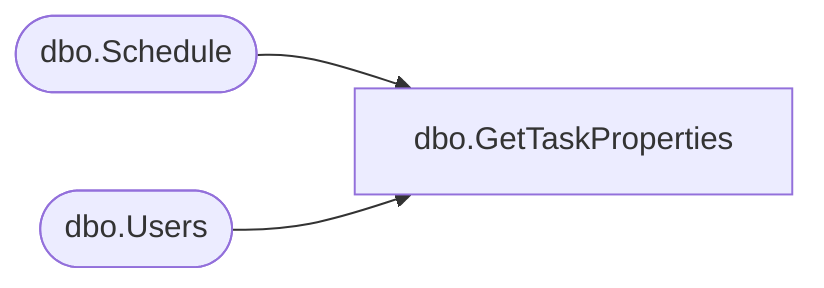

# dbo.GetTaskProperties

**Database:** ReportServerBIRPT02  
**Server:** bearcluster01  

## Architecture Diagram



## Table Dependencies

| Referenced Table |
|---|
| dbo.Schedule |
| dbo.Users |

## Stored Procedure Code

```sql
CREATE PROCEDURE [dbo].[GetTaskProperties]
@ScheduleID uniqueidentifier
AS
-- Grab all of a tasks properties given a task id
select
        S.[ScheduleID],
        S.[Name],
        S.[StartDate],
        S.[Flags],
        S.[NextRunTime],
        S.[LastRunTime],
        S.[EndDate],
        S.[RecurrenceType],
        S.[MinutesInterval],
        S.[DaysInterval],
        S.[WeeksInterval],
        S.[DaysOfWeek],
        S.[DaysOfMonth],
        S.[Month],
        S.[MonthlyWeek],
        S.[State],
        S.[LastRunStatus],
        S.[ScheduledRunTimeout],
        S.[EventType],
        S.[EventData],
        S.[Type],
        S.[Path],
        Owner.[UserName],
        Owner.[UserName],
        Owner.[AuthType]
from
    [Schedule] S with (XLOCK)
    Inner join [Users] Owner on S.[CreatedById] = Owner.UserID
where
    S.[ScheduleID] = @ScheduleID
```

