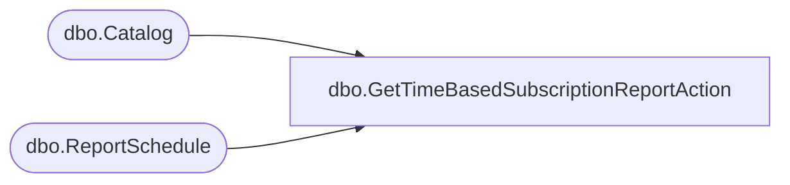

# dbo.GetTimeBasedSubscriptionReportAction

**Database:** ReportServerBIRPT02  
**Server:** bearcluster01  

## Architecture Diagram



## Table Dependencies

| Referenced Table |
|---|
| dbo.Catalog |
| dbo.ReportSchedule |

## Stored Procedure Code

```sql
CREATE PROCEDURE [dbo].[GetTimeBasedSubscriptionReportAction]
@SubscriptionID uniqueidentifier
AS
select
        RS.[ReportAction],
        RS.[ScheduleID],
        RS.[ReportID],
        RS.[SubscriptionID],
        C.[Path],
        C.[Type]
from
    [ReportSchedule] RS Inner join [Catalog] C on RS.[ReportID] = C.[ItemID]
where
    RS.[SubscriptionID] = @SubscriptionID
```

