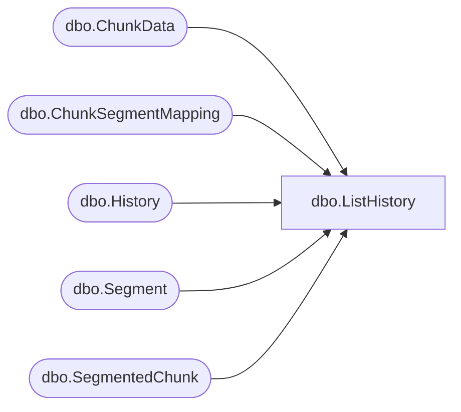

# dbo.ListHistory

**Database:** ReportServerBIRPT02  
**Server:** bearcluster01  

## Architecture Diagram



## Table Dependencies

| Referenced Table |
|---|
| dbo.ChunkData |
| dbo.ChunkSegmentMapping |
| dbo.History |
| dbo.Segment |
| dbo.SegmentedChunk |

## Stored Procedure Code

```sql
-- list all historical snapshots for a specific report
CREATE PROCEDURE [dbo].[ListHistory]
@ReportID uniqueidentifier
AS
SELECT
   S.SnapshotDate,
   ISNULL((SELECT SUM(DATALENGTH( CD.Content ) ) FROM ChunkData AS CD WHERE CD.SnapshotDataID = S.SnapshotDataID ), 0) +
   ISNULL(
    (
     SELECT SUM(DATALENGTH( SEG.Content) )
     FROM Segment SEG WITH(NOLOCK)
     JOIN ChunkSegmentMapping CSM WITH(NOLOCK) ON (CSM.SegmentId = SEG.SegmentId)
     JOIN SegmentedChunk C WITH(NOLOCK) ON (C.ChunkId = CSM.ChunkId AND C.SnapshotDataId = S.SnapshotDataId)
    ), 0)
FROM
   History AS S -- skipping intermediate table SnapshotData
WHERE
   S.ReportID = @ReportID
```

