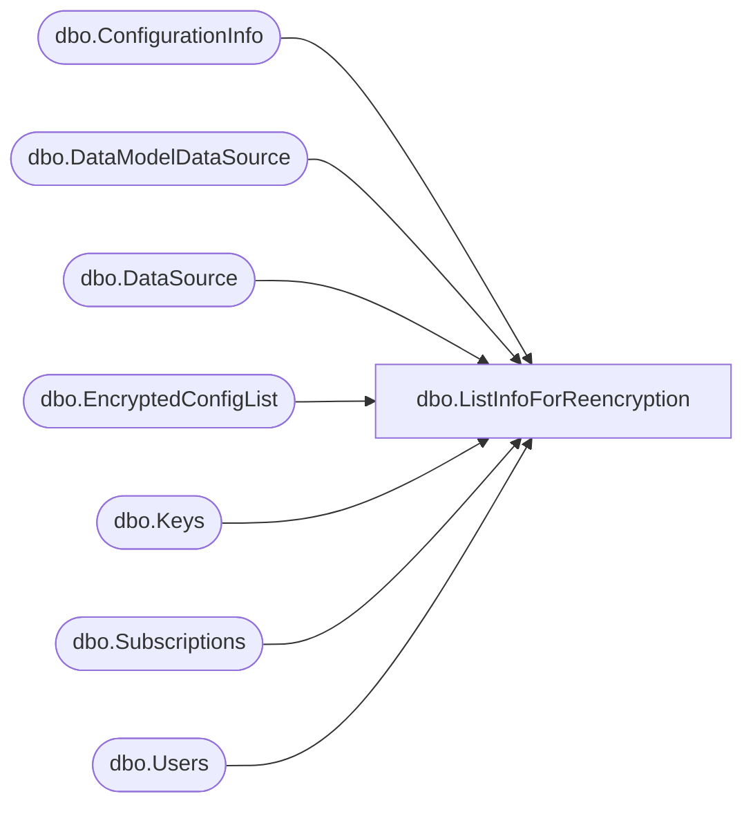

# dbo.ListInfoForReencryption

**Database:** ReportServerBIRPT02  
**Server:** bearcluster01  

## Architecture Diagram



## Table Dependencies

| Referenced Table |
|---|
| dbo.ConfigurationInfo |
| dbo.DataModelDataSource |
| dbo.DataSource |
| dbo.EncryptedConfigList |
| dbo.Keys |
| dbo.Subscriptions |
| dbo.Users |

## Stored Procedure Code

```sql
CREATE PROCEDURE [dbo].[ListInfoForReencryption]
@ConfigNames AS [dbo].[EncryptedConfigList] READONLY
AS

SELECT [DSID]
FROM [dbo].[DataSource] WITH (XLOCK, TABLOCK)

SELECT [SubscriptionID]
FROM [dbo].[Subscriptions] WITH (XLOCK, TABLOCK)

SELECT [InstallationID], [PublicKey]
FROM [dbo].[Keys] WITH (XLOCK, TABLOCK)
WHERE [Client] = 1 AND ([SymmetricKey] IS NOT NULL)

SELECT [Name],[Value]
FROM [dbo].[ConfigurationInfo]
WHERE [Name] IN (SELECT [ConfigName] FROM @ConfigNames)

SELECT [UserID]
FROM [dbo].[Users]
WHERE ([ServiceToken] IS NOT NULL)

SELECT [DSID]
FROM [dbo].[DataModelDataSource]
```

