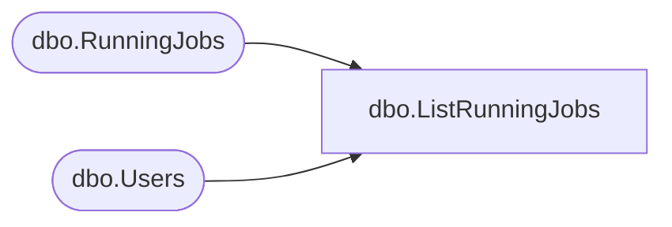

# dbo.ListRunningJobs

**Database:** ReportServerBIRPT02  
**Server:** bearcluster01  

## Architecture Diagram



## Table Dependencies

| Referenced Table |
|---|
| dbo.RunningJobs |
| dbo.Users |

## Stored Procedure Code

```sql
CREATE PROCEDURE [dbo].[ListRunningJobs]
AS
SELECT JobID, StartDate, ComputerName, RequestName, RequestPath, SUSER_SNAME(Users.[Sid]), Users.[UserName], Description,
    Timeout, JobAction, JobType, JobStatus, Users.[AuthType]
FROM RunningJobs
INNER JOIN Users
ON RunningJobs.UserID = Users.UserID
```

