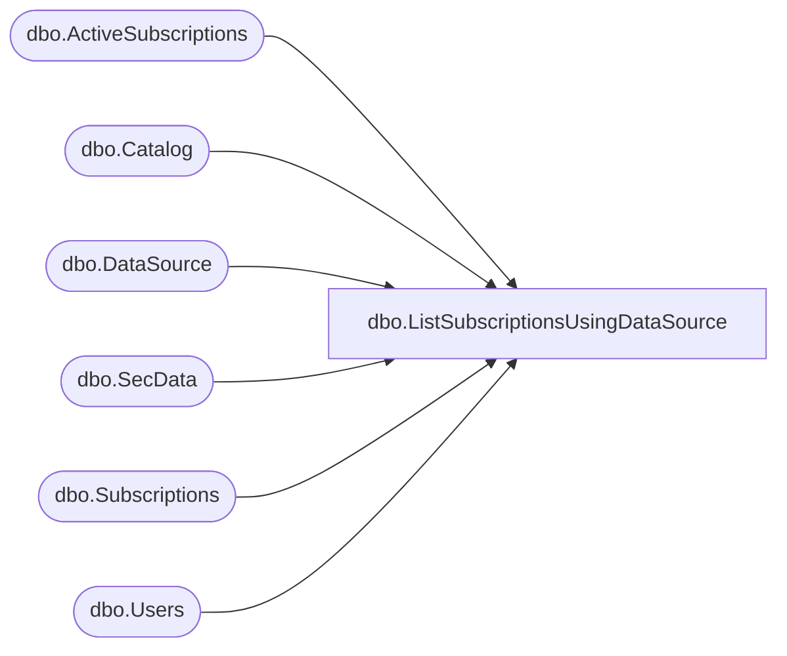

# dbo.ListSubscriptionsUsingDataSource

**Database:** ReportServerBIRPT02  
**Server:** bearcluster01  

## Architecture Diagram



## Table Dependencies

| Referenced Table |
|---|
| dbo.ActiveSubscriptions |
| dbo.Catalog |
| dbo.DataSource |
| dbo.SecData |
| dbo.Subscriptions |
| dbo.Users |

## Stored Procedure Code

```sql
CREATE PROCEDURE [dbo].[ListSubscriptionsUsingDataSource]
@DataSourceName nvarchar(450)
AS
select
    S.[SubscriptionID],
    S.[Report_OID],
    S.[ReportZone],
    S.[Locale],
    S.[InactiveFlags],
    S.[DeliveryExtension],
    S.[ExtensionSettings],
    Modified.[UserName],
    Modified.[UserName],
    S.[ModifiedDate],
    S.[Description],
    S.[LastStatus],
    S.[EventType],
    S.[MatchData],
    S.[Parameters],
    S.[DataSettings],
    A.[TotalNotifications],
    A.[TotalSuccesses],
    A.[TotalFailures],
    Owner.[UserName],
    Owner.[UserName],
    CAT.[Path],
    S.[LastRunTime],
    CAT.[Type],
    SD.NtSecDescPrimary,
    S.[Version],
    Owner.[AuthType]
from
    [DataSource] DS inner join Catalog C on C.ItemID = DS.Link
    inner join Subscriptions S on S.[SubscriptionID] = DS.[SubscriptionID]
    inner join [Catalog] CAT on S.[Report_OID] = CAT.[ItemID]
    inner join [Users] Owner on S.OwnerID = Owner.UserID
    inner join [Users] Modified on S.ModifiedByID = Modified.UserID
    left join [SecData] SD on SD.[PolicyID] = CAT.[PolicyID] AND SD.AuthType = Owner.AuthType
    left outer join [ActiveSubscriptions] A with (NOLOCK) on S.[SubscriptionID] = A.[SubscriptionID]
where
    C.Path = @DataSourceName
```

