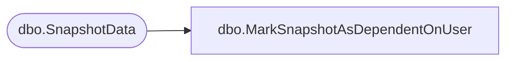

# dbo.MarkSnapshotAsDependentOnUser

**Database:** ReportServerBIRPT02  
**Server:** bearcluster01  

## Architecture Diagram



## Table Dependencies

| Referenced Table |
|---|
| dbo.SnapshotData |

## Stored Procedure Code

```sql
CREATE PROCEDURE [dbo].[MarkSnapshotAsDependentOnUser]
@SnapshotDataID as uniqueidentifier,
@IsPermanentSnapshot as bit
AS
SET NOCOUNT OFF
if @IsPermanentSnapshot = 1
BEGIN
   UPDATE SnapshotData
   SET DependsOnUser = 1
   WHERE SnapshotDataID = @SnapshotDataID
END ELSE BEGIN
   UPDATE [ReportServerBIRPT02TempDB].dbo.SnapshotData
   SET DependsOnUser = 1
   WHERE SnapshotDataID = @SnapshotDataID
END
```

