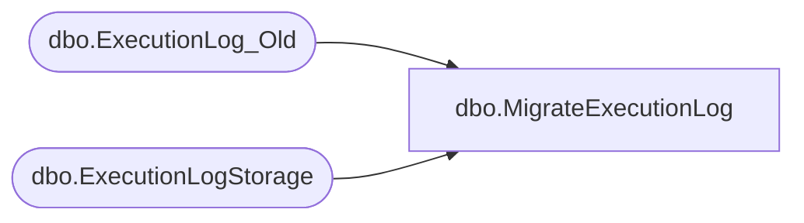

# dbo.MigrateExecutionLog

**Database:** ReportServerBIRPT02  
**Server:** bearcluster01  

## Architecture Diagram



## Table Dependencies

| Referenced Table |
|---|
| dbo.ExecutionLog_Old |
| dbo.ExecutionLogStorage |

## Stored Procedure Code

```sql
create proc [dbo].[MigrateExecutionLog] @updatedRow int output
as
begin
    set @updatedRow = 0 ;
    if exists (select id from dbo.sysobjects where id = object_id(N'[dbo].[ExecutionLog_Old]') and OBJECTPROPERTY(id, N'IsUserTable') = 1)
    begin
        SET DEADLOCK_PRIORITY LOW ;
        SET NOCOUNT OFF ;

        insert into [dbo].[ExecutionLogStorage]
            ([InstanceName],
             [ReportID],
             [UserName],
             [ExecutionId],
             [RequestType],
             [Format],
             [Parameters],
             [ReportAction],
             [TimeStart],
             [TimeEnd],
             [TimeDataRetrieval],
             [TimeProcessing],
             [TimeRendering],
             [Source],
             [Status],
             [ByteCount],
             [RowCount],
             [AdditionalInfo])
        select top (1024) with ties
            [InstanceName],
            [ReportID],
            [UserName],
            null,
            [RequestType],
            [Format],
            [Parameters],
            1,      --Render
            [TimeStart],
            [TimeEnd],
            [TimeDataRetrieval],
            [TimeProcessing],
            [TimeRendering],
            [Source],
            [Status],
            [ByteCount],
            [RowCount],
            null
         from [dbo].[ExecutionLog_Old] WITH (XLOCK)
         order by TimeStart ;

         delete from [dbo].[ExecutionLog_Old]
         where [TimeStart] in (select top (1024) with ties [TimeStart] from [dbo].[ExecutionLog_Old] order by [TimeStart]) ;

         set @updatedRow = @@ROWCOUNT ;

         IF @updatedRow = 0
         begin
            drop table [dbo].[ExecutionLog_Old]
         end
     end
end
```

