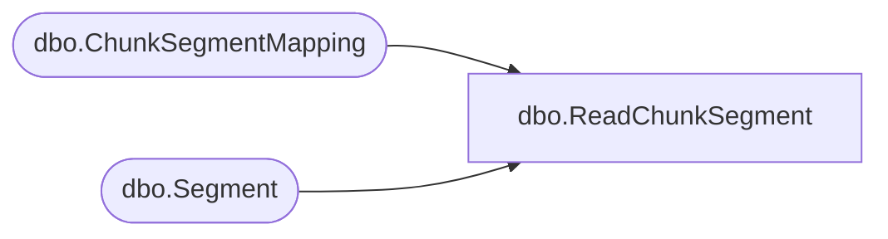

# dbo.ReadChunkSegment

**Database:** ReportServerBIRPT02  
**Server:** bearcluster01  

## Architecture Diagram



## Table Dependencies

| Referenced Table |
|---|
| dbo.ChunkSegmentMapping |
| dbo.Segment |

## Stored Procedure Code

```sql
create proc [dbo].[ReadChunkSegment]
    @ChunkId		uniqueidentifier,
    @SegmentId		uniqueidentifier,
    @IsPermanent	bit,
    @DataIndex		int,
    @Length			int
as begin
    if(@IsPermanent = 1) begin
        select substring(seg.Content, @DataIndex + 1, @Length) as [Content]
        from Segment seg
        join ChunkSegmentMapping csm on (csm.SegmentId = seg.SegmentId)
        where csm.ChunkId = @ChunkId and csm.SegmentId = @SegmentId
    end
    else begin
        select substring(seg.Content, @DataIndex + 1, @Length) as [Content]
        from [ReportServerBIRPT02TempDB].dbo.Segment seg
        join [ReportServerBIRPT02TempDB].dbo.ChunkSegmentMapping csm on (csm.SegmentId = seg.SegmentId)
        where csm.ChunkId = @ChunkId and csm.SegmentId = @SegmentId
    end
end
```

