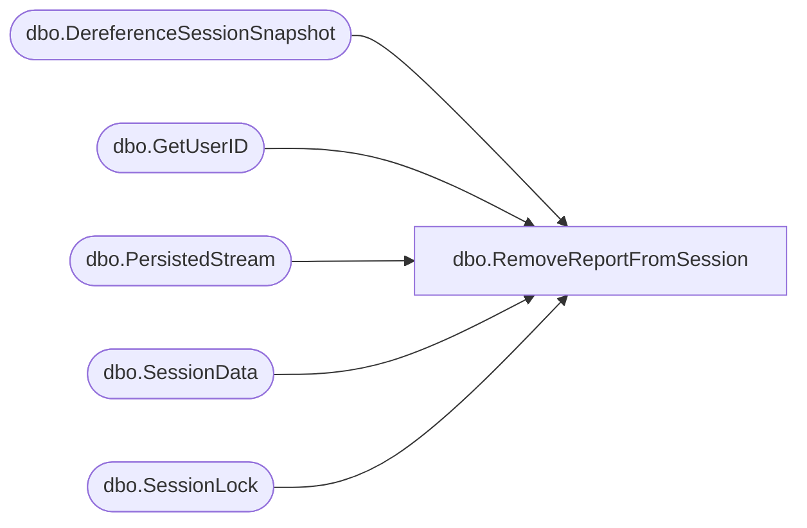

# dbo.RemoveReportFromSession

**Database:** ReportServerBIRPT02  
**Server:** bearcluster01  

## Architecture Diagram



## Table Dependencies

| Referenced Table |
|---|
| dbo.DereferenceSessionSnapshot |
| dbo.GetUserID |
| dbo.PersistedStream |
| dbo.SessionData |
| dbo.SessionLock |

## Stored Procedure Code

```sql
CREATE PROCEDURE [dbo].[RemoveReportFromSession]
@SessionID as varchar(32),
@ReportPath as nvarchar(440),
@OwnerSid as varbinary(85) = NULL,
@OwnerName as nvarchar(260),
@AuthType as int
AS

DECLARE @OwnerID uniqueidentifier
EXEC GetUserID @OwnerSid, @OwnerName, @AuthType, @OwnerID OUTPUT

EXEC DereferenceSessionSnapshot @SessionID, @OwnerID

DELETE
   SE
FROM
   [ReportServerBIRPT02TempDB].dbo.SessionData AS SE
WHERE
   SE.SessionID = @SessionID AND
   SE.ReportPath = @ReportPath AND
   SE.OwnerID = @OwnerID

DELETE FROM [ReportServerBIRPT02TempDB].dbo.SessionLock WHERE SessionID=@SessionID

-- Delete any persisted streams associated with this session
UPDATE PS
SET
    PS.RefCount = 0,
    PS.ExpirationDate = GETDATE()
FROM
    [ReportServerBIRPT02TempDB].dbo.PersistedStream AS PS
WHERE
    PS.SessionID = @SessionID
```

