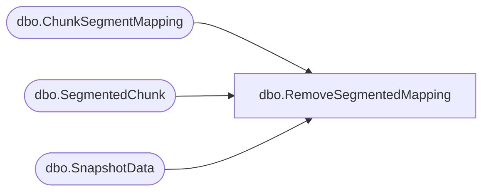

# dbo.RemoveSegmentedMapping

**Database:** ReportServerBIRPT02  
**Server:** bearcluster01  

## Architecture Diagram



## Table Dependencies

| Referenced Table |
|---|
| dbo.ChunkSegmentMapping |
| dbo.SegmentedChunk |
| dbo.SnapshotData |

## Stored Procedure Code

```sql
create proc [dbo].[RemoveSegmentedMapping]
    @DeleteCountPermanentChunk int,
    @DeleteCountPermanentMapping int,
    @DeleteCountTempChunk int,
    @DeleteCountTempMapping int,
    @MachineName nvarchar(260)
as
begin
    SET DEADLOCK_PRIORITY LOW

    declare @deleted table (
        ChunkID uniqueidentifier,
        IsPermanent bit );

    -- details on lock hints:
    -- we use readpast on ChunkSegmentMapping to skip past
    -- rows which are currently locked.  they are being actively
    -- used so clearly we do not want to delete them. we use
    -- nolock on SegmentedChunk table as well, this is because
    -- regardless of whether or not that row is locked, we want to
    -- know if it is referenced by a SegmentedChunk and if
    -- so we do not want to delete the mapping row.  ChunkIds are
    -- only modified when creating a shallow chunk copy(see ShallowCopyChunk),
    -- but in this case the ChunkSegmentMapping row is locked (via the insert)
    -- so we are safe.

    declare @toDeletePermChunks table (
        SnapshotDataId uniqueidentifier ) ;

    insert into @toDeletePermChunks (SnapshotDataId)
    select top (@DeleteCountPermanentChunk) SnapshotDataId
    from SegmentedChunk with (readpast)
    where not exists (
        select 1 from SnapshotData SD with (nolock)
        where SegmentedChunk.SnapshotDataId = SD.SnapshotDataID
        ) ;

    delete from SegmentedChunk with (readpast)
    where SegmentedChunk.SnapshotDataId in (
        select td.SnapshotDataId from @toDeletePermChunks td
        where not exists (
            select 1 from SnapshotData SD
            where td.SnapshotDataId = SD.SnapshotDataID
            )) ;

    -- clean up segmentedchunks from permanent database

    declare @toDeleteChunks table (
        ChunkId uniqueidentifier );

    -- clean up mappings from permanent database
    insert into @toDeleteChunks (ChunkId)
    select top (@DeleteCountPermanentMapping) ChunkId
    from ChunkSegmentMapping with (readpast)
    where not exists (
        select 1 from SegmentedChunk SC with (nolock)
        where SC.ChunkId = ChunkSegmentMapping.ChunkId
        ) ;

    delete from ChunkSegmentMapping with (readpast)
    output deleted.ChunkId, convert(bit, 1) into @deleted
    where ChunkSegmentMapping.ChunkId in (
        select td.ChunkId from @toDeleteChunks td
        where not exists (
            select 1 from SegmentedChunk SC
            where SC.ChunkId = td.ChunkId )
        and not exists (
            select 1 from [ReportServerBIRPT02TempDB].dbo.SegmentedChunk TSC
            where TSC.ChunkId = td.ChunkId ) )

    declare @toDeleteTempChunks table (
        SnapshotDataId uniqueidentifier);

    -- clean up SegmentedChunks from the Temp database
    -- for locking we play the same idea as in the previous query.
    -- snapshotIds never change, so again this operation is safe.
    insert into @toDeleteTempChunks (SnapshotDataId)
    select top (@DeleteCountTempChunk) SnapshotDataId
    from [ReportServerBIRPT02TempDB].dbo.SegmentedChunk with (readpast)
    where [ReportServerBIRPT02TempDB].dbo.SegmentedChunk.Machine = @MachineName
    and not exists (
        select 1 from [ReportServerBIRPT02TempDB].dbo.SnapshotData SD with (nolock)
        where [ReportServerBIRPT02TempDB].dbo.SegmentedChunk.SnapshotDataId = SD.SnapshotDataID
        ) ;

    delete from [ReportServerBIRPT02TempDB].dbo.SegmentedChunk with (readpast)
    where [ReportServerBIRPT02TempDB].dbo.SegmentedChunk.SnapshotDataId in (
        select td.SnapshotDataId from @toDeleteTempChunks td
        where not exists (
            select 1 from [ReportServerBIRPT02TempDB].dbo.SnapshotData SD
            where td.SnapshotDataId = SD.SnapshotDataID
            )) ;

    declare @toDeleteTempMappings table (
        ChunkId uniqueidentifier );

    -- clean up mappings from temp database
    insert into @toDeleteTempMappings (ChunkId)
    select top (@DeleteCountTempMapping) ChunkId
    from [ReportServerBIRPT02TempDB].dbo.ChunkSegmentMapping with (readpast)
    where not exists (
        select 1 from [ReportServerBIRPT02TempDB].dbo.SegmentedChunk SC with (nolock)
        where SC.ChunkId = [ReportServerBIRPT02TempDB].dbo.ChunkSegmentMapping.ChunkId
        ) ;

    delete from [ReportServerBIRPT02TempDB].dbo.ChunkSegmentMapping with (readpast)
    output deleted.ChunkId, convert(bit, 0) into @deleted
    where [ReportServerBIRPT02TempDB].dbo.ChunkSegmentMapping.ChunkId in (
        select td.ChunkId from @toDeleteTempMappings td
        where not exists (
            select 1 from [ReportServerBIRPT02TempDB].dbo.SegmentedChunk SC
            where td.ChunkId = SC.ChunkId )) ;

    -- need to return these so we can cleanup file system chunks
    select distinct ChunkID, IsPermanent
    from @deleted ;
end
```

