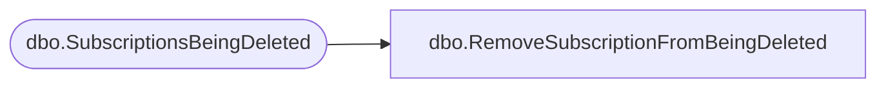

# dbo.RemoveSubscriptionFromBeingDeleted

**Database:** ReportServerBIRPT02  
**Server:** bearcluster01  

## Architecture Diagram



## Table Dependencies

| Referenced Table |
|---|
| dbo.SubscriptionsBeingDeleted |

## Stored Procedure Code

```sql
CREATE PROCEDURE [dbo].[RemoveSubscriptionFromBeingDeleted]
@SubscriptionID uniqueidentifier
AS
delete from [SubscriptionsBeingDeleted] where SubscriptionID = @SubscriptionID
```

