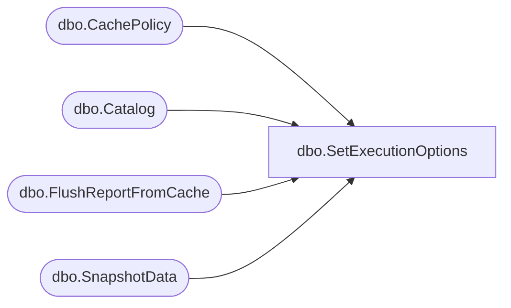

# dbo.SetExecutionOptions

**Database:** ReportServerBIRPT02  
**Server:** bearcluster01  

## Architecture Diagram



## Table Dependencies

| Referenced Table |
|---|
| dbo.CachePolicy |
| dbo.Catalog |
| dbo.FlushReportFromCache |
| dbo.SnapshotData |

## Stored Procedure Code

```sql
CREATE PROCEDURE [dbo].[SetExecutionOptions]
@Path as nvarchar(425),
@ExecutionFlag as int,
@ExecutionChanged as bit = 0
AS
IF @ExecutionChanged = 0
BEGIN
    UPDATE Catalog SET ExecutionFlag = @ExecutionFlag WHERE Catalog.Path = @Path
END
ELSE
BEGIN
    IF (@ExecutionFlag & 3) = 2
    BEGIN   -- set it to snapshot, flush cache
        EXEC FlushReportFromCache @Path
        DELETE CachePolicy FROM CachePolicy INNER JOIN Catalog ON CachePolicy.ReportID = Catalog.ItemID
        WHERE Catalog.Path = @Path
    END

    -- now clean existing snapshot and execution time if any
    UPDATE SnapshotData
    SET PermanentRefcount = PermanentRefcount - 1
    FROM
       SnapshotData
       INNER JOIN Catalog ON SnapshotData.SnapshotDataID = Catalog.SnapshotDataID
    WHERE Catalog.Path = @Path

    UPDATE Catalog
    SET ExecutionFlag = @ExecutionFlag, SnapshotDataID = NULL, ExecutionTime = NULL
    WHERE Catalog.Path = @Path
END
```

