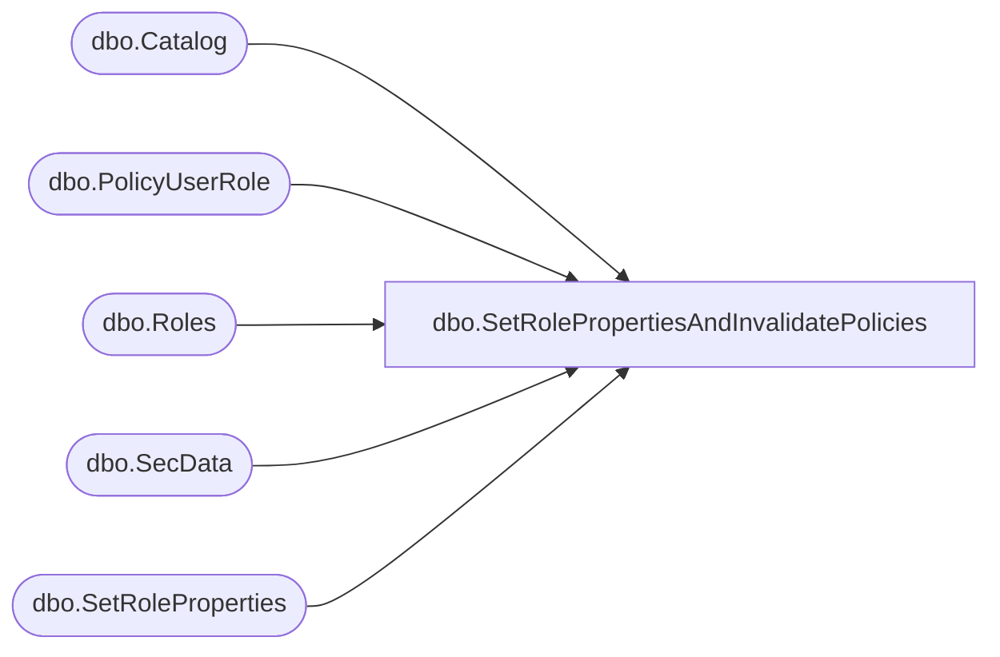

# dbo.SetRolePropertiesAndInvalidatePolicies

**Database:** ReportServerBIRPT02  
**Server:** bearcluster01  

## Architecture Diagram



## Table Dependencies

| Referenced Table |
|---|
| dbo.Catalog |
| dbo.PolicyUserRole |
| dbo.Roles |
| dbo.SecData |
| dbo.SetRoleProperties |

## Stored Procedure Code

```sql
CREATE PROCEDURE [dbo].[SetRolePropertiesAndInvalidatePolicies]
    @RoleName as nvarchar(260),
    @Description as nvarchar(512) = NULL,
    @TaskMask as nvarchar(32),
    @RoleFlags as tinyint
AS
BEGIN
    SET NOCOUNT OFF
    DECLARE @ExistingTaskMask as nvarchar(32)
    SELECT @ExistingTaskMask = TaskMask FROM Roles WHERE RoleName = @RoleName

    EXEC SetRoleProperties @RoleName, @Description, @TaskMask, @RoleFlags

    -- if task masks match, then no additional work needs to be done
    IF @ExistingTaskMask = @TaskMask
    BEGIN
        RETURN
    END

    SELECT [NtSecDescState]
    FROM [dbo].[SecData] WITH (XLOCK, TABLOCK)

    -- if task masks do not match, then a permission has been granted/revoked
    -- so, set policy state to invalid for every policy that uses this role
    UPDATE [dbo].[SecData] SET [NtSecDescState] = 1 WHERE [NtSecDescState] != 1 AND PolicyID in (
        SELECT DISTINCT p.PolicyID
            FROM
                [dbo].[Catalog] AS C
                    INNER JOIN [dbo].[PolicyUserRole] AS P ON C.PolicyID = P.PolicyID
                    INNER JOIN [dbo].[Roles] AS R ON R.RoleID = P.RoleID AND R.RoleName = @RoleName
        )
END
```

