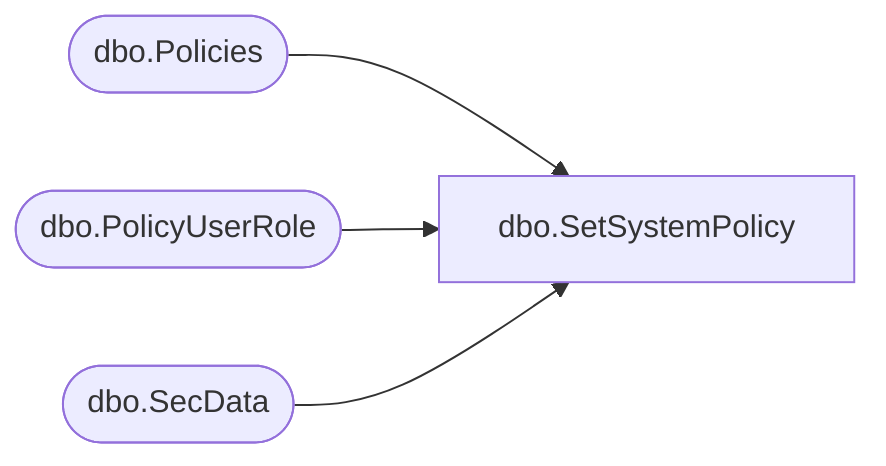

# dbo.SetSystemPolicy

**Database:** ReportServerBIRPT02  
**Server:** bearcluster01  

## Architecture Diagram



## Table Dependencies

| Referenced Table |
|---|
| dbo.Policies |
| dbo.PolicyUserRole |
| dbo.SecData |

## Stored Procedure Code

```sql
-- update the system policy
CREATE PROCEDURE [dbo].[SetSystemPolicy]
@PrimarySecDesc as image,
@SecondarySecDesc as ntext = NULL,
@XmlPolicy as ntext,
@AuthType as int,
@PolicyID uniqueidentifier OUTPUT
AS
SELECT @PolicyID = (SELECT PolicyID FROM Policies WHERE PolicyFlag = 1)
IF (@PolicyID IS NULL)
   BEGIN
     SET @PolicyID = newid()
     INSERT INTO Policies (PolicyID, PolicyFlag)
     VALUES (@PolicyID, 1)
     INSERT INTO SecData (SecDataID, PolicyID, AuthType, XmlDescription, NTSecDescPrimary, NtSecDescSecondary)
     VALUES (newid(), @PolicyID, @AuthType, @XmlPolicy, @PrimarySecDesc, @SecondarySecDesc)
   END
ELSE
   BEGIN
      DECLARE @SecDataID as uniqueidentifier
      SELECT @SecDataID = (SELECT SecDataID FROM SecData WHERE PolicyID = @PolicyID and AuthType = @AuthType)
      IF (@SecDataID IS NULL)
      BEGIN -- insert new sec desc's
        INSERT INTO SecData (SecDataID, PolicyID, AuthType, XmlDescription, NTSecDescPrimary, NtSecDescSecondary)
        VALUES (newid(), @PolicyID, @AuthType, @XmlPolicy, @PrimarySecDesc, @SecondarySecDesc)
      END
      ELSE
      BEGIN -- update existing sec desc's
        UPDATE SecData SET
        XmlDescription = @XmlPolicy,
        NtSecDescPrimary = @PrimarySecDesc,
        NtSecDescSecondary = @SecondarySecDesc
        WHERE SecData.PolicyID = @PolicyID
        AND AuthType = @AuthType

      END
   END
DELETE FROM PolicyUserRole WHERE PolicyID = @PolicyID
```

