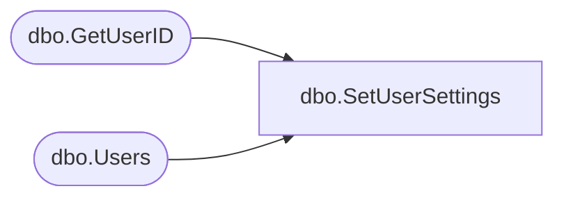

# dbo.SetUserSettings

**Database:** ReportServerBIRPT02  
**Server:** bearcluster01  

## Architecture Diagram



## Table Dependencies

| Referenced Table |
|---|
| dbo.GetUserID |
| dbo.Users |

## Stored Procedure Code

```sql
-- set user properties on user account
CREATE PROCEDURE [dbo].[SetUserSettings]
@Setting ntext,
@UserSid as varbinary(85) = NULL,
@UserName as nvarchar(260) = NULL,
@AuthType int
AS
BEGIN
DECLARE @UserID uniqueidentifier
EXEC GetUserID @UserSid, @UserName, @AuthType, @UserID OUTPUT

IF (@UserID is not null)
    BEGIN
        UPDATE Users
        SET Setting = @Setting
        WHERE UserID = @UserID
    END
END
```

