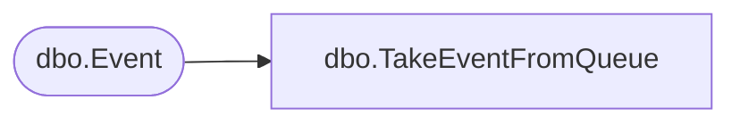

# dbo.TakeEventFromQueue

**Database:** ReportServerBIRPT02  
**Server:** bearcluster01  

## Architecture Diagram



## Table Dependencies

| Referenced Table |
|---|
| dbo.Event |

## Stored Procedure Code

```sql
CREATE PROCEDURE [dbo].[TakeEventFromQueue]
@EventType AS NVARCHAR(520)
AS

-- READPAST hint skip any row being locked (used by other query)
DELETE FROM [Event]
OUTPUT DELETED.*
WHERE EventID IN
(
    SELECT TOP 1 EventID
    FROM [Event] WITH (READPAST)
    WHERE EventType=@EventType
    ORDER BY TimeEntered ASC
)
```

