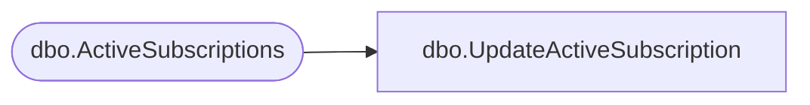

# dbo.UpdateActiveSubscription

**Database:** ReportServerBIRPT02  
**Server:** bearcluster01  

## Architecture Diagram



## Table Dependencies

| Referenced Table |
|---|
| dbo.ActiveSubscriptions |

## Stored Procedure Code

```sql
CREATE PROCEDURE [dbo].[UpdateActiveSubscription]
@ActiveID uniqueidentifier,
@TotalNotifications int = NULL,
@TotalSuccesses int = NULL,
@TotalFailures int = NULL
AS

if @TotalNotifications is not NULL
begin
    update ActiveSubscriptions set TotalNotifications = @TotalNotifications where ActiveID = @ActiveID
end

if @TotalSuccesses is not NULL
begin
    update ActiveSubscriptions set TotalSuccesses = TotalSuccesses + @TotalSuccesses where ActiveID = @ActiveID
end

if @TotalFailures is not NULL
begin
    update ActiveSubscriptions set TotalFailures = TotalFailures + @TotalFailures where ActiveID = @ActiveID
end

select
    TotalNotifications,
    TotalSuccesses,
    TotalFailures
from
    ActiveSubscriptions
where
    ActiveID = @ActiveID
```

