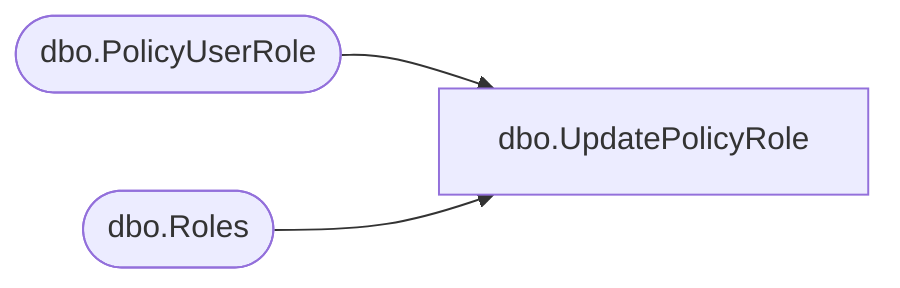

# dbo.UpdatePolicyRole

**Database:** ReportServerBIRPT02  
**Server:** bearcluster01  

## Architecture Diagram



## Table Dependencies

| Referenced Table |
|---|
| dbo.PolicyUserRole |
| dbo.Roles |

## Stored Procedure Code

```sql
CREATE PROCEDURE [dbo].[UpdatePolicyRole]
@PolicyID uniqueidentifier,
@PrincipalID uniqueidentifier,
@RoleName nvarchar(260),
@RoleID uniqueidentifier OUTPUT
AS
SELECT @RoleID = (SELECT RoleID FROM Roles WHERE RoleName = @RoleName)
INSERT INTO PolicyUserRole
(ID, RoleID, UserID, PolicyID)
VALUES (newid(), @RoleID, @PrincipalID, @PolicyID)
```

