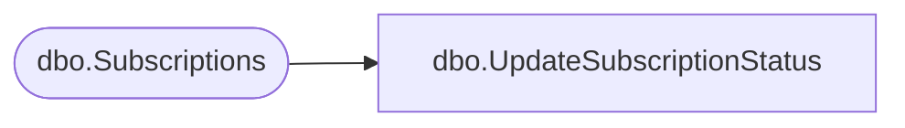

# dbo.UpdateSubscriptionStatus

**Database:** ReportServerBIRPT02  
**Server:** bearcluster01  

## Architecture Diagram



## Table Dependencies

| Referenced Table |
|---|
| dbo.Subscriptions |

## Stored Procedure Code

```sql
CREATE PROCEDURE [dbo].[UpdateSubscriptionStatus]
@SubscriptionID uniqueidentifier,
@Status nvarchar(260)
AS

update Subscriptions set
        [LastStatus] = @Status
where
    [SubscriptionID] = @SubscriptionID
```

