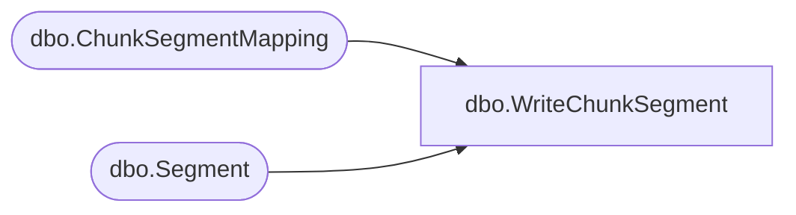

# dbo.WriteChunkSegment

**Database:** ReportServerBIRPT02  
**Server:** bearcluster01  

## Architecture Diagram



## Table Dependencies

| Referenced Table |
|---|
| dbo.ChunkSegmentMapping |
| dbo.Segment |

## Stored Procedure Code

```sql
create proc [dbo].[WriteChunkSegment]
    @ChunkId			uniqueidentifier,
    @IsPermanent		bit,
    @SegmentId			uniqueidentifier,
    @DataIndex			int,
    @Length				int,
    @LogicalByteCount	int,
    @Content			varbinary(max)
as begin
    declare @output table (actualLength int not null) ;
    if(@IsPermanent = 1) begin
        update Segment
        set Content.write( substring(@Content, 1, @Length), @DataIndex, @Length )
        output datalength(inserted.Content) into @output(actualLength)
        where SegmentId = @SegmentId

        update ChunkSegmentMapping
        set LogicalByteCount = @LogicalByteCount,
            ActualByteCount = (select top 1 actualLength from @output)
        where ChunkSegmentMapping.ChunkId = @ChunkId and ChunkSegmentMapping.SegmentId = @SegmentId
    end
    else begin
        update [ReportServerBIRPT02TempDB].dbo.Segment
        set Content.write( substring(@Content, 1, @Length), @DataIndex, @Length )
        output datalength(inserted.Content) into @output(actualLength)
        where SegmentId = @SegmentId

        update [ReportServerBIRPT02TempDB].dbo.ChunkSegmentMapping
        set LogicalByteCount = @LogicalByteCount,
            ActualByteCount = (select top 1 actualLength from @output)
        where ChunkId = @ChunkId and SegmentId = @SegmentId
    end

    if(@@rowcount <> 1)
        raiserror('unexpected # of segments update', 16, 1)
end
```

