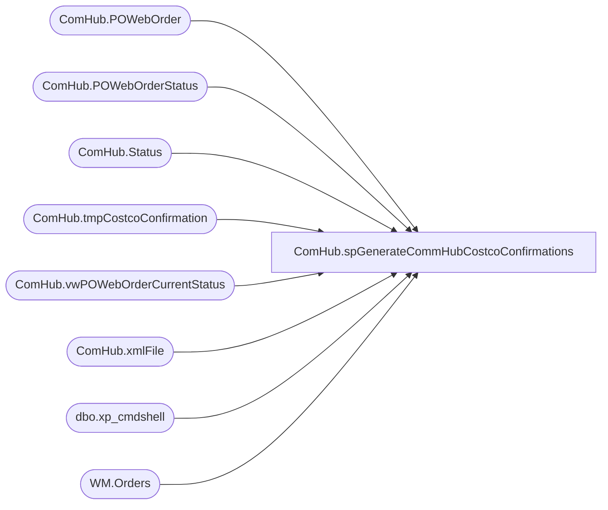

# ComHub.spGenerateCommHubCostcoConfirmations

**Database:** WebOrderProcessing  
**Server:** bearcluster01  

## Architecture Diagram



## Table Dependencies

| Referenced Table |
|---|
| ComHub.POWebOrder |
| ComHub.POWebOrderStatus |
| ComHub.Status |
| ComHub.tmpCostcoConfirmation |
| ComHub.vwPOWebOrderCurrentStatus |
| ComHub.xmlFile |
| dbo.xp_cmdshell |
| WM.Orders |

## Stored Procedure Code

```sql
CREATE PROCEDURE [ComHub].[spGenerateCommHubCostcoConfirmations] 

AS
-- =============================================================================================================
-- Name: spGenerateCommHubCostcoConfirmations
--
-- Description:	Generate Commecehub Costco Confirmations
--
-- Output: 
-- 
-- Available actions:
--
-- Revision History
--		Name:			Date:			Comments:
--		Ben Barud		2020-10-15		Initial Creation
--				

BEGIN
	-- SET NOCOUNT ON added to prevent extra result sets from
	-- interfering with SELECT statements.
	SET NOCOUNT ON;

    DECLARE @FileName VARCHAR(100), @Path VARCHAR(100), @PathFileName VARCHAR(200), @xmlQuery XML, @sql VARCHAR(500), @timeStamp VARCHAR(20), @poAcknowledgedSatusId INT,  @poShipStatusId INT, @xmlFileId INT
    SELECT @poAcknowledgedSatusId = StatusId FROM WebOrderProcessing.ComHub.[Status] WHERE Keyword = 'POACKNOWLEDGED'
    SELECT @poShipStatusId = StatusId FROM WebOrderProcessing.ComHub.[Status] WHERE Keyword = 'POSHIPPED'
	SET @Path = '\\kermode\filerepository\CommerceHubCostcoConfirmation\'
	SET @timeStamp = REPLACE(REPLACE(REPLACE(CONVERT(CHAR(19), GETDATE(), 120), '-', ''), ':', ''), ' ', '')
	SELECT @timeStamp

	IF OBJECT_ID('WebOrderProcessing.ComHub.tmpCostcoConfirmation') IS NULL
	BEGIN
		CREATE TABLE WebOrderProcessing.ComHub.tmpCostcoConfirmation (ID INT IDENTITY(1,1), xmlCol XML)
	END
	TRUNCATE TABLE WebOrderProcessing.ComHub.tmpCostcoConfirmation; 

	WITH hubConfirmElement (PONumber)
    AS
    (
	  SELECT PONumber AS messageBatchLink
  	  FROM [WebOrderProcessing].[ComHub].[vwPOWebOrderCurrentStatus]
	  WHERE StatusId = @poAcknowledgedSatusId
	  AND PONumber NOT IN (SELECT PONumber FROM [WebOrderProcessing].[ComHub].[POWebOrder] WHERE OrderId IS NULL)
	  GROUP BY PONumber 
    )
    SELECT @xmlQuery = (SELECT 
	       (
            SELECT 'Build-A-Bear Workshop Inc.' AS partnerID
          ,(
		    SELECT 'merchant' [participatingParty/@roleType]
		          ,'To:' [participatingParty/@participationCode]
			      ,'Costco' AS participatingParty
		          ,'Build-A-Bear Workshop Inc.'  AS partnerTrxID
			      ,CONVERT(VARCHAR, GETDATE(), 112) AS partnerTrxDate
			      ,PONumber AS poNumber
			      ,'' AS trxShipping 
			      ,(
				    SELECT OrderNumber AS vendorsInvoiceNumber
				    FROM [WebOrderProcessing].[ComHub].[vwPOWebOrderCurrentStatus] p2
				    INNER JOIN [WebOrderProcessing].[WM].[Orders] o ON p2.OrderId = o.OrderId
				    WHERE p.PONumber = p2.PONumber
				    FOR XML PATH(''), TYPE 
			       ) AS 'trxData'
			      ,(
			        SELECT 'v_ship' AS [action]
					      ,merchantLineNumber AS merchantLineNumber
					      ,vendorSKU AS trxVendorSKU
					      ,qtyOrdered AS 'trxQty'
					      ,'PCK' + RIGHT('000000' + CAST(POWebOrderId AS VARCHAR(6)), 6) AS [packageDetailLink/@packageDetailID]
					      ,'13' AS [trxItemData/vendorWarehouseId]
				   FROM OPENJSON(POjson, '$.lineItem')
    			   WITH ([vendorSKU] NVARCHAR(255) '$.vendorSKU', [merchantLineNumber] INT '$.merchantLineNumber', [qtyOrdered] INT '$.qtyOrdered')
				   FOR XML PATH('hubAction'), TYPE
				   --FROM [WebOrderProcessing].[ComHub].[POWebOrder] 
			      )
				 ,(
			       SELECT 'PCK' + RIGHT('000000' + CAST(POWebOrderId AS VARCHAR(6)), 6) AS [@packageDetailID]
				         ,CONVERT(VARCHAR, GETDATE(), 112) AS shipDate
				         ,'OTHR' AS serviceLevel1
					    ,PONumber AS trackingNumber
					    FROM [WebOrderProcessing].[ComHub].[vwPOWebOrderCurrentStatus] p2 WHERE p.PONumber = p2.PONumber
				FOR XML PATH('packageDetail'), TYPE
			  )
		    FROM [WebOrderProcessing].[ComHub].[vwPOWebOrderCurrentStatus] p --WHERE p.PONumber = h.PONumber
			WHERE StatusId = @poAcknowledgedSatusId
	        AND PONumber NOT IN (SELECT PONumber FROM [WebOrderProcessing].[ComHub].[POWebOrder] WHERE OrderId IS NULL)
		    GROUP BY PONumber, POjson, POWebOrderId
		    FOR XML PATH('hubConfirm'), TYPE
	      )
	      ,COUNT(*) AS messageCount
	    FROM hubConfirmElement h
	    --GROUP BY PONumber
      FOR XML  PATH(''), TYPE
      )'ConfirmMessageBatch'
    FOR XML  PATH(''), TYPE
	)
  
  INSERT INTO WebOrderProcessing.ComHub.tmpCostcoConfirmation(xmlCol)
  SELECT @xmlQuery

  IF (SELECT COUNT(OrderMessageBatch) AS messageBatchLink
	  FROM [WebOrderProcessing].[ComHub].[vwPOWebOrderCurrentStatus]
	  WHERE StatusId = @poAcknowledgedSatusId
	  AND PONumber NOT IN (SELECT PONumber FROM [WebOrderProcessing].[ComHub].[POWebOrder] WHERE OrderId IS NULL)
	  ) > 0
  BEGIN
  SET @FileName = 'CostcoConfirmation_' + @timeStamp + '.xml'
  SELECT @PathFileName = @Path + @Filename

  SET @sql = 'bcp "SELECT TOP 1 xmlCol FROM WebOrderProcessing.ComHub.tmpCostcoConfirmation" queryout "' + @PathFileName +'" -T -c ' 

  PRINT @sql
  EXEC master.dbo.xp_cmdshell @sql

  --DECLARE @poReceivedSatusId INT,  @poPlaceStatusId INT
  --SELECT @poReceivedSatusId = StatusId FROM WebOrderProcessing.ComHub.[Status] WHERE Keyword = 'PORECEIVED'
  --SELECT @poPlaceStatusId = StatusId FROM WebOrderProcessing.ComHub.[Status] WHERE Keyword = 'POPLACED'
  
  BEGIN TRAN
    INSERT INTO ComHub.xmlFile (xmlFileName, xmlTypeId)
	VALUES(@FileName, 2)

	SELECT @xmlFileId = @@IDENTITY;
  COMMIT

  UPDATE ComHub.POWebOrder
  SET ConfirmationXmlId = @xmlFileId
  WHERE POWebOrderId IN (SELECT POWebOrderId 
                         FROM [ComHub].[vwPOWebOrderCurrentStatus]
                         WHERE StatusId = @poAcknowledgedSatusId
						 AND PONumber NOT IN (SELECT PONumber FROM [WebOrderProcessing].[ComHub].[POWebOrder] WHERE OrderId IS NULL)
						 )

  INSERT INTO [WebOrderProcessing].[ComHub].[POWebOrderStatus] ([POWebOrderId]
      ,[StatusId]
      ,[CreatedBy]
      ,[CreatedOn])
  SELECT POWebOrderId
        ,@poShipStatusId
		,SYSTEM_USER
		,GETDATE()
  FROM [ComHub].[vwPOWebOrderCurrentStatus]
  WHERE StatusId = @poAcknowledgedSatusId
  AND PONumber NOT IN (SELECT PONumber FROM [WebOrderProcessing].[ComHub].[POWebOrder] WHERE OrderId IS NULL)
  END
  
END
```

