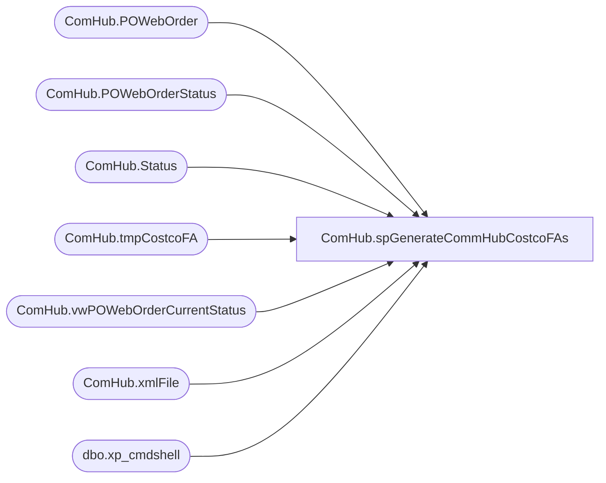

# ComHub.spGenerateCommHubCostcoFAs

**Database:** WebOrderProcessing  
**Server:** bearcluster01  

## Architecture Diagram



## Table Dependencies

| Referenced Table |
|---|
| ComHub.POWebOrder |
| ComHub.POWebOrderStatus |
| ComHub.Status |
| ComHub.tmpCostcoFA |
| ComHub.vwPOWebOrderCurrentStatus |
| ComHub.xmlFile |
| dbo.xp_cmdshell |

## Stored Procedure Code

```sql
CREATE PROCEDURE [ComHub].[spGenerateCommHubCostcoFAs] 

AS
-- =============================================================================================================
-- Name: spGenerateCommHubCostcoFAs
--
-- Description:	Generate Commecehub Costco Functional Acknowledgements
--
-- Output: 
-- 
-- Available actions:
--
-- Revision History
--		Name:			Date:			Comments:
--		Ben Barud		2020-10-09		Initial Creation
--				

BEGIN
	-- SET NOCOUNT ON added to prevent extra result sets from
	-- interfering with SELECT statements.
	SET NOCOUNT ON;

    DECLARE @FileName VARCHAR(100), @Path VARCHAR(100), @PathFileName VARCHAR(200), @xmlQuery XML, @sql VARCHAR(500), @timeStamp VARCHAR(20), @poReceivedSatusId INT,  @poPlaceStatusId INT, @xmlFileId INT
    SELECT @poReceivedSatusId = StatusId FROM WebOrderProcessing.ComHub.[Status] WHERE Keyword = 'PORECEIVED'
    SELECT @poPlaceStatusId = StatusId FROM WebOrderProcessing.ComHub.[Status] WHERE Keyword = 'POPLACED'
	SET @Path = '\\kermode\FileRepository\CommerceHubCostcoFA\'
	SET @timeStamp = REPLACE(REPLACE(REPLACE(CONVERT(CHAR(19), GETDATE(), 120), '-', ''), ':', ''), ' ', '')
	SELECT @timeStamp

	IF OBJECT_ID('WebOrderProcessing.ComHub.tmpCostcoFA') IS NULL
	BEGIN
		CREATE TABLE WebOrderProcessing.ComHub.tmpCostcoFA (ID INT IDENTITY(1,1), xmlCol XML)
	END
	TRUNCATE TABLE WebOrderProcessing.ComHub.tmpCostcoFA; 

	WITH hubFAElement (OrderMessageBatch)
    AS
    (
	  SELECT OrderMessageBatch AS messageBatchLink
	  FROM [WebOrderProcessing].[ComHub].[vwPOWebOrderCurrentStatus]
	  WHERE StatusId = @poReceivedSatusId
	  AND OrderMessageBatch NOT IN (SELECT OrderMessageBatch FROM [WebOrderProcessing].[ComHub].[POWebOrder] WHERE OrderId IS NULL)
	  GROUP BY OrderMessageBatch 
    )
	SELECT @xmlQuery = (
      SELECT @timeStamp  AS [FAMessageBatch/@batchNumber]
            ,'Build-A-Bear Workshop Inc.' AS [FAMessageBatch/partnerID]
        ,(
		  SELECT 
		    (
		      SELECT OrderMessageBatch AS trxSetID
		      FROM [WebOrderProcessing].[ComHub].[vwPOWebOrderCurrentStatus] p2 WHERE p1.OrderMessageBatch = p2.OrderMessageBatch
		      GROUP BY OrderMessageBatch 
		      FOR XML PATH(''), TYPE
	        ) AS [messageBatchLink]
	       ,(
		      SELECT 'order' [@type]
		             ,TransactionId AS trxID
                     --,'' AS detailException
			         ,'A' AS [messageDisposition/@status]
		      FROM [WebOrderProcessing].[ComHub].[vwPOWebOrderCurrentStatus] p2 WHERE p1.OrderMessageBatch = p2.OrderMessageBatch
		      FOR XML PATH('messageAck'), TYPE
	        )
	       ,'A' [messageBatchDisposition/@status]
	       ,(
		      SELECT COUNT(TransactionId) AS 'trxReceivedCount'
		            ,COUNT(TransactionId) AS 'trxAcceptedCount'
			        ,'' AS 'exceptionDesc'
		      FROM [WebOrderProcessing].[ComHub].[POWebOrder] p2 WHERE p1.OrderMessageBatch = p2.OrderMessageBatch
		      GROUP BY OrderMessageBatch 
		      FOR XML PATH(''), TYPE
	        ) AS [messageBatchDisposition]
	       FROM [WebOrderProcessing].[ComHub].[vwPOWebOrderCurrentStatus] p1
		   WHERE StatusId = @poReceivedSatusId
		   AND OrderMessageBatch NOT IN (SELECT OrderMessageBatch FROM [WebOrderProcessing].[ComHub].[POWebOrder] WHERE OrderId IS NULL)
	       GROUP BY OrderMessageBatch 
	       FOR XML PATH('hubFA'), TYPE
	     ) [FAMessageBatch]
	    ,COUNT(*) AS [FAMessageBatch/messageCount]
  FROM hubFAElement
  FOR XML PATH(''), TYPE
  )
  
  INSERT INTO WebOrderProcessing.ComHub.tmpCostcoFA (xmlCol)
  SELECT @xmlQuery

  IF (SELECT COUNT(OrderMessageBatch) AS messageBatchLink
	  FROM [WebOrderProcessing].[ComHub].[vwPOWebOrderCurrentStatus]
	  WHERE StatusId = @poReceivedSatusId
	  AND OrderMessageBatch NOT IN (SELECT OrderMessageBatch FROM [WebOrderProcessing].[ComHub].[POWebOrder] WHERE OrderId IS NULL)
	  ) > 0
  BEGIN
  SET @FileName = 'CostcoFA_' + @timeStamp + '.xml'
  SELECT @PathFileName = @Path + @Filename

  SET @sql = 'bcp "SELECT TOP 1 xmlCol FROM WebOrderProcessing.ComHub.tmpCostcoFA" queryout "' + @PathFileName +'" -T -c ' 

  PRINT @sql
  EXEC master.dbo.xp_cmdshell @sql

  --DECLARE @poReceivedSatusId INT,  @poPlaceStatusId INT
  --SELECT @poReceivedSatusId = StatusId FROM WebOrderProcessing.ComHub.[Status] WHERE Keyword = 'PORECEIVED'
  --SELECT @poPlaceStatusId = StatusId FROM WebOrderProcessing.ComHub.[Status] WHERE Keyword = 'POPLACED'
  
  BEGIN TRAN
    INSERT INTO ComHub.xmlFile (xmlFileName, xmlTypeId)
	VALUES(@FileName, 1)

	SELECT @xmlFileId = @@IDENTITY;
  COMMIT

  UPDATE ComHub.POWebOrder
  SET FAxmlId = @xmlFileId
  WHERE POWebOrderId IN (SELECT POWebOrderId 
                         FROM [ComHub].[vwPOWebOrderCurrentStatus]
                         WHERE StatusId = @poReceivedSatusId
						 AND OrderMessageBatch NOT IN (SELECT OrderMessageBatch FROM [WebOrderProcessing].[ComHub].[POWebOrder] WHERE OrderId IS NULL)
						 )

  INSERT INTO [WebOrderProcessing].[ComHub].[POWebOrderStatus] ([POWebOrderId]
      ,[StatusId]
      ,[CreatedBy]
      ,[CreatedOn])
  SELECT POWebOrderId
        ,@poPlaceStatusId
		,SYSTEM_USER
		,GETDATE()
  FROM [ComHub].[vwPOWebOrderCurrentStatus]
  WHERE StatusId = @poReceivedSatusId
  AND OrderMessageBatch NOT IN (SELECT OrderMessageBatch FROM [WebOrderProcessing].[ComHub].[POWebOrder] WHERE OrderId IS NULL)
  END
  
END
```

