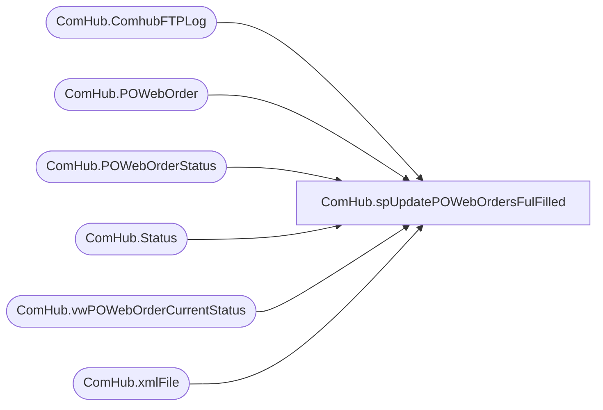

# ComHub.spUpdatePOWebOrdersFulFilled

**Database:** WebOrderProcessing  
**Server:** bearcluster01  

## Architecture Diagram



## Table Dependencies

| Referenced Table |
|---|
| ComHub.ComhubFTPLog |
| ComHub.POWebOrder |
| ComHub.POWebOrderStatus |
| ComHub.Status |
| ComHub.vwPOWebOrderCurrentStatus |
| ComHub.xmlFile |

## Stored Procedure Code

```sql
CREATE PROCEDURE [ComHub].[spUpdatePOWebOrdersFulFilled]

AS

-- =============================================================================================================
-- Name: spUpdatePOWebOrdersFulFilled
--
-- Description:	PowebOrders to PO Fulfilled
--
-- Output: 
-- 
-- Available actions:
--
-- Revision History
--		Name:			Date:			Comments:
--		Ben Barud		2020-10-20		Initial Creation
--		

BEGIN
	-- SET NOCOUNT ON added to prevent extra result sets from
	-- interfering with SELECT statements.
	SET NOCOUNT ON;
	DECLARE @poShipStatusId INT, @poFulfilled INT
    SELECT @poShipStatusId = StatusId FROM WebOrderProcessing.ComHub.[Status] WHERE Keyword = 'POSHIPPED'
	SELECT @poFulfilled = StatusId FROM WebOrderProcessing.ComHub.[Status] WHERE Keyword = 'POFULFILLED'

    IF OBJECT_ID('tempdb..#tmpComhubFTPLog') IS NOT NULL
		DROP TABLE #tmpComhubFTPLog

	SELECT [ComhubFileName]
      ,[UploadDateTime]
      ,[Success]
	  ,xmlTypeId
	INTO #tmpComhubFTPLog
    FROM [STL-SSIS-P-01].[IntegrationStaging].[ComHub].[ComhubFTPLog]
	WHERE xmlTypeId = 1 AND Success = 1
	AND [UploadDateTime] > GETDATE() -1

	INSERT INTO [WebOrderProcessing].[ComHub].[POWebOrderStatus] ([POWebOrderId]
        ,[StatusId]
        ,[CreatedBy]
      ,[CreatedOn])
    SELECT v.POWebOrderId
          ,@poFulfilled
		  ,SYSTEM_USER
		  ,GETDATE()
    FROM [ComHub].[vwPOWebOrderCurrentStatus] v
	INNER JOIN [ComHub].POWebOrder p ON v.POWebOrderId = p.POWebOrderId
	INNER JOIN [ComHub].xmlFile f ON p.FAxmlId = f.xmlFileId
	INNER JOIN #tmpComhubFTPLog t ON f.xmlFileName = t.ComhubFileName
    WHERE StatusId = @poShipStatusId

END
```

