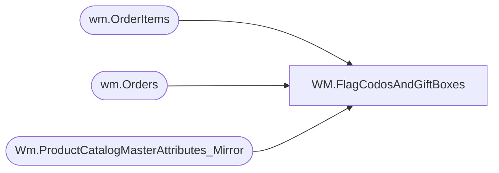

# WM.FlagCodosAndGiftBoxes

**Database:** WebOrderProcessing  
**Server:** bearcluster01  

## Architecture Diagram



## Table Dependencies

| Referenced Table |
|---|
| wm.OrderItems |
| wm.Orders |
| Wm.ProductCatalogMasterAttributes_Mirror |

## Stored Procedure Code

```sql
-- =============================================
-- Author:		John Eck
-- Create date: 11/14/18
-- Description:	Updtes special instructions field to flag orders with condos and gift boxes
-- =============================================
CREATE PROCEDURE [WM].[FlagCodosAndGiftBoxes]
	-- Add the parameters for the stored procedure here
	@TransID int
AS
BEGIN
	-- SET NOCOUNT ON added to prevent extra result sets from
	-- interfering with SELECT statements.
	SET NOCOUNT ON;

    -- Insert statements for procedure here
	Declare @Packaging varchar(200)
  select @Packaging = Coalesce(@Packaging + '   ','') + PackageOption from (
  select distinct PackageOption 
  from wm.OrderItems OI inner join Wm.ProductCatalogMasterAttributes_Mirror on (sku = style_Code)
                     inner join wm.Orders O on O.OrderID = OI.OrderID
  where PackageOption is not null and O.transactionID = @TransID
  ) x

Update WM.Orders set SpecialInstructions =  @Packaging + char(13)
where TransactionID = @TransID
END

WM,PrintFiles,-- =============================================
-- Author:		John Eck
-- Create date: 9/28/17
-- Description:	allows passing parameters to print command for ssis printing of pickslips
-- =============================================
create PROCEDURE wm.PrintFiles 
	-- Add the parameters for the stored procedure here
	
	@Filename varchar(200),
	@Printer varchar(100)
AS
BEGIN
	-- SET NOCOUNT ON added to prevent extra result sets from
	-- interfering with SELECT statements.
	SET NOCOUNT ON;

    -- Insert statements for procedure here
	Declare @PrintString varchar(500) = 'Print ' + @FileName + ' /d:' + @Printer

exec xp_cmdshell @PrintString
END

WM,RemoveOldTransactionData,-- =============================================
-- Author:		John Eck
-- Create date: 8/18/17
-- Description:	removes all data from wm tables for a specified transactionID used to remove pending sound orders so the updated order can be added.
-- =============================================
CREATE PROCEDURE [WM].[RemoveOldTransactionData]
	-- Add the parameters for the stored procedure here
@TransID int
AS
BEGIN
	-- SET NOCOUNT ON added to prevent extra result sets from
	-- interfering with SELECT statements.
	SET NOCOUNT ON;

 delete from wm.payments where transactionID = @Transid
delete from wm.ItemDiscounts where OrderItemID in (select OrderItemID from wm.OrderItems OI 
                              inner join wm.Orders O on OI.OrderID = O.OrderID where O.transactionID = @transID)
delete from wm.ItemStatus where OrderItemID in (select OrderItemID from wm.OrderItems OI 
                              inner join wm.Orders O on OI.OrderID = O.OrderID where O.transactionID = @transID)
delete from wm.Orderstatus  where orderID in (select OrderID from wm.Orders where transactionID = @transID)
delete from wm.OrderItems where OrderItemID in (select OrderItemID from wm.OrderItems OI 
                              inner join wm.Orders O on OI.OrderID = O.OrderID where O.transactionID = @transID)
delete from wm.ShippingDiscounts  where orderID in (select OrderID from wm.Orders where transactionID = @transID)
delete from wm.Orders  where orderID in (select OrderID from wm.Orders where transactionID = @transID)
delete from wm.transactions where transactionID = @TransID
END

WM,spArchiveItemStatusData,-- =============================================
-- Author:		Tim Bytnar
-- Create date: 11-27-2017
-- Description:	This will archive all ItemStatus records that are older than 30 days
-- =============================================
CREATE PROCEDURE [WM].[spArchiveItemStatusData] 

AS
BEGIN
	SET NOCOUNT ON;

DECLARE @NextIDs TABLE(OrderItemStatusId int primary key)
DECLARE @TargetDate datetime
SELECT @TargetDate = DATEADD(d, -30, GetDate())

WHILE EXISTS(SELECT 1 FROM [WM].[ItemStatus] WHERE [ItemStatus].[StatusDate] < @TargetDate)
BEGIN 
    BEGIN TRAN 

    INSERT INTO @NextIDs(OrderItemStatusId)
        SELECT TOP 1000 OrderItemStatusId FROM [WM].[ItemStatus] WHERE [ItemStatus].[StatusDate] < @TargetDate
		

    -----ARCHIVE THE ItemStatus ROWS
    INSERT INTO [WM].[ItemStatus_Archive](OrderItemStatusId,OrderItemID,Status,StatusDate,CurrentStatus,OrderID,OrderTransactionIdentifier,QTY,Price,DiscountedPrice) 
        SELECT a.OrderItemStatusId,OrderItemID,Status,StatusDate,CurrentStatus,OrderID,OrderTransactionIdentifier,QTY,Price,DiscountedPrice
        FROM  [WM].[ItemStatus] AS a
        INNER JOIN @NextIDs AS b ON a.OrderItemStatusId = b.OrderItemStatusId

    DELETE [WM].[ItemStatus]
	   FROM  [WM].[ItemStatus] AS a
	   INNER JOIN @NextIDs AS b ON a.OrderItemStatusId = b.OrderItemStatusId


    DELETE FROM @NextIDs

    COMMIT TRAN
END 

END

WM,spEmailOMSErrorFiles,CREATE proc [WM].[spEmailOMSErrorFiles]

as 

------------------------------------------------------------------------------------------------------------------------------------------------------------
-- Dan Tweedie - 2017-09-14 - Runs at end of SSIS package WebIntegrationValidations
--							- Send Email to WebAlerts
------------------------------------------------------------------------------------------------------------------------------------------------------------

set nocount on

declare @count int

select @count = count(*) from WM.OrderXMLErrorLog

If @count > 0

begin

	declare 
		@text nvarchar(max),
		@subj varchar(100),
		@recip varchar(1000)

	select @recip = 'WebAlerts@buildabear.com'
	select @subj = 'OMS to WMS XML Error Files'

	set @text = '
	<font face =arial size = 2><H3>OMS Order XML Files Which Failed to Parse. <br>Files are located here: \\kermode\filerepository\OMSOrders\Err . <br>Total Files: ' + cast(@count as varchar) + '</H3>' +
		'<table border="1"><font face=arial size = 2>' +
		'<tr>
		<th>FileName</th>
		</tr>' +
		'<font face =arial size = 2>' +
		CAST ( ( SELECT td = ErrFileName,''
				 from WM.OrderXMLErrorLog
				 order by ErrFileName
				  FOR XML PATH('tr'), TYPE 
		) AS NVARCHAR(MAX) ) +
		'</font></table></font></p></p>
		<br>
		<br>
		<br>'


	exec msdb.dbo.sp_send_dbmail
	@profile_name = 'BIAdmin',
	@recipients = @recip,
	@body = @text,
	@subject = @subj,
	@body_format = 'HTML'
	
end
```

