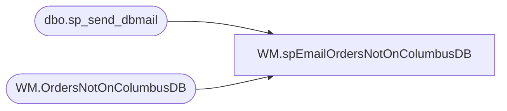

# WM.spEmailOrdersNotOnColumbusDB

**Database:** WebOrderProcessing  
**Server:** bearcluster01  

## Architecture Diagram



## Table Dependencies

| Referenced Table |
|---|
| dbo.sp_send_dbmail |
| WM.OrdersNotOnColumbusDB |

## Stored Procedure Code

```sql
CREATE proc [WM].[spEmailOrdersNotOnColumbusDB]

as 

------------------------------------------------------------------------------------------------------------------------------------------------------------
-- Dan Tweedie - 2019-03-04 - Created proc
------------------------------------------------------------------------------------------------------------------------------------------------------------

set nocount on

declare @count int

select @count = count(*) from WM.OrdersNotOnColumbusDB

If @count > 0

begin

	declare 
		@text nvarchar(max),
		@subj varchar(100),
		@recip varchar(1000)

	select @recip = 'WebAlerts@buildabear.com'
	select @subj = 'Web Orders NOT in Columbus for Printing'

	set @text = '
	<font face =arial><H3>Web Orders Waved in WM but are NOT in Columbus DB for Printing: ' + cast(@count as varchar) + '</H3>' +
		'<table border="1">' +
		'<tr>
		<th>OrderNumber</th>
		<th>WaveDate</th>
		</tr>' +
		'<font face =arial size = 2>' +
		CAST ( ( SELECT td = OrderNumber,'',
						td = WaveDateTime,''
				 from WM.OrdersNotOnColumbusDB
				 order by WaveDateTime, OrderNumber
				  FOR XML PATH('tr'), TYPE 
		) AS NVARCHAR(MAX) ) +
		'</font></table></font></p></p>
		<br>
		<br>
		<br>'


	exec msdb.dbo.sp_send_dbmail
	@profile_name = 'BIAdmin',
	@recipients = @recip,
	@body = @text,
	@subject = @subj,
	@body_format = 'HTML'
	

end
```

