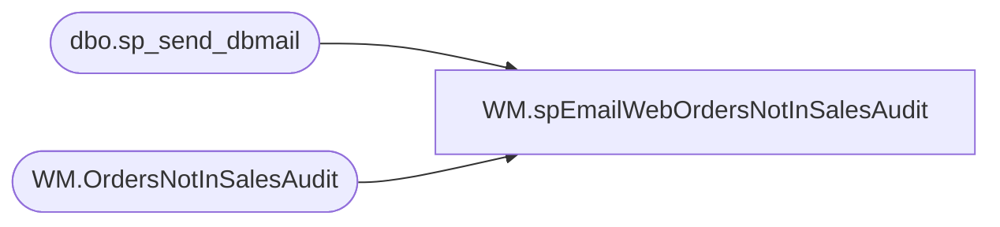

# WM.spEmailWebOrdersNotInSalesAudit

**Database:** WebOrderProcessing  
**Server:** bearcluster01  

## Architecture Diagram



## Table Dependencies

| Referenced Table |
|---|
| dbo.sp_send_dbmail |
| WM.OrdersNotInSalesAudit |

## Stored Procedure Code

```sql
CREATE proc [WM].[spEmailWebOrdersNotInSalesAudit]

as 

------------------------------------------------------------------------------------------------------------------------------------------------------------
-- Dan Tweedie - 2017-10-11 - Runs at end of SSIS package WebIntegrationValidations, which stages Orders shipped in WM.OrderStatus table, but not in lookup to Auditworks..line_note
--							- Send Email to WebAlerts
------------------------------------------------------------------------------------------------------------------------------------------------------------

set nocount on

declare @count int

select @count = count(*) from WM.OrdersNotInSalesAudit

if @count > 0

begin

	declare 
		@text nvarchar(max),
		@subj varchar(100),
		@recip varchar(1000)
		

	select @recip = 'WebAlerts@buildabear.com'
	select @subj = 'Web Orders NOT in Sales Audit'

	set @text = '
	<font face =arial><H3>US Web Orders Which Are Shipped in our processing tables, but are NOT in Sales Audit. <br>Total Orders: ' + cast(@count as varchar) + '</H3>' +
		'<table border="1">' +
		'<tr>
		<th>OrderNumber</th>
		<th>ShipDate</th>
		<th>InSettlementData</th>
		<th>ES Order</th>
		</tr>' +
		'<font face =arial size = 2>' +
		CAST ( ( SELECT td = OrderNum,'',
						td = ShipDate, '',
						td = InSettlementData, '',
						td = case when ESReferenceNo is null then 'NO' else 'YES' end, ''
				 from WM.OrdersNotInSalesAudit
				 where datediff(mi, ShipDate, getdate())>=180
				 order by ShipDate, OrderNum
				  FOR XML PATH('tr'), TYPE 
		) AS NVARCHAR(MAX) ) +
		'</font></table></font></p></p>
		<br>
		<br>
		<br>'

		

	exec msdb.dbo.sp_send_dbmail
	@profile_name = 'BIAdmin',
	@recipients = @recip,
	@body = @text,
	@subject = @subj,
	@body_format = 'HTML'
	

	--if @count >= 500
	--	and datepart(hh, getdate()) >= 20


	--begin
	--	exec msdb.dbo.sp_send_dbmail
	--	@profile_name = 'BIAdmin',
	--	@recipients = '3143249033@txt.att.net;3143986176@txt.att.net', --dan and ben
	--	@body = @text,
	--	@subject = @subj,
	--	@body_format = 'HTML'
	--end
end


WM,spEmailWebOrdersNotInWM,CREATE proc [WM].[spEmailWebOrdersNotInWM]

as 

------------------------------------------------------------------------------------------------------------------------------------------------------------
-- Dan Tweedie - 2017-09-14 - Runs at end of SSIS package WebIntegrationValidations, which stages Orders Sent To WM that are NOT found in WM
--							- Send Email to WebAlerts
------------------------------------------------------------------------------------------------------------------------------------------------------------

set nocount on

declare @count int

select @count = count(*) 
	from WM.OrdersNotInWM oi
	join wm.Orders o with (nolock) 
	on oi.OrderNumber=o.OrderNum
	and o.PickUpStore is NULL

If @count > 0

begin

	declare 
		@text nvarchar(max),
		@subj varchar(100),
		@recip varchar(1000)

	select @recip = 'WebAlerts@buildabear.com'
	--select @recip = 'WebAlerts@buildabear.com;TimC@buildabear.com'
	select @subj = 'Web Orders NOT in WM'

	set @text = '
	<font face =arial><H3>US OMS Orders Which are NOT in WM. <br>Total Orders: ' + cast(@count as varchar) + '</H3>' +
		'<table border="1">' +
		'<tr>
		<th>OrderNumber</th>
		<th>OrderImportDate</th>
		<th>OrderFileName</th>
		<th>OrderStatus</th>
		<th>WMFileName</th>
		<th>SendTime</th>
		</tr>' +
		'<font face =arial size = 2>' +
		CAST ( ( SELECT td = oi.OrderNumber,'',
						td = oi.OrderImportDateTime,'',
						td = oi.OrderFileName,'',
						td = isnull(oi.OrderStatus, 'no data'),'',
						td = isnull(oi.WMFileName, 'not logged'),'',
						td = isnull(oi.SendTime, cast(cast(oi.OrderImportDateTime as date) as datetime)), ''
				 from WM.OrdersNotInWM oi
				 join wm.Orders o with (nolock) 
					on oi.OrderNumber=o.OrderNum
					and o.PickUpStore is NULL --excludes orders routed to stores
				 order by oi.OrderImportDateTime, oi.OrderNumber
				  FOR XML PATH('tr'), TYPE 
		) AS NVARCHAR(MAX) ) +
		'</font></table></font></p></p>
		<br>
		<br>
		<br>'


	exec msdb.dbo.sp_send_dbmail
	@profile_name = 'BIAdmin',
	@recipients = @recip,
	@body = @text,
	@subject = @subj,
	@body_format = 'HTML'
	
	--if @count >= 100
	--begin
	--	exec msdb.dbo.sp_send_dbmail
	--	@profile_name = 'BIAdmin',
	--	@recipients = '3143249033@txt.att.net', 
	--	@body = @text,
	--	@subject = @subj,
	--	@body_format = 'HTML'
	--end

end


WM,spEmailWebOrdersNotSentToUK,CREATE proc [WM].[spEmailWebOrdersNotSentToUK]

as 

------------------------------------------------------------------------------------------------------------------------------------------------------------
-- Dan Tweedie - 2017-09-14 - Runs at end of SSIS package WebIntegrationValidations
--							- Send Email to WebAlerts
------------------------------------------------------------------------------------------------------------------------------------------------------------

set nocount on

declare @count int

select @count = count(*) from WM.OrdersNotSentToUK

If @count > 0

begin

	declare 
		@text nvarchar(max),
		@subj varchar(100),
		@recip varchar(1000)

	select @recip = 'WebAlerts@buildabear.com'
	select @subj = 'Web Orders NOT Sent to UK'

	set @text = '
	<font face =arial><H3>UK OMS Orders Which are NOT in UK FTP log. <br>Total Orders: ' + cast(@count as varchar) + '</H3>' +
		'<table border="1">' +
		'<tr>
		<th>OrderNumber</th>
		<th>OrderFileName</th>
		<th>FileImportDate</th>
		<th>OrderStatus</th>
		</tr>' +
		'<font face =arial size = 2>' +
		CAST ( ( SELECT td = OrderNumber,'',
						td = OrderFileName, '',
						td = OrderImportDateTime,'',
						td = isnull(OrderStatus,'no data'),''
				 from WM.OrdersNotSentToUK
				 order by OrderImportDateTime, OrderNumber
				  FOR XML PATH('tr'), TYPE 
		) AS NVARCHAR(MAX) ) +
		'</font></table></font></p></p>
		<br>
		<br>
		<br>'


	exec msdb.dbo.sp_send_dbmail
	@profile_name = 'BIAdmin',
	@recipients = @recip,
	@body = @text,
	@subject = @subj,
	@body_format = 'HTML'

	if @count >= 100
	begin
		exec msdb.dbo.sp_send_dbmail
		@profile_name = 'BIAdmin',
		@recipients = '3143249033@txt.att.com', --dan and john
		@body = @text,
		@subject = @subj,
		@body_format = 'HTML'
	end
	
end
```

