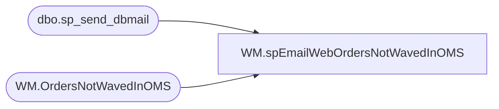

# WM.spEmailWebOrdersNotWavedInOMS

**Database:** WebOrderProcessing  
**Server:** bearcluster01  

## Architecture Diagram



## Table Dependencies

| Referenced Table |
|---|
| dbo.sp_send_dbmail |
| WM.OrdersNotWavedInOMS |

## Stored Procedure Code

```sql
CREATE proc [WM].[spEmailWebOrdersNotWavedInOMS]

as 

------------------------------------------------------------------------------------------------------------------------------------------------------------
-- Dan Tweedie - 2017-09-14 - Runs at end of SSIS package WebIntegrationValidations, which stages Orders waved in WM but not in OMS etl tables
--							- Send Email to WebAlerts
------------------------------------------------------------------------------------------------------------------------------------------------------------

set nocount on

declare @count int

select @count = count(*) from WM.OrdersNotWavedInOMS

if @count > 0

begin

	declare 
		@text nvarchar(max),
		@subj varchar(100),
		@recip varchar(1000)

	select @recip = 'WebAlerts@buildabear.com'
	select @subj = 'Web Orders NOT WAVED in OMS'

	set @text = '
	<font face =arial><H3>US Web Orders Which Are Waved in WM but NOT in OMS. <br>Total Orders: ' + cast(@count as varchar) + '</H3>' +
		'<table border="1">' +
		'<tr>
		<th>OrderNumber</th>
		<th>WaveDate</th>
		<th>ErrorMessage</th>
		<th>LogDateTime</th>
		<th>Logged Attempts</th>
		</tr>' +
		'<font face =arial size = 2>' +
		CAST ( ( SELECT td = OrderNum,'',
						td = WaveDate, '',
						td = isnull(ErrorMessage, 'n/a'), '',
						td = isnull(LogDateTime, cast(cast(WaveDate as date) as datetime)), '',
						td = isnull(Attempts,0), ''
				 from WM.OrdersNotWavedInOMS
				 order by WaveDate, OrderNum
				  FOR XML PATH('tr'), TYPE 
		) AS NVARCHAR(MAX) ) +
		'</font></table></font></p></p>
		<br>
		<br>
		<br>'


	exec msdb.dbo.sp_send_dbmail
	@profile_name = 'BIAdmin',
	@recipients = @recip,
	@body = @text,
	@subject = @subj,
	@body_format = 'HTML'
	
end
```

