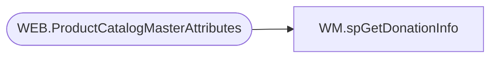

# WM.spGetDonationInfo

**Database:** WebOrderProcessing  
**Server:** bearcluster01  

## Architecture Diagram



## Table Dependencies

| Referenced Table |
|---|
| WEB.ProductCatalogMasterAttributes |

## Stored Procedure Code

```sql
CREATE PROCEDURE [WM].[spGetDonationInfo]

-- =============================================================================================================
-- Name: spGetDonationInfo
--
-- Description:	Get Donation information for SalesAudit Transalate.
--
-- Output: 
--	
-- Dependencies: 
--
-- Revision History
--		Name:			Date:			Comments:
--		Ben Barud		01/19/2018		Initial Creation
-- =============================================================================================================

AS
BEGIN
	-- SET NOCOUNT ON added to prevent extra result sets from
	-- interfering with SELECT statements.
	SET NOCOUNT ON;

	SELECT [Style_Code]
	      ,[ClassName]
    FROM [STL-SSIS-P-01].[IntegrationStaging].[WEB].[ProductCatalogMasterAttributes]
    WHERE ClassName IN ('Donations', 'UK-Donations')
	AND Style_Code NOT IN ('057700')
END
```

