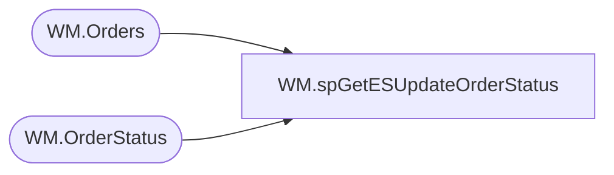

# WM.spGetESUpdateOrderStatus

**Database:** WebOrderProcessing  
**Server:** bearcluster01  

## Architecture Diagram



## Table Dependencies

| Referenced Table |
|---|
| WM.Orders |
| WM.OrderStatus |

## Stored Procedure Code

```sql
CREATE PROCEDURE WM.spGetESUpdateOrderStatus
	@ESID VARCHAR(20)

-- =============================================================================================================
-- Name: WM.spGetESUpdateOrderStatus 
--
-- Description:	Get ES Update Order Status for GetESUpdateOrderStatus.dtsx for WebOrderProcessing on stl.ssis.p.01
-- they cannot be redeemed multiple times
--
-- Output: 
--	
-- Dependencies: 
--
-- Revision History
--		Name:			Date:			Comments:
--		Ben Barud		07/03/2018		Initial Creation
-- =============================================================================================================

AS
BEGIN
	SET NOCOUNT ON;

    SELECT MAX(o.[OrderId]) AS 'OrderId'
      ,[TransactionID]
      ,MAX([OrderNum]) AS 'OrderNum'
      ,[EnterpriseSellingID]
      ,MAX(os.[Status]) AS 'OrderStatus'
    FROM [WebOrderProcessing].[WM].[Orders] o
    INNER JOIN [WebOrderProcessing].[WM].OrderStatus os ON o.OrderId = os.OrderId  AND os.CurrentStatus = 1
    WHERE EnterpriseSellingID = @ESID
    GROUP BY TransactionID, EnterpriseSellingID
END
```

