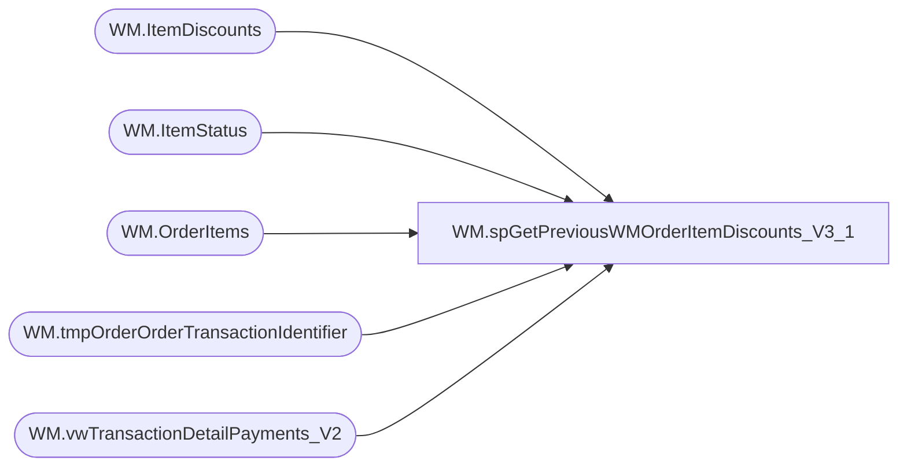

# WM.spGetPreviousWMOrderItemDiscounts_V3_1

**Database:** WebOrderProcessing  
**Server:** bearcluster01  

## Architecture Diagram



## Table Dependencies

| Referenced Table |
|---|
| WM.ItemDiscounts |
| WM.ItemStatus |
| WM.OrderItems |
| WM.tmpOrderOrderTransactionIdentifier |
| WM.vwTransactionDetailPayments_V2 |

## Stored Procedure Code

```sql
CREATE PROCEDURE [WM].[spGetPreviousWMOrderItemDiscounts_V3_1] 

-- =============================================================================================================
-- Name: WM.spGetPreviousWMOrderItemDiscounts
--
-- Description:	Get Previous WM Orders Item Discounts for Sales Audit Translate
--
-- Output: 
--	
-- Dependencies: 
--
-- Revision History
--		Name:			Date:			Comments:
--		Ben Barud		9/10/2017		Initial Creation
-- =============================================================================================================

AS
BEGIN
	-- SET NOCOUNT ON added to prevent extra result sets from
	-- interfering with SELECT statements.
	SET NOCOUNT ON;
	
	SELECT DISTINCT MAX(v.[OrderNumber]) AS 'OrderNumber'
	      ,id.[OrderItemID]
          ,[PromoCode]
          ,[DiscountAmount]
          ,[IsOrderDiscount]
          ,[DiscountName]
		  ,td.CurrencyMultiplier
	FROM [WebOrderProcessing].[WM].[vwTransactionDetailPayments_V2] td
	INNER JOIN [WebOrderProcessing].[WM].[tmpOrderOrderTransactionIdentifier] v ON td.TransactionID = v.TransactionID AND td.OrderTransactionIdentifier = v.OrderTransactionIdentifier
	LEFT JOIN [WebOrderProcessing].[WM].[OrderItems] oi ON v.TransactionID = oi.TransactionID
	INNER JOIN [WebOrderProcessing].[WM].[ItemStatus] ist ON oi.OrderItemID = ist.OrderItemID AND ist.OrderTransactionIdentifier = v.OrderTransactionIdentifier
	INNER JOIN [WebOrderProcessing].[WM].[ItemDiscounts] id ON oi.OrderItemID = id.OrderItemID
	WHERE DiscountAmount IS NOT NULL 
	AND ist.Status IN ('IR', 'OIV', 'OIVNC')
	AND CurrencyMultiplier = -1
	AND PaymentTransactionType NOT IN ('Credit')
	AND DiscountName NOT IN ('OrderManualCredit')
	AND td.OmsTransactionType NOT IN ('OrderManualCredit', 'ShippingManualCredit')
	GROUP BY id.[OrderItemID]
          ,[PromoCode]
          ,[DiscountAmount]
          ,[IsOrderDiscount]
          ,[DiscountName]
		  ,td.CurrencyMultiplier

	/*OLD LOGIC
    SELECT [TransactionNum]
	      ,id.[OrderItemID]
          ,[PromoCode]
          ,[DiscountAmount]
          ,[IsOrderDiscount]
          ,[DiscountName]
    FROM [WM].[ItemDiscounts] id
	LEFT JOIN [WM].[OrderItems] oi ON id.OrderItemID = oi.OrderItemID
	LEFT JOIN [WebOrderProcessing].[WM].[Orders] o ON oi.OrderId = o.OrderId
    LEFT JOIN [WebOrderProcessing].[WM].[vwTransactionsShipments_vs_Shipped] svs ON o.TransactionID = svs.TransactionID
    WHERE svs.ShipmentsCount = svs.ShippedCount AND DiscountAmount IS NOT NULL
	*/
END
```

