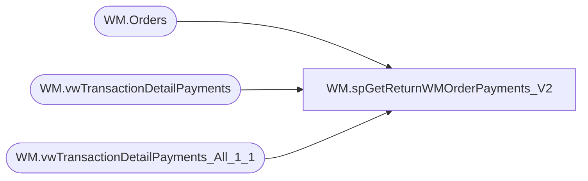

# WM.spGetReturnWMOrderPayments_V2

**Database:** WebOrderProcessing  
**Server:** bearcluster01  

## Architecture Diagram



## Table Dependencies

| Referenced Table |
|---|
| WM.Orders |
| WM.vwTransactionDetailPayments |
| WM.vwTransactionDetailPayments_All_1_1 |

## Stored Procedure Code

```sql
CREATE PROCEDURE [WM].[spGetReturnWMOrderPayments_V2] 

-- =============================================================================================================
-- Name: WM.spGetShippedWMOrderPayments
--
-- Description:	Get return and credit WM Orders Payments for Sales Audit Translate
--
-- Output: 
--	
-- Dependencies: 
--
-- Revision History
--		Name:			Date:			Comments:
--		Ben Barud		9/10/2017		Initial Creation
--		Ben Barud		11/08/2017		Added Logic for Amazon/ChannelAdvisor
--		Ben Barud		11/15/2017		Updated Logic for Amazon/ChannelAdvisor for Deck integration
-- =============================================================================================================

AS
BEGIN
	-- SET NOCOUNT ON added to prevent extra result sets from
	-- interfering with SELECT statements.
	SET NOCOUNT ON;

	WITH SalePayments (TransactionID
				    ,CurrencyMultiplier
					,PaymentAmount
	)
	AS
	(
		SELECT [TransactionID]
		  ,CurrencyMultiplier
		  ,SUM([TransactionAmount]) AS 'PaymentAmount'
		FROM [WebOrderProcessing].[WM].[vwTransactionDetailPayments_All_1_1]
		--WHERE PaymentTransactionType IN ('return', 'credit')
		WHERE PaymentTransactionType IN ('sales')
		GROUP BY [TransactionID]
		  ,PaymentType
		  ,[PaymentTransactionType]
		  ,[CurrencyMultiplier]
		  ,[TransactionGeneric1]
		  ,[PaymentGeneric1]
		  ,[PaymentGeneric2]
		  ,[PaymentGeneric3]
	)
	, ReturnPayments (OrderNumber
					,TransactionID
					,PaymentID
					,PaymentMethod
					,PaymentTransactionType
					,CurrencyMultiplier
					,PaymentAmount
					,PaymentAuthCode
					,PaymentNum
					,CardType
					,CreditCardNumber
					,ExpirationMonth
					,ExpirationYear
					,GiftCardNumber
	)
	AS
	(
	SELECT DISTINCT td.[OrderNumber]
			  ,td.TransactionID
			  ,[OrderTransactionIdentifier] AS 'PaymentID'
			  ,CASE
				WHEN [PaymentType] = 'GiftCard' THEN 'GiftCard'
				WHEN [PaymentType] = 'PayPal' THEN 'PayPal'
				WHEN [PaymentType] = 'Amazon' THEN 'Amazon'
				WHEN td.[TransactionNum] LIKE 'C%' THEN 'Amazon'
				WHEN [PaymentType] = 'Cash' THEN 'StoreCredit'
				ELSE 'CreditCard'
			   END AS 'PaymentMethod'
			  ,[PaymentTransactionType]
			  ,[CurrencyMultiplier]
			  ,[TransactionAmount] AS 'PaymentAmount'
			  ,TransactionGeneric1 AS 'PaymentAuthCode'
			  ,TransactionGeneric1 AS 'PaymentNum'
			  ,CASE
			     WHEN [PaymentGeneric1] = 'Amex' THEN 'American Express'
		         ELSE [PaymentGeneric1]
		       END AS 'CardType'
			  ,[PaymentGeneric2] AS 'CreditCardNumber'
			  ,LEFT(RIGHT('0' + ISNULL([PaymentGeneric3], ''), 7), 2) AS 'ExpirationMonth'
			  ,RIGHT(RIGHT('0' + ISNULL([PaymentGeneric3], ''), 7), 4) AS 'ExpirationYear'
			  ,CASE
		         WHEN td.TransactionNum LIKE 'C%' THEN o.EnterpriseSellingID
				 WHEN PaymentType = 'Amazon' THEN OrderCustom3 
			     ELSE TransactionGeneric1
		       END AS 'GiftCardNumber'
		FROM [WebOrderProcessing].[WM].[vwTransactionDetailPayments] td
		LEFT JOIN [WebOrderProcessing].[WM].[Orders] o ON td.TransactionID = o.TransactionID
		--WHERE PaymentTransactionType IN ('return', 'credit')
		WHERE PaymentTransactionType IN ('return')
	)
	SELECT DISTINCT OrderNumber
		  ,r.TransactionID
          ,PaymentID
          ,PaymentMethod
          ,PaymentTransactionType
          ,s.CurrencyMultiplier
	      ,s.PaymentAmount
		  ,PaymentAuthCode
		  ,PaymentNum
          ,CardType
          ,CreditCardNumber
		  ,ExpirationMonth
          ,ExpirationYear
          ,GiftCardNumber
	FROM ReturnPayments r
	LEFT JOIN SalePayments s ON r.TransactionID = s.TransactionID
	                          
	/*OLD LOGIC
	SELECT [OrderNumber]
			  ,TransactionID
			  ,[OrderTransactionIdentifier] AS 'PaymentID'
			  ,CASE
				WHEN [PaymentTransactionType] = 'GiftCard' THEN 'GiftCard'
				WHEN [PaymentTransactionType] = 'PayPal' THEN 'PayPal'
				ELSE 'CreditCard'
			   END AS 'PaymentMethod'
			  ,[PaymentTransactionType]
			  ,[CurrencyMultiplier]
			  ,[TransactionAmount] AS 'PaymentAmount'
			  ,TransactionGeneric1 AS 'PaymentAuthCode'
			  ,TransactionGeneric1 AS 'PaymentNum'
			  ,[PaymentGeneric1] AS 'CardType'
			  ,[PaymentGeneric2] AS 'CreditCardNumber'
			  ,LEFT(RIGHT('0' + ISNULL([PaymentGeneric3], ''), 7), 2) AS 'ExpirationMonth'
			  ,RIGHT(RIGHT('0' + ISNULL([PaymentGeneric3], ''), 7), 4) AS 'ExpirationYear'
			  ,TransactionGeneric1 AS 'GiftCardNumber'
		FROM [WebOrderProcessing].[WM].[vwTransactionDetail]
		--WHERE PaymentTransactionType IN ('return', 'credit')
		WHERE PaymentTransactionType IN ('return')
		*/

	/* OLD Logic
	WITH OrderReturnPayments(
	OrderNumber
	,TransactionID
	,PaymentID
	,PaymentMethod
	,PaymentTransactionType
	,CurrencyMultiplier
	,PaymentAmount
	,PaymentAuthCode
	,PaymentNum
	,CardType
	,CreditCardNumber
	,ExpirationMonth
	,ExpirationYear
	,GiftCardNumber
	)
	AS
	(
		SELECT [OrderNumber]
			  ,TransactionID
			  ,[OrderTransactionIdentifier] AS 'PaymentID'
			  ,CASE
				WHEN [PaymentTransactionType] = 'GiftCard' THEN 'GiftCard'
				WHEN [PaymentTransactionType] = 'PayPal' THEN 'PayPal'
				ELSE 'CreditCard'
			   END AS 'PaymentMethod'
			  ,[PaymentTransactionType]
			  ,[CurrencyMultiplier]
			  ,[TransactionAmount] AS 'PaymentAmount'
			  ,TransactionGeneric1 AS 'PaymentAuthCode'
			  ,TransactionGeneric1 AS 'PaymentNum'
			  ,[PaymentGeneric1] AS 'CardType'
			  ,[PaymentGeneric2] AS 'CreditCardNumber'
			  ,LEFT(RIGHT('0' + ISNULL([PaymentGeneric3], ''), 7), 2) AS 'ExpirationMonth'
			  ,RIGHT(RIGHT('0' + ISNULL([PaymentGeneric3], ''), 7), 4) AS 'ExpirationYear'
			  ,TransactionGeneric1 AS 'GiftCardNumber'
		FROM [WebOrderProcessing].[WM].[vwTransactionDetail]
		--WHERE PaymentTransactionType IN ('return', 'credit')
		WHERE PaymentTransactionType IN ('return')
	)
	, OrderSalePayments
	(
		OrderNumber
	   ,TransactionID
	   ,PaymentID
	   ,PaymentMethod
	   ,PaymentTransactionType
	   ,CurrencyMultiplier
	   ,PaymentAmount
	   ,PaymentAuthCode
	   ,PaymentNum
	   ,CardType
	   ,CreditCardNumber
	   ,ExpirationMonth
	   ,ExpirationYear
	   ,GiftCardNumber
	)
	AS
	(
	SELECT [OrderNumber]
			  ,TransactionID
			  ,[OrderTransactionIdentifier] AS 'PaymentID'
			  ,CASE
				WHEN [PaymentTransactionType] = 'GiftCard' THEN 'GiftCard'
				WHEN [PaymentTransactionType] = 'PayPal' THEN 'PayPal'
				ELSE 'CreditCard'
			   END AS 'PaymentMethod'
			  ,[PaymentTransactionType]
			  ,[CurrencyMultiplier]
			  ,[TransactionAmount] AS 'PaymentAmount'
			  ,TransactionGeneric1 AS 'PaymentAuthCode'
			  ,TransactionGeneric1 AS 'PaymentNum'
			  ,[PaymentGeneric1] AS 'CardType'
			  ,[PaymentGeneric2] AS 'CreditCardNumber'
			  ,LEFT(RIGHT('0' + ISNULL([PaymentGeneric3], ''), 7), 2) AS 'ExpirationMonth'
			  ,RIGHT(RIGHT('0' + ISNULL([PaymentGeneric3], ''), 7), 4) AS 'ExpirationYear'
			  ,TransactionGeneric1 AS 'GiftCardNumber'
		FROM [WebOrderProcessing].[WM].[vwTransactionDetail]
		WHERE PaymentTransactionType IN ('sales')
	)
	SELECT DISTINCT r.OrderNumber
	   ,s.TransactionID
	   ,s.PaymentID
	   ,s.PaymentMethod
	   ,s.PaymentTransactionType
	   ,s.CurrencyMultiplier
	   ,s.PaymentAmount
	   ,s.PaymentAuthCode
	   ,s.PaymentNum
	   ,s.CardType
	   ,s.CreditCardNumber
	   ,s.ExpirationMonth
	   ,s.ExpirationYear
	   ,s.GiftCardNumber
	FROM OrderSalePayments s
	INNER JOIN OrderReturnPayments r ON s.TransactionID = r.TransactionID
	*/

	/*OLD LOGIC
		SELECT [OrderNumber]
	      ,TransactionID
	      ,[OrderTransactionIdentifier] AS 'PaymentID'
          ,CASE
			WHEN [PaymentTransactionType] = 'GiftCard' THEN 'GiftCard'
			WHEN [PaymentTransactionType] = 'PayPal' THEN 'PayPal'
			ELSE 'CreditCard'
		   END AS 'PaymentMethod'
		  ,[PaymentTransactionType]
		  ,[CurrencyMultiplier]
          ,[TransactionAmount] AS 'PaymentAmount'
          ,TransactionGeneric1 AS 'PaymentAuthCode'
          ,TransactionGeneric1 AS 'PaymentNum'
		  ,[PaymentGeneric1] AS 'CardType'
          ,[PaymentGeneric2] AS 'CreditCardNumber'
          ,LEFT(RIGHT('0' + ISNULL([PaymentGeneric3], ''), 7), 2) AS 'ExpirationMonth'
          ,RIGHT(RIGHT('0' + ISNULL([PaymentGeneric3], ''), 7), 4) AS 'ExpirationYear'
		  ,TransactionGeneric1 AS 'GiftCardNumber'
	FROM [WebOrderProcessing].[WM].[vwTransactionDetail]
	WHERE PaymentTransactionType IN ('credit', 'return')
	*/

	/*OLD LOGIN 20170913
	SELECT [PaymentID]
          ,[PaymentMethod]
		  ,[PaymentTransactionType]
		  ,[CurrencyMultiplier]
          ,[PaymentAmount]
          ,[PaymentAuthCode]
          ,[PaymentNum]
		  ,[PaymentGeneric1] AS 'CardType'
          ,[PaymentGeneric2] AS 'CreditCardNumber'
          ,LEFT(RIGHT('0' + ISNULL([PaymentGeneric3], ''), 7), 2) AS 'ExpirationMonth'
          ,RIGHT(RIGHT('0' + ISNULL([PaymentGeneric3], ''), 7), 4) AS 'ExpirationYear'
		  ,TransactionGeneric1 AS 'GiftCardNumber'
	      ,v.[TransactionNum]
	FROM [WebOrderProcessing].[WM].[vwTransactionDetail] v
	LEFT JOIN [WebOrderProcessing].[WM].[Payments] p ON v.TransactionID = p.TransactionID
	*/

	/*
    SELECT [PaymentID]
          ,[PaymentMethod]
          ,[PaymentAmount]
          ,[PaymentAuthCode]
          ,[PaymentNum]
          ,[CardType]
          ,[CreditCardNumber]
          ,[ExpirationMonth]
          ,[ExpirationYear]
	      ,svs.[TransactionNum]
    FROM [WM].[Payments] p
    LEFT JOIN [WebOrderProcessing].[WM].[vwTransactionsShipments_vs_Shipped] svs ON p.TransactionID = svs.TransactionID
    WHERE svs.ShipmentsCount = svs.ShippedCount
	*/
END
```

