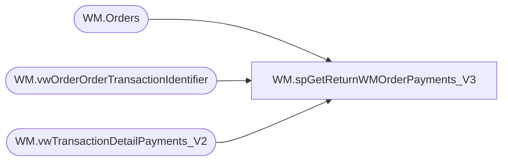

# WM.spGetReturnWMOrderPayments_V3

**Database:** WebOrderProcessing  
**Server:** bearcluster01  

## Architecture Diagram



## Table Dependencies

| Referenced Table |
|---|
| WM.Orders |
| WM.vwOrderOrderTransactionIdentifier |
| WM.vwTransactionDetailPayments_V2 |

## Stored Procedure Code

```sql
CREATE PROCEDURE [WM].[spGetReturnWMOrderPayments_V3] 

-- =============================================================================================================
-- Name: WM.spGetShippedWMOrderPayments
--
-- Description:	Get return and credit WM Orders Payments for Sales Audit Translate
--
-- Output: 
--	
-- Dependencies: 
--
-- Revision History
--		Name:			Date:			Comments:
--		Ben Barud		9/10/2017		Initial Creation
--		Ben Barud		11/08/2017		Added Logic for Amazon/ChannelAdvisor
--		Ben Barud		11/15/2017		Updated Logic for Amazon/ChannelAdvisor for Deck integration
-- =============================================================================================================

AS
BEGIN
	-- SET NOCOUNT ON added to prevent extra result sets from
	-- interfering with SELECT statements.
	SET NOCOUNT ON;
	WITH OrderNumberPickupStore(OrderNumber, TransactionID, PickupStore)
	AS
	(
	SELECT MAX(o.OrderNum) AS OrderNumber
	      ,td.TransactionID
		  ,v.PickupStore
    FROM [WebOrderProcessing].[WM].[vwTransactionDetailPayments_V2] td
	INNER JOIN [WebOrderProcessing].[WM].[vwOrderOrderTransactionIdentifier] v ON td.TransactionID = v.TransactionID AND td.OrderTransactionIdentifier = v.OrderTransactionIdentifier
	INNER JOIN [WebOrderProcessing].[WM].[Orders] o ON v.TransactionID = o.TransactionID AND v.PickupStore = o.PickupStore AND OrderStatus IN ('Complete', 'Shipped', 'StorePickedForPickup')
	GROUP BY td.TransactionID, v.PickupStore
	)
	SELECT DISTINCT MAX(onps.[OrderNumber]) AS 'OrderNumber'
		--,td.TransactionID
		,v.[OrderTransactionIdentifier] AS 'PaymentID'
		,CASE
		WHEN MAX([PaymentType]) = 'GiftCard' THEN 'GiftCard'
		WHEN MAX([PaymentType]) = 'PayPal' THEN 'PayPal'
		WHEN MAX([PaymentType]) = 'Amazon' THEN 'Amazon'
		WHEN MAX(td.[TransactionNum]) LIKE 'C%' THEN 'Amazon'
		WHEN MAX([PaymentType]) = 'Cash' THEN 'StoreCredit'
		ELSE 'CreditCard'
		END AS 'PaymentMethod'
		,MAX([PaymentTransactionType]) AS 'PaymentTransactionType'
		,MAX([CurrencyMultiplier]) AS 'CurrencyMultiplier'
		,MAX([TransactionAmount]) AS 'PaymentAmount'
		,MAX(TransactionGeneric1) AS 'PaymentAuthCode'
		,MAX(TransactionGeneric1) AS 'PaymentNum'
		,CASE
			WHEN MAX([PaymentGeneric1]) = 'Amex' THEN 'American Express'
		    ELSE MAX([PaymentGeneric1])
		END AS 'CardType'
		,MAX([PaymentGeneric2]) AS 'CreditCardNumber'
		,LEFT(RIGHT('0' + ISNULL(MAX([PaymentGeneric3]), ''), 7), 2) AS 'ExpirationMonth'
		,RIGHT(RIGHT('0' + ISNULL(MAX([PaymentGeneric3]), ''), 7), 4) AS 'ExpirationYear'
		,CASE
		    --WHEN MAX(td.TransactionNum) LIKE 'C%' THEN MAX(o.EnterpriseSellingID)
			WHEN PaymentType = 'Amazon' THEN MAX(OrderCustom3)
			ELSE MAX(TransactionGeneric1)
		END AS 'GiftCardNumber'
FROM OrderNumberPickupStore onps
INNER JOIN [WebOrderProcessing].[WM].[vwTransactionDetailPayments_V2] td ON onps.TransactionID = td.TransactionID
INNER JOIN [WebOrderProcessing].[WM].[vwOrderOrderTransactionIdentifier] v ON td.TransactionID = v.TransactionID AND td.OrderTransactionIdentifier = v.OrderTransactionIdentifier
--INNER JOIN [WebOrderProcessing].[WM].[Orders] o ON td.TransactionID = o.TransactionID AND onps.OrderNumber = o.OrderNum
--WHERE PaymentTransactionType IN ('return', 'credit')
WHERE PaymentTransactionType IN ('return')
GROUP BY v.PickupStore, td.TransactionID, PaymentType, v.OrderTransactionIdentifier
	
END
```

