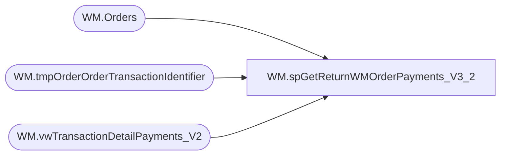

# WM.spGetReturnWMOrderPayments_V3_2

**Database:** WebOrderProcessing  
**Server:** bearcluster01  

## Architecture Diagram



## Table Dependencies

| Referenced Table |
|---|
| WM.Orders |
| WM.tmpOrderOrderTransactionIdentifier |
| WM.vwTransactionDetailPayments_V2 |

## Stored Procedure Code

```sql
CREATE PROCEDURE [WM].[spGetReturnWMOrderPayments_V3_2] 

-- =============================================================================================================
-- Name: WM.spGetShippedWMOrderPayments
--
-- Description:	Get return and credit WM Orders Payments for Sales Audit Translate
--
-- Output: 
--	
-- Dependencies: 
--
-- Revision History
--		Name:			Date:			Comments:
--		Ben Barud		9/10/2017		Initial Creation
--		Ben Barud		11/08/2017		Added Logic for Amazon/ChannelAdvisor
--		Ben Barud		11/15/2017		Updated Logic for Amazon/ChannelAdvisor for Deck integration
-- =============================================================================================================

AS
BEGIN
	-- SET NOCOUNT ON added to prevent extra result sets from
	-- interfering with SELECT statements.
	SET NOCOUNT ON;
	
	SELECT DISTINCT MAX(v.[OrderNumber]) AS 'OrderNumber'
		--,td.TransactionID
		,v.[OrderTransactionIdentifier] AS 'PaymentID'
		,CASE
			WHEN o.OrderType = 'CC' THEN 'Costco'
			WHEN MAX(PaymentGeneric1) LIKE '%Facebook%' THEN 'Facebook'
			WHEN MAX(PaymentGeneric1) LIKE '%Instagram%' THEN 'Facebook'
			WHEN MAX([PaymentType]) = 'GiftCard' THEN 'GiftCard'
			WHEN MAX([PaymentType]) = 'Adyen_GiftCard' THEN 'GiftCard'
			WHEN MAX([PaymentType]) LIKE '%PayPal%' THEN 'PayPal'
			WHEN [PaymentType] = 'Klarna' THEN 'Klarna'
			WHEN [PaymentType] = 'Adyen_Klarna' THEN 'Klarna'
			WHEN MAX([PaymentType]) = 'Amazon' THEN 'Amazon'
			WHEN MAX(td.[TransactionNum]) LIKE 'C%' THEN 'Amazon'
			WHEN MAX([PaymentType]) = 'Cash' THEN 'StoreCredit'
			ELSE 'CreditCard'
		END AS 'PaymentMethod'
		,MAX([PaymentTransactionType]) AS 'PaymentTransactionType'
		,MAX([CurrencyMultiplier]) AS 'CurrencyMultiplier'
		,MAX([TransactionAmount]) AS 'PaymentAmount'
		,MAX(TransactionGeneric1) AS 'PaymentAuthCode'
		,MAX(TransactionGeneric1) AS 'PaymentNum'
		,CASE
			WHEN MAX([PaymentGeneric1]) = 'Amex' THEN 'American Express'
		    ELSE MAX([PaymentGeneric1])
		END AS 'CardType'
		,CASE
			WHEN MAX([PaymentGeneric2]) = 'null' THEN '0000'
			ELSE MAX([PaymentGeneric2])
		END AS 'CreditCardNumber'
		,LEFT(RIGHT('0' + ISNULL(MAX([PaymentGeneric3]), ''), 7), 2) AS 'ExpirationMonth'
		,RIGHT(RIGHT('0' + ISNULL(MAX([PaymentGeneric3]), ''), 7), 4) AS 'ExpirationYear'
		,CASE
		    --WHEN MAX(td.TransactionNum) LIKE 'C%' THEN MAX(o.EnterpriseSellingID)
			WHEN o.OrderType = 'CC' THEN o.EnterpriseSellingID
			WHEN PaymentType = 'Amazon' THEN MAX(OrderCustom3)
			WHEN  MAX(TransactionGeneric1) = 'undefined' THEN '0000000000000000'
			ELSE MAX(TransactionGeneric1)
		END AS 'GiftCardNumber'
		,CASE
	      WHEN [Processor] LIKE 'Adyen%' THEN 'Cybersource'
		  ELSE [Processor]
	     END AS 'PaymentProcessor'
FROM [WebOrderProcessing].[WM].[vwTransactionDetailPayments_V2] td 
INNER JOIN [WebOrderProcessing].[WM].[tmpOrderOrderTransactionIdentifier] v ON td.TransactionID = v.TransactionID AND td.OrderTransactionIdentifier = v.OrderTransactionIdentifier
INNER JOIN [WebOrderProcessing].[WM].[Orders] o ON td.TransactionID = o.TransactionID AND o.OrderId = v.OrderId
--WHERE PaymentTransactionType IN ('return', 'credit')
WHERE PaymentTransactionType IN ('return')
GROUP BY v.PickupStore, td.TransactionID, PaymentType, v.OrderTransactionIdentifier, o.OrderType, o.EnterpriseSellingID, Processor 
	
END
```

