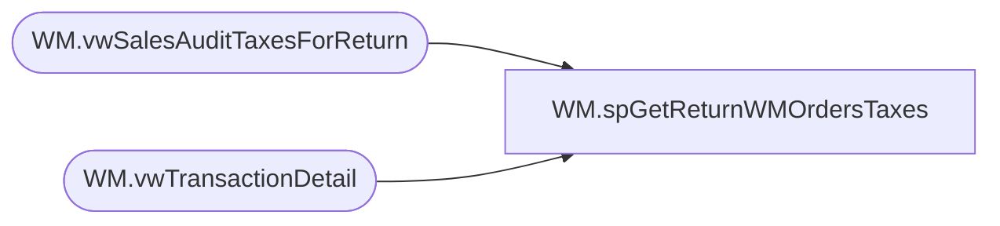

# WM.spGetReturnWMOrdersTaxes

**Database:** WebOrderProcessing  
**Server:** bearcluster01  

## Architecture Diagram



## Table Dependencies

| Referenced Table |
|---|
| WM.vwSalesAuditTaxesForReturn |
| WM.vwTransactionDetail |

## Stored Procedure Code

```sql
CREATE PROCEDURE [WM].[spGetReturnWMOrdersTaxes]

-- =============================================================================================================
-- Name: spGetShippedWMOrdersTaxes
--
-- Description:	Get Shipped WM Orders Taxes for Sales Audit Translate
--
-- Output: 
--	
-- Dependencies: 
--
-- Revision History
--		Name:			Date:			Comments:
--		Ben Barud		9/10/2017		Initial Creation
--		Ben Barud		10/16/2017		Added Canada Non-Taxable States to TaxJurisdiction exclusions
--		Ben Barud		10/25/2017		If tax is 0.0, exclude.
--		Ben Barud		10/25/2017		APO Tax Jurisdictions are coming in as AP.  Added case to change AP to APO.
-- =============================================================================================================

AS
BEGIN
	-- SET NOCOUNT ON added to prevent extra result sets from
	-- interfering with SELECT statements.
	SET NOCOUNT ON;

	SELECT DISTINCT c.[OrderNumber]
	      ,p.[OrderTransactionIdentifier]
          ,p.[PreviousTaxAmount] AS 'TaxAmount'
          ,CASE
		    WHEN [TaxJurisdiction] = 'AP' THEN 'APO'
			ELSE [TaxJurisdiction]
		   END AS 'TaxJurisdiction'
          ,[TaxAuthority]
          ,[TaxType]
		  ,p.[CurrencyMultiplier] 
	FROM [WebOrderProcessing].[WM].vwTransactionDetail c
	LEFT JOIN [WebOrderProcessing].[WM].vwSalesAuditTaxesForReturn p ON p.TransactionID = c.TransactionID AND p.OrderTransactionIdentifier = c.OrderTransactionIdentifier
	--INNER JOIN [WebOrderProcessing].[WM].[Transactions] t ON v.TransactionID = t.TransactionID
	WHERE TaxAmount IS NOT NULL AND TaxJurisdiction NOT IN ('AT', 'BE', 'BG', 'HR', 'CY', 'CZ', 'DK', 'EE', 'FI', 'FR', 'DE', 'EL', 'HU', 'IE', 'IT', 'LV', 'LT', 'LU', 'MT', 'NL', 'PL', 'PT', 'RO', 'SK', 'SI', 'ES', 'SE', 'GB', 'UK', 'AB', 'BC', 'MB', 'NB', 'NS', 'NT', 'ON', 'QC', 'SK', 'NO')
	AND PreviousTaxAmount <> 0.00
	--WHERE TaxAmount IS NOT NULL AND TaxJurisdiction NOT IN ('GB', 'IE', 'DK', 'SE', 'DE', 'BE', 'FR', 'LU', 'NL', 'NO', 'UK', 'IT')
	--WHERE TaxJurisdiction NOT IN ('GB', 'IE', 'DK', 'SE') AND c.PaymentTransactionType IN ('Return')

	/*OLD LOGIC
    SELECT svs.[TransactionNum]
          ,[TaxAmount]
          ,[TaxJurisdiction]
          ,[TaxAuthority]
          ,[TaxType] 
	FROM [WebOrderProcessing].[WM].[Transactions] t
    LEFT JOIN [WebOrderProcessing].[WM].[vwTransactionsShipments_vs_Shipped] svs ON t.TransactionID = svs.TransactionID
    WHERE svs.ShipmentsCount = svs.ShippedCount
	*/
END
```

