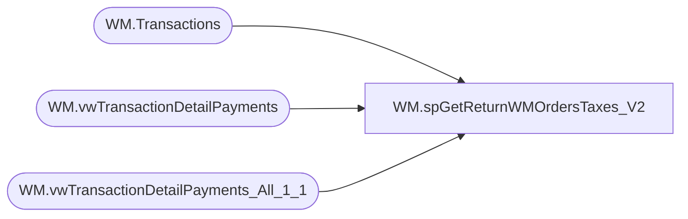

# WM.spGetReturnWMOrdersTaxes_V2

**Database:** WebOrderProcessing  
**Server:** bearcluster01  

## Architecture Diagram



## Table Dependencies

| Referenced Table |
|---|
| WM.Transactions |
| WM.vwTransactionDetailPayments |
| WM.vwTransactionDetailPayments_All_1_1 |

## Stored Procedure Code

```sql
CREATE PROCEDURE [WM].[spGetReturnWMOrdersTaxes_V2]

-- =============================================================================================================
-- Name: spGetShippedWMOrdersTaxes
--
-- Description:	Get Shipped WM Orders Taxes for Sales Audit Translate
--
-- Output: 
--	
-- Dependencies: 
--
-- Revision History
--		Name:			Date:			Comments:
--		Ben Barud		9/10/2017		Initial Creation
--		Ben Barud		10/16/2017		Added Canada Non-Taxable States to TaxJurisdiction exclusions
--		Ben Barud		10/25/2017		If tax is 0.0, exclude.
--		Ben Barud		10/25/2017		APO Tax Jurisdictions are coming in as AP.  Added case to change AP to APO.
--		Ben Barud		02/20/2018		No longer using vwSalesAuditTaxesForReturn_V2.  It would error out when joining
--									    to find orders with previous transactions.  Selecting everything into a temp
--										table and creating the view using CTE's
-- =============================================================================================================

AS
BEGIN
	-- SET NOCOUNT ON added to prevent extra result sets from
	-- interfering with SELECT statements.
	SET NOCOUNT ON;

	SELECT [TansactionDetailID]
      ,[TransactionNum]
      ,[OrderNumber]
      ,[TransactionID]
      ,[OrderTransactionIdentifier]
      ,[TransactionDate]
      ,[SubTotal]
      ,[Shipping]
      ,[ProcessingFee]
      ,[Tax]
      ,[TotalCharges]
      ,[PaymentTransactionType]
      ,[PaymentType]
      ,[TransactionAmount]
      ,[OrderDiscount]
      ,[ItemDiscount]
      ,[InvoiceAmount]
      ,[InvoiceBillTo]
      ,[InvoiceNumber]
      ,[InvoiceDate]
      ,[Processor]
      ,[CurrencyMultiplier]
      ,[PaymentGeneric1]
      ,[PaymentGeneric2]
      ,[PaymentGeneric3]
      ,[PaymentGeneric4]
      ,[PaymentGeneric5]
      ,[TransactionGeneric1]
      ,[TransactionGeneric2]
      ,[TransactionGeneric3]
      ,[TransactionGeneric4]
      ,[TransactionGeneric5]
      ,[BillToFName]
      ,[BillToLName]
      ,[BillToAddress1]
      ,[BillToAddress2]
      ,[BillToCity]
      ,[BillToState]
      ,[BillToPostalCode]
      ,[BillToCountry]
      ,[BillToEmail]
      ,[BillToPhone]
      ,[ShipToFName]
      ,[ShipToLName]
      ,[ShipToAddress1]
      ,[ShipToAddress2]
      ,[ShipToCity]
      ,[ShipToState]
      ,[ShipToPostalCode]
      ,[ShipToCountry]
      ,[ShipToEmail]
      ,[ShipToPhone]
      ,[OrderCustom1]
      ,[OrderCustom2]
      ,[OrderCustom3]
      ,[OrderCustom4]
      ,[OrderCustom5]
      ,[isSAProcessed]
      ,[OrderItemCount]
	  INTO #tmpTransactionDetailPayments_All_1_1
  FROM [WebOrderProcessing].[WM].[vwTransactionDetailPayments_All_1_1];

  WITH WMOrdersWithPrevTrans (
	TransactionID
   ,OrderTransactionIdentifier
   ,PreviousOrderTransactionIdentifier
  )
  AS
  (
  SELECT td.[TransactionID]
		,td.OrderTransactionIdentifier AS 'OrderTransactionIdentifier'
		,MAX(ptd.OrderTransactionIdentifier) AS 'PreviousOrderTransactionIdentifier'
  FROM #tmpTransactionDetailPayments_All_1_1 td
  LEFT JOIN #tmpTransactionDetailPayments_All_1_1 ptd ON td.TransactionID = ptd.TransactionID AND ptd.OrderTransactionIdentifier < td.OrderTransactionIdentifier
  LEFT JOIN [WebOrderProcessing].[WM].[Transactions]	t ON td.TransactionID = t.TransactionID
  WHERE ptd.OrderTransactionIdentifier IS NOT NULL
  --WHERE ptd.TansactionDetailID IS NOT NULL AND td.PaymentTransactionType = 'return'
  --WHERE TransactionNum = '00041209' AND ptd.PaymentTransactionType NOT IN ('sales')
  GROUP BY td.[TransactionID], td.OrderTransactionIdentifier)
  , SalesAuditTaxesForReturn ( OrderNumber
							,TaxAmount
							,PreviousTaxAmount
							,TaxJurisdiction
							,TaxAuthority
							,TaxType
							,CurrencyMultiplier
							,PaymentTransactionType
							,TransactionID
							,OrderTransactionIdentifier
							,PreviousOrderTransactionIdentifier
  )
  AS
  (SELECT t.TransactionNum AS 'OrderNumber'
	    ,td.[Tax] AS 'TaxAmount'
		,ptd.[Tax] AS 'PreviousTaxAmount'
        ,[TaxJurisdiction]
        ,[TaxAuthority]
        ,[TaxType]
		,td.[CurrencyMultiplier]
		,td.[PaymentTransactionType]
		,t.TransactionID
		,td.OrderTransactionIdentifier AS 'OrderTransactionIdentifier'
		,ptd.OrderTransactionIdentifier AS 'PreviousOrderTransactionIdentifier'
  FROM WMOrdersWithPrevTrans cte
  LEFT JOIN #tmpTransactionDetailPayments_All_1_1 td ON td.TransactionID = cte.TransactionID AND td.OrderTransactionIdentifier = cte.OrderTransactionIdentifier
  LEFT JOIN #tmpTransactionDetailPayments_All_1_1  ptd ON ptd.TransactionID = cte.TransactionID AND ptd.OrderTransactionIdentifier = cte.PreviousOrderTransactionIdentifier
  LEFT JOIN [WebOrderProcessing].[WM].[Transactions] t ON td.TransactionID = t.TransactionID
  )

	SELECT DISTINCT c.[OrderNumber]
	      ,p.[OrderTransactionIdentifier]
          ,p.[PreviousTaxAmount] AS 'TaxAmount'
          ,CASE
		    WHEN [TaxJurisdiction] = 'AP' THEN 'APO'
			ELSE [TaxJurisdiction]
		   END AS 'TaxJurisdiction'
          ,[TaxAuthority]
          ,[TaxType]
		  ,p.[CurrencyMultiplier] 
	FROM [WebOrderProcessing].[WM].vwTransactionDetailPayments c
	LEFT JOIN SalesAuditTaxesForReturn p ON p.TransactionID = c.TransactionID AND p.OrderTransactionIdentifier = c.OrderTransactionIdentifier
	--INNER JOIN [WebOrderProcessing].[WM].[Transactions] t ON v.TransactionID = t.TransactionID
	WHERE TaxAmount IS NOT NULL AND TaxJurisdiction NOT IN ('AT', 'BE', 'BG', 'HR', 'CY', 'CZ', 'DK', 'EE', 'FI', 'FR', 'DE', 'EL', 'HU', 'IE', 'IT', 'LV', 'LT', 'LU', 'MT', 'NL', 'PL', 'PT', 'RO', 'SK', 'SI', 'ES', 'SE', 'GB', 'UK', 'AB', 'BC', 'MB', 'NB', 'NS', 'NT', 'ON', 'QC', 'SK', 'NO')
	AND PreviousTaxAmount <> 0.00


	--SELECT DISTINCT c.[OrderNumber]
	--      ,p.[OrderTransactionIdentifier]
 --         ,p.[PreviousTaxAmount] AS 'TaxAmount'
 --         ,CASE
	--	    WHEN [TaxJurisdiction] = 'AP' THEN 'APO'
	--		ELSE [TaxJurisdiction]
	--	   END AS 'TaxJurisdiction'
 --         ,[TaxAuthority]
 --         ,[TaxType]
	--	  ,p.[CurrencyMultiplier] 
	--FROM [WebOrderProcessing].[WM].vwTransactionDetail_V2 c
	--LEFT JOIN [WebOrderProcessing].[WM].vwSalesAuditTaxesForReturn_V2 p ON p.TransactionID = c.TransactionID AND p.OrderTransactionIdentifier = c.TansactionDetailID
	----INNER JOIN [WebOrderProcessing].[WM].[Transactions] t ON v.TransactionID = t.TransactionID
	--WHERE TaxAmount IS NOT NULL AND TaxJurisdiction NOT IN ('AT', 'BE', 'BG', 'HR', 'CY', 'CZ', 'DK', 'EE', 'FI', 'FR', 'DE', 'EL', 'HU', 'IE', 'IT', 'LV', 'LT', 'LU', 'MT', 'NL', 'PL', 'PT', 'RO', 'SK', 'SI', 'ES', 'SE', 'GB', 'UK', 'AB', 'BC', 'MB', 'NB', 'NS', 'NT', 'ON', 'QC', 'SK', 'NO')
	--AND PreviousTaxAmount <> 0.00


	--WHERE TaxAmount IS NOT NULL AND TaxJurisdiction NOT IN ('GB', 'IE', 'DK', 'SE', 'DE', 'BE', 'FR', 'LU', 'NL', 'NO', 'UK', 'IT')
	--WHERE TaxJurisdiction NOT IN ('GB', 'IE', 'DK', 'SE') AND c.PaymentTransactionType IN ('Return')

	/*OLD LOGIC
    SELECT svs.[TransactionNum]
          ,[TaxAmount]
          ,[TaxJurisdiction]
          ,[TaxAuthority]
          ,[TaxType] 
	FROM [WebOrderProcessing].[WM].[Transactions] t
    LEFT JOIN [WebOrderProcessing].[WM].[vwTransactionsShipments_vs_Shipped] svs ON t.TransactionID = svs.TransactionID
    WHERE svs.ShipmentsCount = svs.ShippedCount
	*/
END
```

