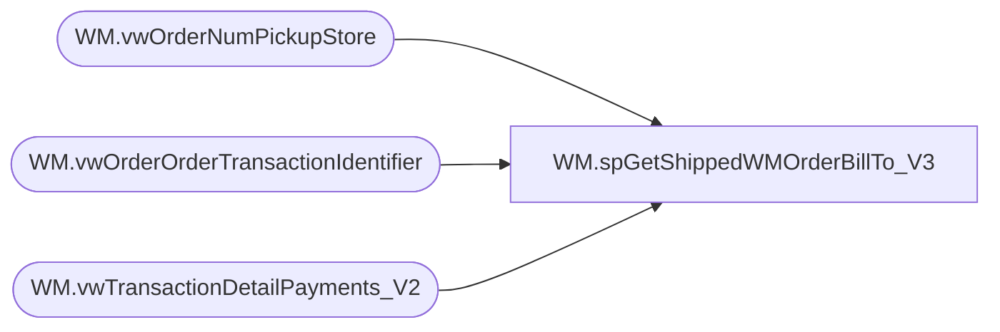

# WM.spGetShippedWMOrderBillTo_V3

**Database:** WebOrderProcessing  
**Server:** bearcluster01  

## Architecture Diagram



## Table Dependencies

| Referenced Table |
|---|
| WM.vwOrderNumPickupStore |
| WM.vwOrderOrderTransactionIdentifier |
| WM.vwTransactionDetailPayments_V2 |

## Stored Procedure Code

```sql
CREATE PROCEDURE [WM].[spGetShippedWMOrderBillTo_V3] 

-- =============================================================================================================
-- Name: WM.spGetShippedWMOrderBillTo
--
-- Description:	Get Shipped WM Orders Customer Bill To for Sales Audit Translate
--
-- Output: 
--	
-- Dependencies: 
--
-- Revision History
--		Name:			Date:			Comments:
--		Ben Barud		9/10/2017		Initial Creation
-- =============================================================================================================

AS
BEGIN
	-- SET NOCOUNT ON added to prevent extra result sets from
	-- interfering with SELECT statements.
	SET NOCOUNT ON;

	SELECT MAX(onps.[OrderNumber]) AS 'OrderNumber'
	      ,td.[TransactionID]
          ,MAX([BillToFName]) AS 'BillToFName'
          ,MAX([BillToLName]) AS 'BillToLName'
          ,MAX([BillToAddress1]) AS 'BillToAddress1'
          ,ISNULL(MAX([BillToAddress2]), '') AS 'BillToAddress2'
          ,MAX([BillToCity]) AS 'BillToCity'
          ,MAX([BillToState]) AS 'BillToState'
          ,MAX([BillToPostalCode]) AS 'BillToPostalCode'
          ,MAX([BillToCountry]) AS 'BillToCountry'
          ,MAX([BillToPhone]) AS 'BillToPhone'
          ,MAX([BillToEmail]) AS 'BillToEmail'
	FROM [WebOrderProcessing].[WM].vwOrderNumPickupStore onps
	INNER JOIN [WebOrderProcessing].[WM].[vwTransactionDetailPayments_V2] td ON onps.TransactionID = td.TransactionID
	INNER JOIN [WebOrderProcessing].[WM].[vwOrderOrderTransactionIdentifier] v ON td.TransactionID = v.TransactionID AND td.OrderTransactionIdentifier = v.OrderTransactionIdentifier
	GROUP BY onps.PickupStore, td.TransactionID

	/*OLD LOGIC
    SELECT svs.[TransactionNum]
          ,[BillToFName]
          ,[BillToLName]
          ,[BillToAddress1]
          ,ISNULL([BillToAddress2], '') AS 'BillToAddress2'
          ,[BillToCity]
          ,[BillToState]
          ,[BillToPostalCode]
          ,[BillToCountry]
          ,[BillToPhone]
          ,[BillToEmail]
  FROM [WM].[Orders] o
  LEFT JOIN [WebOrderProcessing].[WM].[vwTransactionsShipments_vs_Shipped] svs ON o.TransactionID = svs.TransactionID
  WHERE svs.ShipmentsCount = svs.ShippedCount
  */
END
```

