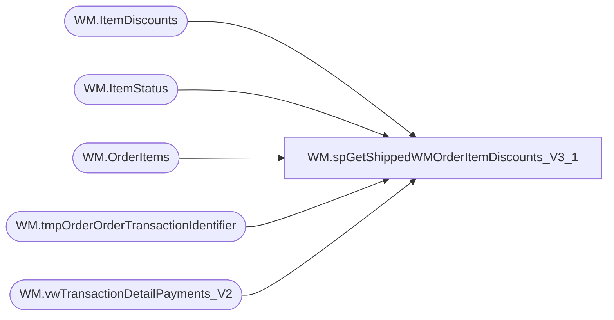

# WM.spGetShippedWMOrderItemDiscounts_V3_1

**Database:** WebOrderProcessing  
**Server:** bearcluster01  

## Architecture Diagram



## Table Dependencies

| Referenced Table |
|---|
| WM.ItemDiscounts |
| WM.ItemStatus |
| WM.OrderItems |
| WM.tmpOrderOrderTransactionIdentifier |
| WM.vwTransactionDetailPayments_V2 |

## Stored Procedure Code

```sql
CREATE PROCEDURE [WM].[spGetShippedWMOrderItemDiscounts_V3_1] 

-- =============================================================================================================
-- Name: WM.spGetShippedWMOrderItemDiscounts
--
-- Description:	Get Shipped WM Orders Item Discounts for Sales Audit Translate
--
-- Output: 
--	
-- Dependencies: 
--
-- Revision History
--		Name:			Date:			Comments:
--		Ben Barud		09/10/2017		Initial Creation
--		Ben Barud		10/18/2017		Add logic to exlude discounts on bundle skus
-- =============================================================================================================

AS
BEGIN
	-- SET NOCOUNT ON added to prevent extra result sets from
	-- interfering with SELECT statements.
	SET NOCOUNT ON;

	--WITH OrderNumberPickupStore(OrderNumber, TransactionID, PickupStore)
	--AS
	--(
	--SELECT MAX(v.OrderNumber) AS OrderNumber
	--      ,td.TransactionID
	--	  ,PickupStore
 --   FROM [WebOrderProcessing].[WM].[vwTransactionDetailPayments_V2] td
	--INNER JOIN [WebOrderProcessing].[WM].[vwOrderOrderTransactionIdentifier] v ON td.TransactionID = v.TransactionID AND td.OrderTransactionIdentifier = v.OrderTransactionIdentifier
	--GROUP BY td.TransactionID, PickupStore
	--)
	SELECT DISTINCT o.[OrderNumber]
	      ,id.[OrderItemID]
          ,[PromoCode]
          ,[DiscountAmount]
          ,[IsOrderDiscount]
          ,[DiscountName]
		  ,v.CurrencyMultiplier
	FROM [WebOrderProcessing].[WM].[vwTransactionDetailPayments_V2] v 
	INNER JOIN [WebOrderProcessing].[WM].[tmpOrderOrderTransactionIdentifier] o ON v.TransactionID = o.TransactionID AND v.OrderTransactionIdentifier = o.OrderTransactionIdentifier
	INNER JOIN [WebOrderProcessing].[WM].[OrderItems] oi ON oi.TransactionID = v.TransactionID
	INNER JOIN [WebOrderProcessing].[WM].[ItemStatus] ist ON oi.OrderItemID = ist.OrderItemID AND v.OrderTransactionIdentifier = ist.OrderTransactionIdentifier AND [Status] NOT IN ('IN', 'RYVUpdated') --AND ist.CurrentStatus = 1
	INNER JOIN [WebOrderProcessing].[WM].[ItemDiscounts] id ON id.OrderItemID = ist.OrderItemID
	WHERE LEN(sku) <= 6 AND DiscountAmount IS NOT NULL 
	--AND ist.Status NOT IN ('IR', 'OIV', 'OIVNC')
	--AND CurrencyMultiplier = 1 
	--AND PaymentTransactionType NOT IN ('credit') 
	AND DiscountName NOT IN ('ItemManualCredit', 'OrderManualCredit')
	AND v.OmsTransactionType NOT IN ('OrderManualCredit', 'ShippingManualCredit', 'ItemManualCredit')
	--AND oi.sku NOT LIKE ('_______%')

	/*OLD LOGIC
    SELECT [TransactionNum]
	      ,id.[OrderItemID]
          ,[PromoCode]
          ,[DiscountAmount]
          ,[IsOrderDiscount]
          ,[DiscountName]
    FROM [WM].[ItemDiscounts] id
	LEFT JOIN [WM].[OrderItems] oi ON id.OrderItemID = oi.OrderItemID
	LEFT JOIN [WebOrderProcessing].[WM].[Orders] o ON oi.OrderId = o.OrderId
    LEFT JOIN [WebOrderProcessing].[WM].[vwTransactionsShipments_vs_Shipped] svs ON o.TransactionID = svs.TransactionID
    WHERE svs.ShipmentsCount = svs.ShippedCount AND DiscountAmount IS NOT NULL
	*/
END
```

