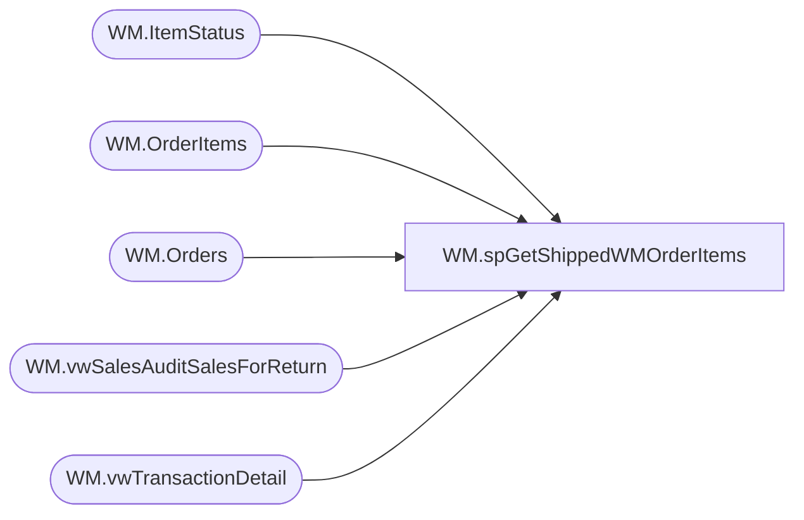

# WM.spGetShippedWMOrderItems

**Database:** WebOrderProcessing  
**Server:** bearcluster01  

## Architecture Diagram



## Table Dependencies

| Referenced Table |
|---|
| WM.ItemStatus |
| WM.OrderItems |
| WM.Orders |
| WM.vwSalesAuditSalesForReturn |
| WM.vwTransactionDetail |

## Stored Procedure Code

```sql
CREATE PROCEDURE [WM].[spGetShippedWMOrderItems] 

-- =============================================================================================================
-- Name: WM.spGetShippedWMOrderItems
--
-- Description:	Get Shipped WM Orders Items for Sales Audit Translate
--
-- Output: 
--	
-- Dependencies: 
--
-- Revision History
--		Name:			Date:			Comments:
--		Ben Barud		9/10/2017		Initial Creation
--		Ben Barud		10/11/2017		Added OMSTransactionType to OrderItemsSold to Exclude GiftCards.  For GiftCards Added CTE, Select, And Union
--		Ben Barud		11/21/2017		Removed idNum.  Not used and it was creating duplicate items in UK orders.
--		Ben Barud		11/21/2017		Cleaned up CTE OrderItemsSold.  Added ist.CurrentStatus = 1 and an exclusion for IZDT
-- =============================================================================================================

AS
BEGIN
	-- SET NOCOUNT ON added to prevent extra result sets from
	-- interfering with SELECT statements.
	SET NOCOUNT ON;
	
	WITH OrderItemsSold ([OrderItemID]
	  ,[OrderNumber]
      ,[sku]
      ,[qty]
      ,[Price]
      ,[DiscountedPrice]
	  ,[PreviousQTY]
	  ,[PreviousOriginalPrice]
	  ,[PreviousDiscountedPrice]
      ,[GuestSatisfactionRefund]
      ,[GiftCardNumber]
      ,[Note]
      ,[EmbroideryCode]
      ,[FullName]
      ,[Height]
      ,[Weight]
      ,[FurColor]
      ,[EyeColor]
      ,[BelongsTo]
      ,[StuffedBy]
      --,[idNum]
      ,[ParentItem])
	AS
	(
	SELECT DISTINCT oi.[OrderItemID]
	  ,v.[OrderNumber]
      ,[sku]
      ,ist.[qty]
      ,ist.[Price]
	  ,ist.[DiscountedPrice]
	  ,0 AS 'PreviousQTY'
	  ,0 AS 'PreviousOriginalPrice'
	  ,0 AS 'PreviousDiscountedPrice'
      ,[GuestSatisfactionRefund]
      ,[GiftCardNumber]
      ,[Note]
      ,[EmbroideryCode]
      ,[FullName]
      ,[Height]
      ,[Weight]
      ,[FurColor]
      ,[EyeColor]
      ,[BelongsTo]
      ,[StuffedBy]
      --,[idNum]
      ,[ParentItem]
	FROM [WebOrderProcessing].[WM].[vwTransactionDetail] v
	LEFT JOIN [WebOrderProcessing].[WM].[Orders] o ON v.TransactionID = o.TransactionID --AND o.ShipmentNumber = v.ShipmentNumber
	LEFT JOIN [WebOrderProcessing].[WM].[OrderItems] oi ON o.OrderId = oi.OrderId
	LEFT JOIN [WebOrderProcessing].[WM].[ItemStatus] ist ON oi.OrderItemID = ist.OrderItemID AND v.OrderTransactionIdentifier = ist.OrderTransactionIdentifier AND ist.CurrentStatus = 1
	WHERE PaymentTransactionType = 'Sales' 
	AND OmsTransactionType = 'Shipment'
	--AND ist.CurrentStatus = 1
	--AND o.ShipmentNumber = v.ShipmentNumber 
	AND ist.OrderItemID NOT IN (SELECT OrderItemID FROM [WebOrderProcessing].[WM].[ItemStatus] WHERE [Status] IN ('IV', 'IZDT'))
	--WHERE (ist.[Status] = 'shipped' OR ist.[Status] = 'IZDT') AND PaymentTransactionType = 'Sales'
	)
	,OrderItemsReturned ([OrderItemID]
	  ,[OrderNumber]
      ,[sku]
      ,[qty]
      ,[Price]
      ,[DiscountedPrice]
	  ,[PreviousQTY]
	  ,[PreviousOriginalPrice]
	  ,[PreviousDiscountedPrice]
      ,[GuestSatisfactionRefund]
      ,[GiftCardNumber]
      ,[Note]
      ,[EmbroideryCode]
      ,[FullName]
      ,[Height]
      ,[Weight]
      ,[FurColor]
      ,[EyeColor]
      ,[BelongsTo]
      ,[StuffedBy]
      --,[idNum]
      ,[ParentItem])
	AS 
	(
	SELECT DISTINCT oi.[OrderItemID]
	  ,[OrderNumber]
      ,[sku]
      ,ist.[qty]
      ,ist.[Price]
	  ,ist.[DiscountedPrice]
	  ,[PreviousQTY]
	  ,[PreviousOriginalPrice]
	  ,[PreviousDiscountedPrice]
      ,[GuestSatisfactionRefund]
      ,[GiftCardNumber]
      ,[Note]
      ,[EmbroideryCode]
      ,[FullName]
      ,[Height]
      ,[Weight]
      ,[FurColor]
      ,[EyeColor]
      ,[BelongsTo]
      ,[StuffedBy]
      --,[idNum]
      ,[ParentItem]
	FROM [WebOrderProcessing].[WM].[vwTransactionDetail] v
	LEFT JOIN [WebOrderProcessing].[WM].[OrderItems] oi ON v.TransactionID = oi.TransactionID
	LEFT JOIN [WebOrderProcessing].[WM].[ItemStatus] ist ON oi.OrderItemID = ist.OrderItemID
	WHERE ist.[Status] = 'IR' AND PaymentTransactionType = 'Return'
	)
	,OrderItemsDonation ([OrderItemID]
	  ,[OrderNumber]
      ,[sku]
      ,[qty]
      ,[Price]
      ,[DiscountedPrice]
	  ,[PreviousQTY]
	  ,[PreviousOriginalPrice]
	  ,[PreviousDiscountedPrice]
      ,[GuestSatisfactionRefund]
      ,[GiftCardNumber]
      ,[Note]
      ,[EmbroideryCode]
      ,[FullName]
      ,[Height]
      ,[Weight]
      ,[FurColor]
      ,[EyeColor]
      ,[BelongsTo]
      ,[StuffedBy]
      --,[idNum]
      ,[ParentItem])
	AS 
	(
	SELECT DISTINCT oi.[OrderItemID]
	  ,[OrderNumber]
      ,[sku]
      ,ist.[qty]
      ,ist.[Price]
	  ,ist.[DiscountedPrice]
	  ,0 'PreviousQTY'
	  ,0 'PreviousOriginalPrice'
	  ,0 'PreviousDiscountedPrice'
      ,[GuestSatisfactionRefund]
      ,[GiftCardNumber]
      ,[Note]
      ,[EmbroideryCode]
      ,[FullName]
      ,[Height]
      ,[Weight]
      ,[FurColor]
      ,[EyeColor]
      ,[BelongsTo]
      ,[StuffedBy]
      --,[idNum]
      ,[ParentItem]
	FROM [WebOrderProcessing].[WM].[vwTransactionDetail] v
	LEFT JOIN [WebOrderProcessing].[WM].[OrderItems] oi ON v.TransactionID = oi.TransactionID
	LEFT JOIN [WebOrderProcessing].[WM].[ItemStatus] ist ON oi.OrderItemID = ist.OrderItemID AND v.OrderTransactionIdentifier = ist.OrderTransactionIdentifier
	WHERE ist.[Status] = 'IZDT' AND PaymentTransactionType = 'sales'
	)
	,OrderItemsGiftCards ([OrderItemID]
	  ,[OrderNumber]
      ,[sku]
      ,[qty]
      ,[Price]
      ,[DiscountedPrice]
	  ,[PreviousQTY]
	  ,[PreviousOriginalPrice]
	  ,[PreviousDiscountedPrice]
      ,[GuestSatisfactionRefund]
      ,[GiftCardNumber]
      ,[Note]
      ,[EmbroideryCode]
      ,[FullName]
      ,[Height]
      ,[Weight]
      ,[FurColor]
      ,[EyeColor]
      ,[BelongsTo]
      ,[StuffedBy]
      --,[idNum]
      ,[ParentItem])
	AS 
	(
	SELECT DISTINCT oi.[OrderItemID]
	  ,[OrderNumber]
      ,[sku]
      ,ist.[qty]
      ,ist.[Price]
	  ,ist.[DiscountedPrice]
	  ,0 'PreviousQTY'
	  ,0 'PreviousOriginalPrice'
	  ,0 'PreviousDiscountedPrice'
      ,[GuestSatisfactionRefund]
      ,[GiftCardNumber]
      ,[Note]
      ,[EmbroideryCode]
      ,[FullName]
      ,[Height]
      ,[Weight]
      ,[FurColor]
      ,[EyeColor]
      ,[BelongsTo]
      ,[StuffedBy]
      --,[idNum]
      ,[ParentItem]
	FROM [WebOrderProcessing].[WM].[vwTransactionDetail] v
	LEFT JOIN [WebOrderProcessing].[WM].[OrderItems] oi ON v.TransactionID = oi.TransactionID
	LEFT JOIN [WebOrderProcessing].[WM].[ItemStatus] ist ON oi.OrderItemID = ist.OrderItemID AND v.OrderTransactionIdentifier = ist.OrderTransactionIdentifier
	WHERE ist.[Status] = 'IZGIFT' AND GiftCardNumber IS NOT NULL AND PaymentTransactionType = 'sales'
	)
	SELECT[OrderItemID]
	  ,[OrderNumber]
      ,[sku]
      ,[qty]
      ,[Price]
      ,[DiscountedPrice]
	  ,[PreviousQTY]
	  ,[PreviousOriginalPrice]
	  ,[PreviousDiscountedPrice]
      ,[GuestSatisfactionRefund]
      ,[GiftCardNumber]
      ,[Note]
      ,[EmbroideryCode]
      ,[FullName]
      ,[Height]
      ,[Weight]
      ,[FurColor]
      ,[EyeColor]
      ,[BelongsTo]
      ,[StuffedBy]
      --,[idNum]
      ,[ParentItem]
	FROM OrderItemsSold
	WHERE LEN(sku) <= 6 --Exclud concatenated SKU's for Bundles and Sets
	UNION
	SELECT r.[OrderItemID]
	  ,r.[OrderNumber]
      ,r.[sku]
      ,s.[qty] - r.[qty] AS 'qty'
	  ,s.[Price] - r.[Price] AS 'Price'
	  ,s.[DiscountedPrice] - r.[DiscountedPrice] AS 'DiscountedPrice'
	  ,r.[PreviousQTY]
	  ,r.[PreviousOriginalPrice]
      ,r.[PreviousDiscountedPrice]
      ,r.[GuestSatisfactionRefund]
      ,r.[GiftCardNumber]
      ,r.[Note]
      ,r.[EmbroideryCode]
      ,r.[FullName]
      ,r.[Height]
      ,r.[Weight]
      ,r.[FurColor]
      ,r.[EyeColor]
      ,r.[BelongsTo]
      ,r.[StuffedBy]
      --,r.[idNum]
      ,r.[ParentItem]
	FROM OrderItemsReturned r
	INNER JOIN [WebOrderProcessing].[WM].vwSalesAuditSalesForReturn s ON r.OrderItemID = s.OrderItemID AND r.sku = s.sku
	WHERE LEN(r.sku) <= 6 --Exclud concatenated SKU's for Bundles and Sets
	UNION
	SELECT[OrderItemID]
	  ,[OrderNumber]
      ,[sku]
      ,[qty]
      ,[Price]
      ,[DiscountedPrice]
	  ,[PreviousQTY]
	  ,[PreviousOriginalPrice]
	  ,[PreviousDiscountedPrice]
      ,[GuestSatisfactionRefund]
      ,[GiftCardNumber]
      ,[Note]
      ,[EmbroideryCode]
      ,[FullName]
      ,[Height]
      ,[Weight]
      ,[FurColor]
      ,[EyeColor]
      ,[BelongsTo]
      ,[StuffedBy]
      --,[idNum]
      ,[ParentItem]
	FROM OrderItemsDonation r
	WHERE LEN(r.sku) <= 6 --Exclud concatenated SKU's for Bundles and Sets
		UNION
	SELECT[OrderItemID]
	  ,[OrderNumber]
      ,[sku]
      ,[qty]
      ,[Price]
      ,[DiscountedPrice]
	  ,[PreviousQTY]
	  ,[PreviousOriginalPrice]
	  ,[PreviousDiscountedPrice]
      ,[GuestSatisfactionRefund]
      ,[GiftCardNumber]
      ,[Note]
      ,[EmbroideryCode]
      ,[FullName]
      ,[Height]
      ,[Weight]
      ,[FurColor]
      ,[EyeColor]
      ,[BelongsTo]
      ,[StuffedBy]
      --,[idNum]
      ,[ParentItem]
	FROM OrderItemsGiftCards r
	WHERE LEN(r.sku) <= 6 --Exclud concatenated SKU's for Bundles and Sets

	/*OLD LOGIC
	WITH OrderItemsSold ([OrderItemID]
	  ,[OrderNumber]
      ,[sku]
      ,[qty]
      ,[Price]
      ,[DiscountedPrice]
	  ,[PreviousQTY]
	  ,[PreviousOriginalPrice]
	  ,[PreviousDiscountedPrice]
      ,[GuestSatisfactionRefund]
      ,[GiftCardNumber]
      ,[Note]
      ,[EmbroideryCode]
      ,[FullName]
      ,[Height]
      ,[Weight]
      ,[FurColor]
      ,[EyeColor]
      ,[BelongsTo]
      ,[StuffedBy]
      ,[idNum]
      ,[ParentItem])
	AS
	(
	SELECT DISTINCT oi.[OrderItemID]
	  ,[OrderNumber]
      ,[sku]
      ,[qty]
      ,[Price]
	  ,[PreviousQTY]
	  ,[PreviousOriginalPrice]
	  ,[PreviousDiscountedPrice]
      ,[DiscountedPrice]
      ,[GuestSatisfactionRefund]
      ,[GiftCardNumber]
      ,[Note]
      ,[EmbroideryCode]
      ,[FullName]
      ,[Height]
      ,[Weight]
      ,[FurColor]
      ,[EyeColor]
      ,[BelongsTo]
      ,[StuffedBy]
      ,[idNum]
      ,[ParentItem]
	FROM [WebOrderProcessing].[WM].[vwTransactionDetail] v
	LEFT JOIN [WebOrderProcessing].[WM].[OrderItems] oi ON v.TransactionID = oi.TransactionID
	LEFT JOIN [WebOrderProcessing].[WM].[ItemStatus] ist ON oi.OrderItemID = ist.OrderItemID
	--WHERE ist.[Status] = 'IWVP' AND PaymentTransactionType = 'Sales'
	WHERE (ist.[Status] = 'shipped' OR ist.[Status] = 'IZDT') AND PaymentTransactionType = 'Sales'
	)
	,OrderItemsReturned ([OrderItemID]
	  ,[OrderNumber]
      ,[sku]
      ,[qty]
      ,[Price]
      ,[DiscountedPrice]
	  ,[PreviousQTY]
	  ,[PreviousOriginalPrice]
	  ,[PreviousDiscountedPrice]
      ,[GuestSatisfactionRefund]
      ,[GiftCardNumber]
      ,[Note]
      ,[EmbroideryCode]
      ,[FullName]
      ,[Height]
      ,[Weight]
      ,[FurColor]
      ,[EyeColor]
      ,[BelongsTo]
      ,[StuffedBy]
      ,[idNum]
      ,[ParentItem])
	AS 
	(
	SELECT DISTINCT oi.[OrderItemID]
	  ,[OrderNumber]
      ,[sku]
      ,[qty]
      ,[Price]
	  ,[PreviousQTY]
	  ,[PreviousOriginalPrice]
	  ,[PreviousDiscountedPrice]
      ,[DiscountedPrice]
      ,[GuestSatisfactionRefund]
      ,[GiftCardNumber]
      ,[Note]
      ,[EmbroideryCode]
      ,[FullName]
      ,[Height]
      ,[Weight]
      ,[FurColor]
      ,[EyeColor]
      ,[BelongsTo]
      ,[StuffedBy]
      ,[idNum]
      ,[ParentItem]
	FROM [WebOrderProcessing].[WM].[vwTransactionDetail] v
	LEFT JOIN [WebOrderProcessing].[WM].[OrderItems] oi ON v.TransactionID = oi.TransactionID
	LEFT JOIN [WebOrderProcessing].[WM].[ItemStatus] ist ON oi.OrderItemID = ist.OrderItemID
	WHERE ist.[Status] = 'IR' AND PaymentTransactionType = 'Return'
	)
	SELECT[OrderItemID]
	  ,[OrderNumber]
      ,[sku]
      ,[qty]
      ,[Price]
      ,[DiscountedPrice]
	  ,[PreviousQTY]
	  ,[PreviousOriginalPrice]
	  ,[PreviousDiscountedPrice]
      ,[GuestSatisfactionRefund]
      ,[GiftCardNumber]
      ,[Note]
      ,[EmbroideryCode]
      ,[FullName]
      ,[Height]
      ,[Weight]
      ,[FurColor]
      ,[EyeColor]
      ,[BelongsTo]
      ,[StuffedBy]
      ,[idNum]
      ,[ParentItem]
	FROM OrderItemsSold
	WHERE LEN(sku) <= 6 --Exclud concatenated SKU's for Bundles and Sets
	UNION
	SELECT r.[OrderItemID]
	  ,r.[OrderNumber]
      ,r.[sku]
      ,s.[qty] - r.[qty] AS 'qty'
	  ,s.[Price] - r.[Price] AS 'Price'
	  ,s.[DiscountedPrice] - r.[DiscountedPrice] AS 'DiscountedPrice'
	  ,r.[PreviousQTY]
	  ,r.[PreviousOriginalPrice]
      ,r.[PreviousDiscountedPrice]
      ,r.[GuestSatisfactionRefund]
      ,r.[GiftCardNumber]
      ,r.[Note]
      ,r.[EmbroideryCode]
      ,r.[FullName]
      ,r.[Height]
      ,r.[Weight]
      ,r.[FurColor]
      ,r.[EyeColor]
      ,r.[BelongsTo]
      ,r.[StuffedBy]
      ,r.[idNum]
      ,r.[ParentItem]
	FROM OrderItemsReturned r
	LEFT JOIN OrderItemsSold s ON r.OrderItemID = s.OrderItemID AND r.sku = s.sku
	WHERE LEN(r.sku) <= 6 --Exclud concatenated SKU's for Bundles and Sets
	*/

	/*
	SELECT [OrderItemID]
	  ,[TransactionNum]
      ,[sku]
      ,[qty]
      ,[Price]
      ,[DiscountedPrice]
      ,[PreviousQTY]
      ,[PreviousOriginalPrice]
      ,[PreviousDiscountedPrice]
      ,[GuestSatisfactionRefund]
      ,[GiftCardNumber]
      ,[Note]
      ,[EmbroideryCode]
      ,[FullName]
      ,[Height]
      ,[Weight]
      ,[FurColor]
      ,[EyeColor]
      ,[BelongsTo]
      ,[StuffedBy]
      ,[idNum]
      ,[ParentItem]
	FROM [WebOrderProcessing].[WM].[vwTransactionDetail] v
	LEFT JOIN [WebOrderProcessing].[WM].[OrderItems] oi ON v.TransactionID = oi.TransactionID
	*/

	/*OLD LOGIC
    SELECT [OrderItemID]
	  ,[TransactionNum]
      ,[sku]
      ,[qty]
      ,[Price]
      ,[DiscountedPrice]
      ,[PreviousQTY]
      ,[PreviousOriginalPrice]
      ,[PreviousDiscountedPrice]
      ,[GuestSatisfactionRefund]
      ,[GiftCardNumber]
      ,[Note]
      ,[EmbroideryCode]
      ,[FullName]
      ,[Height]
      ,[Weight]
      ,[FurColor]
      ,[EyeColor]
      ,[BelongsTo]
      ,[StuffedBy]
      ,[idNum]
      ,[ParentItem]
    FROM [WM].[OrderItems] oi
	LEFT JOIN [WebOrderProcessing].[WM].[Orders] o ON oi.OrderId = o.OrderId
    LEFT JOIN [WebOrderProcessing].[WM].[vwTransactionsShipments_vs_Shipped] svs ON o.TransactionID = svs.TransactionID
    WHERE svs.ShipmentsCount = svs.ShippedCount
	*/
END
```

