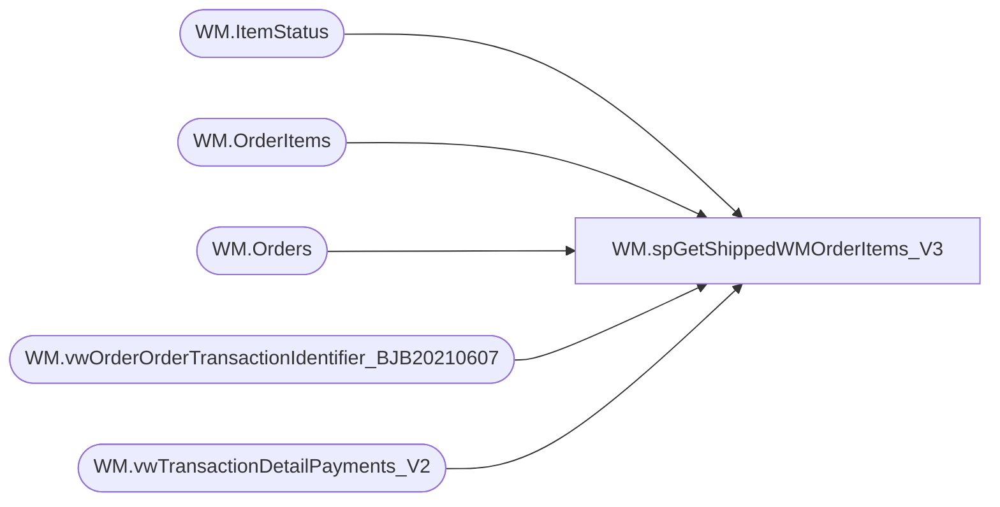

# WM.spGetShippedWMOrderItems_V3

**Database:** WebOrderProcessing  
**Server:** bearcluster01  

## Architecture Diagram



## Table Dependencies

| Referenced Table |
|---|
| WM.ItemStatus |
| WM.OrderItems |
| WM.Orders |
| WM.vwOrderOrderTransactionIdentifier_BJB20210607 |
| WM.vwTransactionDetailPayments_V2 |

## Stored Procedure Code

```sql
CREATE PROCEDURE [WM].[spGetShippedWMOrderItems_V3] 

-- =============================================================================================================
-- Name: WM.spGetShippedWMOrderItems
--
-- Description:	Get Shipped WM Orders Items for Sales Audit Translate
--
-- Output: 
--	
-- Dependencies: 
--
-- Revision History
--		Name:			Date:			Comments:
--		Ben Barud		9/10/2017		Initial Creation
--		Ben Barud		10/11/2017		Added OMSTransactionType to OrderItemsSold to Exclude GiftCards.  For GiftCards Added CTE, Select, And Union
--		Ben Barud		11/21/2017		Removed idNum.  Not used and it was creating duplicate items in UK orders.
--		Ben Barud		11/21/2017		Cleaned up CTE OrderItemsSold.  Added ist.CurrentStatus = 1 and an exclusion for IZDT
-- =============================================================================================================

AS
BEGIN
	-- SET NOCOUNT ON added to prevent extra result sets from
	-- interfering with SELECT statements.
	SET NOCOUNT ON;
	
	WITH OrderNumberPickupStore(OrderNumber, TransactionID, PickupStore, OrderTransactionIdentifier)
	AS
	(
	SELECT MAX(o.OrderNum) AS OrderNumber
	      ,td.TransactionID
		  ,v.PickupStore
		  ,td.OrderTransactionIdentifier
    FROM [WebOrderProcessing].[WM].[vwTransactionDetailPayments_V2] td
	INNER JOIN [WebOrderProcessing].[WM].[vwOrderOrderTransactionIdentifier_BJB20210607] v ON td.TransactionID = v.TransactionID AND td.OrderTransactionIdentifier = v.OrderTransactionIdentifier
	INNER JOIN [WebOrderProcessing].[WM].[Orders] o ON v.TransactionID = o.TransactionID AND v.PickupStore = o.PickupStore AND OrderStatus IN ('Complete', 'Shipped', 'StorePickedForPickup')
	GROUP BY td.TransactionID, v.PickupStore, td.OrderTransactionIdentifier
	), saleItems(OrderItemId, OrderNumber, sku, qty, Price, DiscountedPrice, PreviousQTY, PreviousOriginalPrice, PreviousDiscountedPrice, GuestSatisfactionRefund, GiftCardNumber, Note, [EmbroideryCode], [FullName], [Height], [Weight], [FurColor], [EyeColor], [BelongsTo], [StuffedBy],[ParentItem])
	AS
	(	
	SELECT DISTINCT ist.[OrderItemID]
	  ,onps.[OrderNumber]
      ,[sku]
      ,CASE
	    WHEN PaymentTransactionType = 'Return' THEN 0
	    ELSE ist.[qty]
	   END AS 'qty'
      ,CASE
	    WHEN PaymentTransactionType = 'Return' THEN 0
		ELSE ist.[Price]
	   END AS 'Price'
      ,CASE
	    WHEN PaymentTransactionType = 'Return' THEN 0
		ELSE ist.[DiscountedPrice]
	   END AS 'DiscountedPrice'
	  ,CASE
	    WHEN PaymentTransactionType IN ('Sales', 'Credit')  THEN 0
		ELSE [PreviousQTY]
	   END AS 'PreviousQTY'
	  ,CASE
	    WHEN PaymentTransactionType IN ('Sales', 'Credit')  THEN 0
		ELSE [PreviousOriginalPrice]
	   END AS 'PreviousOriginalPrice'
	  ,CASE
	    WHEN PaymentTransactionType IN ('Sales', 'Credit')  THEN 0
		ELSE [PreviousDiscountedPrice]
	   END 'PreviousDiscountedPrice'
      ,[GuestSatisfactionRefund]
      ,[GiftCardNumber]
      ,[Note]
      ,[EmbroideryCode]
      ,[FullName]
      ,[Height]
      ,[Weight]
      ,[FurColor]
      ,[EyeColor]
      ,[BelongsTo]
      ,[StuffedBy]
      --,[idNum]
      ,[ParentItem]
    FROM OrderNumberPickupStore onps
	INNER JOIN [WebOrderProcessing].[WM].[vwTransactionDetailPayments_V2] v ON onps.TransactionID = v.TransactionID AND onps.OrderTransactionIdentifier = v.OrderTransactionIdentifier AND PaymentTransactionType NOT IN ('credit')
	--INNER JOIN vwOrders o ON v.TransactionID = o.TransactionID AND v.ShipmentNumber = o.shipmentNumber
	INNER JOIN [WebOrderProcessing].[WM].[OrderItems] oi ON v.TransactionID = oi.TransactionID --.OrderId = oi.OrderId
	INNER JOIN [WebOrderProcessing].[WM].[ItemStatus] ist ON oi.OrderItemID = ist.OrderItemID AND v.OrderTransactionIdentifier = ist.OrderTransactionIdentifier --AND ist.CurrentStatus = 1 
	--AND [Status] NOT IN ('IN', 'RYVUpdated', 'IWVP')
	AND [Status] NOT IN ('IN', 'RYVUpdated')
	WHERE LEN(sku) <= 6
	), cancelItems(OrderItemId, OrderNumber, sku, qty, Price, DiscountedPrice, PreviousQTY, PreviousOriginalPrice, PreviousDiscountedPrice, GuestSatisfactionRefund, GiftCardNumber, Note, [EmbroideryCode], [FullName], [Height], [Weight], [FurColor], [EyeColor], [BelongsTo], [StuffedBy],[ParentItem])
	AS
	(	
	SELECT DISTINCT ist.[OrderItemID]
	  ,onps.[OrderNumber]
      ,[sku]
      ,CASE
	    WHEN PaymentTransactionType = 'Return' THEN 0
	    ELSE ist.[qty]
	   END AS 'qty'
      ,CASE
	    WHEN PaymentTransactionType = 'Return' THEN 0
		ELSE ist.[Price]
	   END AS 'Price'
      ,CASE
	    WHEN PaymentTransactionType = 'Return' THEN 0
		ELSE ist.[DiscountedPrice]
	   END AS 'DiscountedPrice'
	  ,CASE
	    WHEN PaymentTransactionType IN ('Sales', 'Credit')  THEN 0
		ELSE [PreviousQTY]
	   END AS 'PreviousQTY'
	  ,CASE
	    WHEN PaymentTransactionType IN ('Sales', 'Credit')  THEN 0
		ELSE [PreviousOriginalPrice]
	   END AS 'PreviousOriginalPrice'
	  ,CASE
	    WHEN PaymentTransactionType IN ('Sales', 'Credit')  THEN 0
		ELSE [PreviousDiscountedPrice]
	   END 'PreviousDiscountedPrice'
      ,[GuestSatisfactionRefund]
      ,[GiftCardNumber]
      ,[Note]
      ,[EmbroideryCode]
      ,[FullName]
      ,[Height]
      ,[Weight]
      ,[FurColor]
      ,[EyeColor]
      ,[BelongsTo]
      ,[StuffedBy]
      --,[idNum]
      ,[ParentItem]
    FROM OrderNumberPickupStore onps
	INNER JOIN [WebOrderProcessing].[WM].[vwTransactionDetailPayments_V2] v ON onps.TransactionID = v.TransactionID --AND onps.OrderTransactionIdentifier = v.OrderTransactionIdentifier AND PaymentTransactionType NOT IN ('credit')
	--INNER JOIN vwOrders o ON v.TransactionID = o.TransactionID AND v.ShipmentNumber = o.shipmentNumber
	INNER JOIN [WebOrderProcessing].[WM].[OrderItems] oi ON v.TransactionID = oi.TransactionID --.OrderId = oi.OrderId
	INNER JOIN [WebOrderProcessing].[WM].[ItemStatus] ist ON oi.OrderItemID = ist.OrderItemID --AND v.OrderTransactionIdentifier = ist.OrderTransactionIdentifier --AND ist.CurrentStatus = 1 
	--AND [Status] NOT IN ('IN', 'RYVUpdated', 'IWVP')
	AND [Status] IN ('IV')
	WHERE LEN(sku) <= 6
	)
	SELECT OrderItemId
	      ,MAX(OrderNumber) AS 'OrderNumber'
		  ,sku
		  ,qty
		  ,Price
		  ,DiscountedPrice
		  ,PreviousQTY
		  ,PreviousOriginalPrice
		  ,PreviousDiscountedPrice
		  ,GuestSatisfactionRefund
		  ,GiftCardNumber
		  ,Note
		  ,[EmbroideryCode]
		  ,[FullName]
		  ,[Height]
		  ,[Weight]
		  ,[FurColor]
		  ,[EyeColor]
		  ,[BelongsTo]
		  ,[StuffedBy]
		  ,[ParentItem]
	FROM saleItems
	GROUP BY OrderItemId, sku, qty, Price, DiscountedPrice, PreviousQTY, PreviousOriginalPrice, PreviousDiscountedPrice, GuestSatisfactionRefund, GiftCardNumber, Note, [EmbroideryCode], [FullName], [Height], [Weight], [FurColor], [EyeColor], [BelongsTo], [StuffedBy],[ParentItem]
	EXCEPT
	SELECT OrderItemId
	      ,MAX(OrderNumber) AS 'OrderNumber'
		  ,sku
		  ,qty
		  ,Price
		  ,DiscountedPrice
		  ,PreviousQTY
		  ,PreviousOriginalPrice
		  ,PreviousDiscountedPrice
		  ,GuestSatisfactionRefund
		  ,GiftCardNumber
		  ,Note
		  ,[EmbroideryCode]
		  ,[FullName]
		  ,[Height]
		  ,[Weight]
		  ,[FurColor]
		  ,[EyeColor]
		  ,[BelongsTo]
		  ,[StuffedBy]
		  ,[ParentItem]
	FROM cancelItems
	GROUP BY OrderItemId, sku, qty, Price, DiscountedPrice, PreviousQTY, PreviousOriginalPrice, PreviousDiscountedPrice, GuestSatisfactionRefund, GiftCardNumber, Note, [EmbroideryCode], [FullName], [Height], [Weight], [FurColor], [EyeColor], [BelongsTo], [StuffedBy],[ParentItem]
END
```

