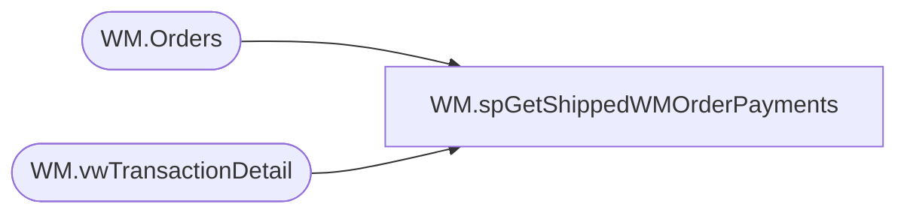

# WM.spGetShippedWMOrderPayments

**Database:** WebOrderProcessing  
**Server:** bearcluster01  

## Architecture Diagram



## Table Dependencies

| Referenced Table |
|---|
| WM.Orders |
| WM.vwTransactionDetail |

## Stored Procedure Code

```sql
CREATE PROCEDURE [WM].[spGetShippedWMOrderPayments] 

-- =============================================================================================================
-- Name: WM.spGetShippedWMOrderPayments
--
-- Description:	Get Shipped WM Orders Payments for Sales Audit Translate
--
-- Output: 
--	
-- Dependencies: 
--
-- Revision History
--		Name:			Date:			Comments:
--		Ben Barud		9/10/2017		Initial Creation
--		Ben Barud		10/16/2017		Added Amex Translation for SalesAuditTranslate.cs.  Amex cards are coming into
--										SA as Debit Cards
--		Ben Barud		10/18/2017		Add StoreCredit PaymentType
--		Ben Barud		11/08/2017		Added Logic for Amazon/ChannelAdvisor
--		Ben Barud		11/15/2017		Updated Logic for Amazon/ChannelAdvisor for Deck integration
-- =============================================================================================================

AS
BEGIN
	-- SET NOCOUNT ON added to prevent extra result sets from
	-- interfering with SELECT statements.
	SET NOCOUNT ON;

		SELECT DISTINCT td.[OrderNumber]
	      ,td.TransactionID
	      ,[OrderTransactionIdentifier] AS 'PaymentID'
          ,CASE
			WHEN [PaymentType] = 'GiftCard' THEN 'GiftCard'
			WHEN [PaymentType] = 'PayPal' THEN 'PayPal'
			WHEN [PaymentType] = 'Amazon' THEN 'Amazon'
			WHEN td.[TransactionNum] LIKE 'C%' THEN 'Amazon'
			WHEN [PaymentType] = 'Cash' THEN 'StoreCredit'
			ELSE 'CreditCard'
		   END AS 'PaymentMethod'
		  ,[PaymentTransactionType]
		  ,[CurrencyMultiplier]
          ,[TransactionAmount] AS 'PaymentAmount'
          ,TransactionGeneric1 AS 'PaymentAuthCode'
          ,TransactionGeneric1 AS 'PaymentNum'
		  ,CASE
			 WHEN [PaymentGeneric1] = 'Amex' THEN 'American Express'
		     ELSE [PaymentGeneric1]
		   END AS 'CardType'
          ,[PaymentGeneric2] AS 'CreditCardNumber'
          ,LEFT(RIGHT('0' + ISNULL([PaymentGeneric3], ''), 7), 2) AS 'ExpirationMonth'
          ,RIGHT(RIGHT('0' + ISNULL([PaymentGeneric3], ''), 7), 4) AS 'ExpirationYear'
		  ,CASE
		     WHEN td.TransactionNum LIKE 'C%' THEN o.EnterpriseSellingID
			 WHEN PaymentType = 'Amazon' THEN OrderCustom3 
			 ELSE TransactionGeneric1
		   END AS 'GiftCardNumber'
	FROM [WebOrderProcessing].[WM].[vwTransactionDetail] td
	LEFT JOIN [WebOrderProcessing].[WM].[Orders] o ON td.TransactionID = o.TransactionID
	--WHERE PaymentTransactionType NOT IN ('return')

	/*OLD LOGIN 20170913
	SELECT [PaymentID]
          ,[PaymentMethod]
		  ,[PaymentTransactionType]
		  ,[CurrencyMultiplier]
          ,[PaymentAmount]
          ,[PaymentAuthCode]
          ,[PaymentNum]
		  ,[PaymentGeneric1] AS 'CardType'
          ,[PaymentGeneric2] AS 'CreditCardNumber'
          ,LEFT(RIGHT('0' + ISNULL([PaymentGeneric3], ''), 7), 2) AS 'ExpirationMonth'
          ,RIGHT(RIGHT('0' + ISNULL([PaymentGeneric3], ''), 7), 4) AS 'ExpirationYear'
		  ,TransactionGeneric1 AS 'GiftCardNumber'
	      ,v.[TransactionNum]
	FROM [WebOrderProcessing].[WM].[vwTransactionDetail] v
	LEFT JOIN [WebOrderProcessing].[WM].[Payments] p ON v.TransactionID = p.TransactionID
	*/

	/*
    SELECT [PaymentID]
          ,[PaymentMethod]
          ,[PaymentAmount]
          ,[PaymentAuthCode]
          ,[PaymentNum]
          ,[CardType]
          ,[CreditCardNumber]
          ,[ExpirationMonth]
          ,[ExpirationYear]
	      ,svs.[TransactionNum]
    FROM [WM].[Payments] p
    LEFT JOIN [WebOrderProcessing].[WM].[vwTransactionsShipments_vs_Shipped] svs ON p.TransactionID = svs.TransactionID
    WHERE svs.ShipmentsCount = svs.ShippedCount
	*/
END
```

