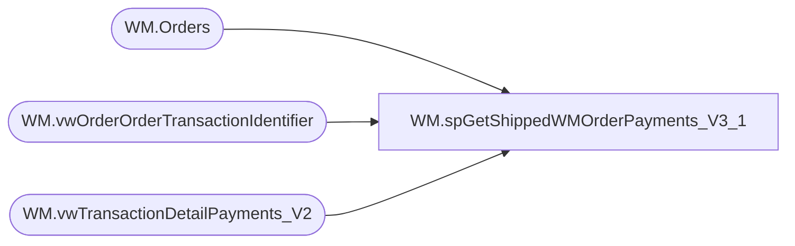

# WM.spGetShippedWMOrderPayments_V3_1

**Database:** WebOrderProcessing  
**Server:** bearcluster01  

## Architecture Diagram



## Table Dependencies

| Referenced Table |
|---|
| WM.Orders |
| WM.vwOrderOrderTransactionIdentifier |
| WM.vwTransactionDetailPayments_V2 |

## Stored Procedure Code

```sql
CREATE PROCEDURE [WM].[spGetShippedWMOrderPayments_V3_1] 

-- =============================================================================================================
-- Name: WM.spGetShippedWMOrderPayments
--
-- Description:	Get Shipped WM Orders Payments for Sales Audit Translate
--
-- Output: 
--	
-- Dependencies: 
--
-- Revision History
--		Name:			Date:			Comments:
--		Ben Barud		9/10/2017		Initial Creation
--		Ben Barud		10/16/2017		Added Amex Translation for SalesAuditTranslate.cs.  Amex cards are coming into
--										SA as Debit Cards
--		Ben Barud		10/18/2017		Add StoreCredit PaymentType
--		Ben Barud		11/08/2017		Added Logic for Amazon/ChannelAdvisor
--		Ben Barud		11/15/2017		Updated Logic for Amazon/ChannelAdvisor for Deck integration
-- =============================================================================================================

AS
BEGIN
	-- SET NOCOUNT ON added to prevent extra result sets from
	-- interfering with SELECT statements.
	SET NOCOUNT ON;
		WITH OrderNumberPickupStore(OrderNumber, TransactionID, PickupStore)
	AS
	(
	SELECT MAX(o.OrderNum) AS OrderNumber
	      ,td.TransactionID
		  ,v.PickupStore
    FROM [WebOrderProcessing].[WM].[vwTransactionDetailPayments_V2] td
	INNER JOIN [WebOrderProcessing].[WM].[vwOrderOrderTransactionIdentifier] v ON td.TransactionID = v.TransactionID AND td.OrderTransactionIdentifier = v.OrderTransactionIdentifier
	INNER JOIN [WebOrderProcessing].[WM].[Orders] o ON v.TransactionID = o.TransactionID AND v.PickupStore = o.PickupStore AND OrderStatus IN ('Complete', 'Shipped', 'StorePickedForPickup')
	GROUP BY td.TransactionID, v.PickupStore
	), distinctTransactions (OrderNumber, TransactionID, PaymentID, PaymentMethod, PaymentTransactionType, CurrencyMultiplier, PaymentAmount, PaymentAuthCode, PaymentNum, CardType, CreditCardNumber, ExpirationMonth, ExpirationYear, GiftCardNumber)
	AS
	(
		SELECT DISTINCT MAX(onps.[OrderNumber]) AS 'OrderNumber'
	      ,td.TransactionID
	      ,v.[OrderTransactionIdentifier] AS 'PaymentID'
          ,CASE
		    WHEN o.OrderType = 'CC' THEN 'Costco'
			WHEN PaymentGeneric1 LIKE '%Facebook%' THEN 'Facebook'
			WHEN PaymentGeneric1 LIKE '%Instagram%' THEN 'Facebook'
			WHEN [PaymentType] = 'GiftCard' THEN 'GiftCard'
			WHEN [PaymentType] = 'PayPal' THEN 'PayPal'
			WHEN [PaymentType] = 'Klarna' THEN 'Klarna'
			WHEN [PaymentType] = 'Amazon' THEN 'Amazon'
			WHEN MAX(v.[OrderNumber]) LIKE 'C%' THEN 'Amazon'
			WHEN [PaymentType] = 'Cash' THEN 'StoreCredit'
			ELSE 'CreditCard'
		   END AS 'PaymentMethod'
		  ,[PaymentTransactionType]
		  ,MAX([CurrencyMultiplier]) AS 'CurrencyMultiplier'
          ,[TransactionAmount] AS 'PaymentAmount'
          ,CASE
			WHEN [PaymentType] = 'Klarna' AND LEN(TransactionGeneric1) > 20 THEN LEFT(TransactionGeneric1, 17) + '...'
			ELSE TransactionGeneric1 
		   END AS 'PaymentAuthCode'
          ,CASE
			WHEN [PaymentType] = 'Klarna' AND LEN(TransactionGeneric1) > 20 THEN LEFT(TransactionGeneric1, 17) + '...'
			ELSE TransactionGeneric1 
		   END AS 'PaymentNum'
		  ,CASE
			 WHEN [PaymentGeneric1] = 'Amex' THEN 'American Express'
		     ELSE [PaymentGeneric1]
		   END AS 'CardType'
          ,[PaymentGeneric2] AS 'CreditCardNumber'
          ,LEFT(RIGHT('0' + ISNULL([PaymentGeneric3], ''), 7), 2) AS 'ExpirationMonth'
          ,RIGHT(RIGHT('0' + ISNULL([PaymentGeneric3], ''), 7), 4) AS 'ExpirationYear'
		  ,CASE
		     --WHEN MAX(v.OrderNumber) LIKE 'C%' THEN MAX(o.EnterpriseSellingID)
			 WHEN o.OrderType = 'CC' THEN MAX(o.EnterpriseSellingID)
			 WHEN PaymentType = 'Amazon' THEN MAX(OrderCustom3)
			 WHEN LEN(TransactionGeneric1) > 20 THEN LEFT(TransactionGeneric1, 17) + '...'
			 ELSE TransactionGeneric1
		   END AS 'GiftCardNumber'
	FROM OrderNumberPickupStore onps
	INNER JOIN [WebOrderProcessing].[WM].[vwTransactionDetailPayments_V2] td ON onps.TransactionID = td.TransactionID
	INNER JOIN [WebOrderProcessing].[WM].[vwOrderOrderTransactionIdentifier] v ON td.TransactionID = v.TransactionID AND td.OrderTransactionIdentifier = v.OrderTransactionIdentifier AND onps.PickupStore = v.PickupStore
	INNER JOIN [WebOrderProcessing].[WM].[Orders] o ON td.TransactionID = o.TransactionID AND o.OrderId = v.OrderId
	--WHERE OrderNum = 'U0628653'
	GROUP BY td.TransactionID, v.[OrderTransactionIdentifier], PaymentTransactionType, [TransactionAmount], TransactionGeneric1, [PaymentGeneric1], [PaymentGeneric2], [PaymentGeneric3], PaymentType, onps.PickupStore, o.OrderType 
	)
	SELECT OrderNumber
	      ,TransactionID
		  ,MAX(PaymentID) AS PaymentID
		  ,PaymentMethod
		  ,PaymentTransactionType
		  ,CurrencyMultiplier
		  ,SUM(PaymentAmount) AS PaymentAmount
		  ,PaymentAuthCode
		  ,PaymentNum
		  ,CardType
		  ,CreditCardNumber
		  ,ExpirationMonth
		  ,ExpirationYear
		  ,GiftCardNumber
	FROM distinctTransactions
	GROUP BY OrderNumber, TransactionID, PaymentMethod, PaymentTransactionType,CurrencyMultiplier
		  ,PaymentAuthCode
		  ,PaymentNum
		  ,CardType
		  ,CreditCardNumber
		  ,ExpirationMonth
		  ,ExpirationYear
		  ,GiftCardNumber

	/*OLD LOGIN 20170913
	SELECT [PaymentID]
          ,[PaymentMethod]
		  ,[PaymentTransactionType]
		  ,[CurrencyMultiplier]
          ,[PaymentAmount]
          ,[PaymentAuthCode]
          ,[PaymentNum]
		  ,[PaymentGeneric1] AS 'CardType'
          ,[PaymentGeneric2] AS 'CreditCardNumber'
          ,LEFT(RIGHT('0' + ISNULL([PaymentGeneric3], ''), 7), 2) AS 'ExpirationMonth'
          ,RIGHT(RIGHT('0' + ISNULL([PaymentGeneric3], ''), 7), 4) AS 'ExpirationYear'
		  ,TransactionGeneric1 AS 'GiftCardNumber'
	      ,v.[TransactionNum]
	FROM [WebOrderProcessing].[WM].[vwTransactionDetail] v
	LEFT JOIN [WebOrderProcessing].[WM].[Payments] p ON v.TransactionID = p.TransactionID
	*/

	/*
    SELECT [PaymentID]
          ,[PaymentMethod]
          ,[PaymentAmount]
          ,[PaymentAuthCode]
          ,[PaymentNum]
          ,[CardType]
          ,[CreditCardNumber]
          ,[ExpirationMonth]
          ,[ExpirationYear]
	      ,svs.[TransactionNum]
    FROM [WM].[Payments] p
    LEFT JOIN [WebOrderProcessing].[WM].[vwTransactionsShipments_vs_Shipped] svs ON p.TransactionID = svs.TransactionID
    WHERE svs.ShipmentsCount = svs.ShippedCount
	*/
END
```

