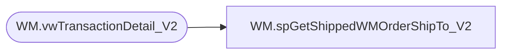

# WM.spGetShippedWMOrderShipTo_V2

**Database:** WebOrderProcessing  
**Server:** bearcluster01  

## Architecture Diagram



## Table Dependencies

| Referenced Table |
|---|
| WM.vwTransactionDetail_V2 |

## Stored Procedure Code

```sql
CREATE PROCEDURE [WM].[spGetShippedWMOrderShipTo_V2] 

-- =============================================================================================================
-- Name: WM.spGetShippedWMOrderShipTo
--
-- Description:	Get Shipped WM Orders Customer Ship To for Sales Audit Translate
--
-- Output: 
--	
-- Dependencies: 
--
-- Revision History
--		Name:			Date:			Comments:
--		Ben Barud		9/10/2017		Initial Creation
-- =============================================================================================================

AS
BEGIN
	-- SET NOCOUNT ON added to prevent extra result sets from
	-- interfering with SELECT statements.
	SET NOCOUNT ON;

	SELECT [OrderNumber]
          ,[ShipToFName]
          ,[ShipToLName]
          ,[ShipToAddress1]
          ,ISNULL([ShipToAddress2], '') AS 'ShipToAddress2'
          ,[ShipToCity]
          ,[ShipToState]
          ,[ShipToPostalCode]
          ,[ShipToCountry]
          ,[ShipToPhone]
          ,[ShipToEmail]
	FROM [WebOrderProcessing].[WM].[vwTransactionDetail_V2] 

	/*
    SELECT svs.[TransactionNum]
          ,[ShipToFName]
          ,[ShipToLName]
          ,[ShipToAddress1]
          ,ISNULL([ShipToAddress2], '') AS 'ShipToAddress2'
          ,[ShipToCity]
          ,[ShipToState]
          ,[ShipToPostalCode]
          ,[ShipToCountry]
          ,[ShipToPhone]
          ,[ShipToEmail]
  FROM [WM].[Orders] o
  LEFT JOIN [WebOrderProcessing].[WM].[vwTransactionsShipments_vs_Shipped] svs ON o.TransactionID = svs.TransactionID
  WHERE svs.ShipmentsCount = svs.ShippedCount
  */
END
```

