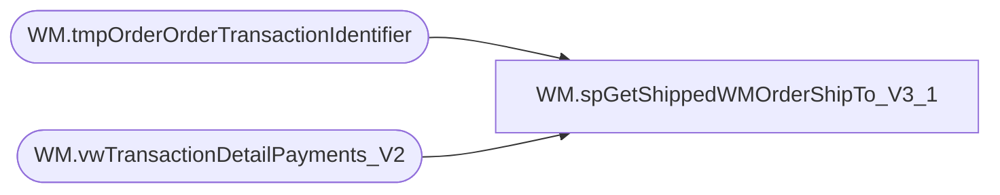

# WM.spGetShippedWMOrderShipTo_V3_1

**Database:** WebOrderProcessing  
**Server:** bearcluster01  

## Architecture Diagram



## Table Dependencies

| Referenced Table |
|---|
| WM.tmpOrderOrderTransactionIdentifier |
| WM.vwTransactionDetailPayments_V2 |

## Stored Procedure Code

```sql
CREATE PROCEDURE [WM].[spGetShippedWMOrderShipTo_V3_1] 

-- =============================================================================================================
-- Name: WM.spGetShippedWMOrderShipTo
--
-- Description:	Get Shipped WM Orders Customer Ship To for Sales Audit Translate
--
-- Output: 
--	
-- Dependencies: 
--
-- Revision History
--		Name:			Date:			Comments:
--		Ben Barud		9/10/2017		Initial Creation
-- =============================================================================================================

AS
BEGIN
	-- SET NOCOUNT ON added to prevent extra result sets from
	-- interfering with SELECT statements.
	SET NOCOUNT ON;

	SELECT MAX(v.[OrderNumber]) AS 'OrderNumber'
          ,MAX([ShipToFName]) AS 'ShipToFName'
          ,MAX([ShipToLName]) AS 'ShipToLName'
          ,MAX([ShipToAddress1]) AS 'ShipToAddress1'
          ,ISNULL(MAX([ShipToAddress2]), '') AS 'ShipToAddress2'
          ,MAX([ShipToCity]) AS 'ShipToCity'
          ,MAX([ShipToState]) AS 'ShipToState'
          ,MAX([ShipToPostalCode]) AS 'ShipToPostalCode'
          ,MAX([ShipToCountry]) AS 'ShipToCountry'
          ,MAX([ShipToPhone]) AS 'ShipToPhone'
          ,MAX([ShipToEmail]) AS 'ShipToEmail'
	FROM [WebOrderProcessing].[WM].[vwTransactionDetailPayments_V2] td
	INNER JOIN [WebOrderProcessing].[WM].[tmpOrderOrderTransactionIdentifier] v ON td.TransactionID = v.TransactionID AND td.OrderTransactionIdentifier = v.OrderTransactionIdentifier
	GROUP BY v.PickupStore, td.TransactionID

	/*
    SELECT svs.[TransactionNum]
          ,[ShipToFName]
          ,[ShipToLName]
          ,[ShipToAddress1]
          ,ISNULL([ShipToAddress2], '') AS 'ShipToAddress2'
          ,[ShipToCity]
          ,[ShipToState]
          ,[ShipToPostalCode]
          ,[ShipToCountry]
          ,[ShipToPhone]
          ,[ShipToEmail]
  FROM [WM].[Orders] o
  LEFT JOIN [WebOrderProcessing].[WM].[vwTransactionsShipments_vs_Shipped] svs ON o.TransactionID = svs.TransactionID
  WHERE svs.ShipmentsCount = svs.ShippedCount
  */
END
```

