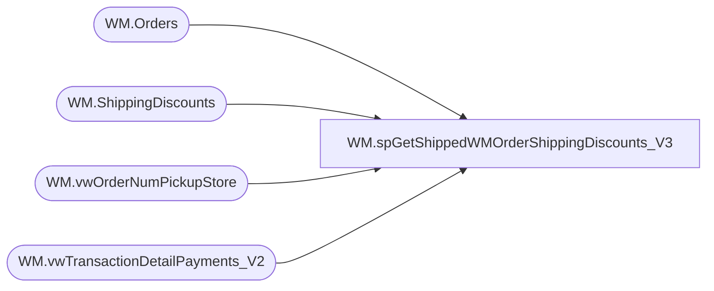

# WM.spGetShippedWMOrderShippingDiscounts_V3

**Database:** WebOrderProcessing  
**Server:** bearcluster01  

## Architecture Diagram



## Table Dependencies

| Referenced Table |
|---|
| WM.Orders |
| WM.ShippingDiscounts |
| WM.vwOrderNumPickupStore |
| WM.vwTransactionDetailPayments_V2 |

## Stored Procedure Code

```sql
CREATE PROCEDURE [WM].[spGetShippedWMOrderShippingDiscounts_V3] 

-- =============================================================================================================
-- Name: WM.spGetShippedWMOrderShippingDiscounts
--
-- Description:	Get Shipped WM Orders Shipping Discounts for Sales Audit Translate
--
-- Output: 
--	
-- Dependencies: 
--
-- Revision History
--		Name:			Date:			Comments:
--		Ben Barud		9/10/2017		Initial Creation
-- =============================================================================================================

AS
BEGIN
	-- SET NOCOUNT ON added to prevent extra result sets from
	-- interfering with SELECT statements.
	SET NOCOUNT ON;

	--WITH OrderNumberPickupStore(OrderNumber, TransactionID, PickupStore)
	--AS
	--(
	--SELECT MAX(v.OrderNumber) AS OrderNumber
	--      ,td.TransactionID
	--	  ,PickupStore
 --   FROM [WebOrderProcessing].[WM].[vwTransactionDetailPayments_V2] td
	--INNER JOIN [WebOrderProcessing].[WM].[vwOrderOrderTransactionIdentifier] v ON td.TransactionID = v.TransactionID AND td.OrderTransactionIdentifier = v.OrderTransactionIdentifier
	--GROUP BY td.TransactionID, PickupStore
	--)
	SELECT DISTINCT onps.[OrderNumber]
      ,[PromoCode]
      ,[DiscountAmount]
      ,[DiscountName]
	  ,[CurrencyMultiplier]
	FROM [WebOrderProcessing].[WM].vwOrderNumPickupStore onps
	INNER JOIN [WebOrderProcessing].[WM].[vwTransactionDetailPayments_V2] v ON onps.TransactionID = v.TransactionID
	LEFT JOIN [WebOrderProcessing].[WM].[Orders] o ON v.TransactionID = o.TransactionID
	LEFT JOIN [WebOrderProcessing].[WM].[ShippingDiscounts] sd ON o.OrderID = sd.OrderID
	WHERE DiscountAmount IS NOT NULL AND DiscountName NOT IN ('ShippingManualCredit')

	/*OLD LOGIC
    SELECT [TransactionNum]
      ,[PromoCode]
      ,[DiscountAmount]
      ,[DiscountName]
    FROM [WebOrderProcessing].[WM].[ShippingDiscounts] sd
	LEFT JOIN [WebOrderProcessing].[WM].[Orders] o ON sd.OrderId = o.OrderId
    LEFT JOIN [WebOrderProcessing].[WM].[vwTransactionsShipments_vs_Shipped] svs ON o.TransactionID = svs.TransactionID
    WHERE svs.ShipmentsCount = svs.ShippedCount AND DiscountAmount IS NOT NULL
	*/
END
```

