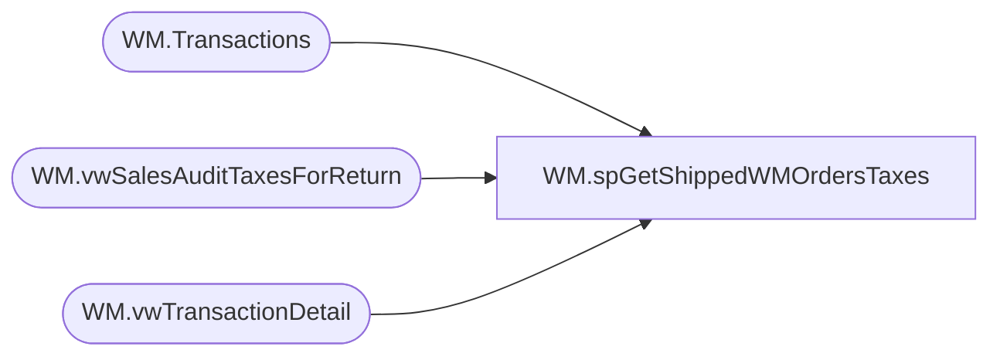

# WM.spGetShippedWMOrdersTaxes

**Database:** WebOrderProcessing  
**Server:** bearcluster01  

## Architecture Diagram



## Table Dependencies

| Referenced Table |
|---|
| WM.Transactions |
| WM.vwSalesAuditTaxesForReturn |
| WM.vwTransactionDetail |

## Stored Procedure Code

```sql
CREATE PROCEDURE [WM].[spGetShippedWMOrdersTaxes]

-- =============================================================================================================
-- Name: spGetShippedWMOrdersTaxes
--
-- Description:	Get Shipped WM Orders Taxes for Sales Audit Translate
--
-- Output: 
--	
-- Dependencies: 
--
-- Revision History
--		Name:			Date:			Comments:
--		Ben Barud		09/10/2017		Initial Creation
--		Ben Barud		10/16/2017		Added Canada Non-Taxable States to TaxJurisdiction exclusions
--		Ben Barud		10/25/2017		Added exclusion to OrderTaxesSold CTE.  If tax is 0.0, exclude.
--		Ben Barud		10/25/2017		APO Tax Jurisdictions are coming in as AP.  Added case to change AP to APO.
-- =============================================================================================================

AS
BEGIN
	-- SET NOCOUNT ON added to prevent extra result sets from
	-- interfering with SELECT statements.
	SET NOCOUNT ON;

	WITH OrderTaxesSold (OrderNumber
					,OrderTransactionIdentifier
					,TaxAmount
					,TaxJurisdiction
					,TaxAuthority
					,TaxType
					,CurrencyMultiplier
					,[TransactionID]
	)
	AS
	(
	SELECT DISTINCT v.[OrderNumber]
	      ,[OrderTransactionIdentifier] 
          ,[Tax] AS 'TaxAmount'
          ,CASE
		    WHEN [TaxJurisdiction] = 'AP' THEN 'APO'
			ELSE [TaxJurisdiction]
		   END AS 'TaxJurisdiction'
          ,[TaxAuthority]
          ,[TaxType]
		  ,[CurrencyMultiplier]
		  ,v.[TransactionID] 
	FROM [WebOrderProcessing].[WM].[vwTransactionDetail] v
	INNER JOIN [WebOrderProcessing].[WM].[Transactions] t ON v.TransactionID = t.TransactionID
	WHERE TaxJurisdiction NOT IN ('AT', 'BE', 'BG', 'HR', 'CY', 'CZ', 'DK', 'EE', 'FI', 'FR', 'DE', 'EL', 'HU', 'IE', 'IT', 'LV', 'LT', 'LU', 'MT', 'NL', 'PL', 'PT', 'RO', 'SK', 'SI', 'ES', 'SE', 'GB', 'UK', 'AB', 'BC', 'MB', 'NB', 'NS', 'NT', 'ON', 'QC', 'SK', 'NO') 
	--WHERE TaxJurisdiction NOT IN ('GB', 'IE', 'DK', 'SE', 'DE', 'BE', 'FR', 'LU', 'NL', 'NO', 'UK', 'IT') 
	AND v.PaymentTransactionType = 'Sales' 
	AND Tax <> 0.00
	),OrderTaxesReturned
	AS
	(
	SELECT DISTINCT v.[OrderNumber]
	      ,[OrderTransactionIdentifier] 
          ,[Tax] AS 'TaxAmount'
          ,CASE
		    WHEN [TaxJurisdiction] = 'AP' THEN 'APO'
			ELSE [TaxJurisdiction]
		   END AS 'TaxJurisdiction'
          ,[TaxAuthority]
          ,[TaxType]
		  ,[CurrencyMultiplier]
		  ,v.[TransactionID] 
	FROM [WebOrderProcessing].[WM].[vwTransactionDetail] v
	INNER JOIN [WebOrderProcessing].[WM].[Transactions] t ON v.TransactionID = t.TransactionID
	WHERE TaxJurisdiction NOT IN ('AT', 'BE', 'BG', 'HR', 'CY', 'CZ', 'DK', 'EE', 'FI', 'FR', 'DE', 'EL', 'HU', 'IE', 'IT', 'LV', 'LT', 'LU', 'MT', 'NL', 'PL', 'PT', 'RO', 'SK', 'SI', 'ES', 'SE', 'GB', 'UK', 'AB', 'BC', 'MB', 'NB', 'NS', 'NT', 'ON', 'QC', 'SK', 'NO')
	--WHERE TaxJurisdiction NOT IN ('GB', 'IE', 'DK', 'SE', 'DE', 'BE', 'FR', 'LU', 'NL', 'NO', 'UK', 'IT') 
	AND v.PaymentTransactionType = 'return' 
	AND Tax <> 0.00
	)
	SELECT OrderNumber
		,OrderTransactionIdentifier
		,TaxAmount
		,TaxJurisdiction
		,TaxAuthority
		,TaxType
		,CurrencyMultiplier
		,TransactionID
	FROM OrderTaxesSold
	UNION
	SELECT DISTINCT r.[OrderNumber]
		  ,r.OrderTransactionIdentifier
          ,r.[TaxAmount]
          ,v.[TaxJurisdiction]
          ,v.[TaxAuthority]
          ,v.[TaxType]
		  ,r.[CurrencyMultiplier] 
		  ,r.[TransactionID]
	FROM OrderTaxesReturned r
	LEFT JOIN [WebOrderProcessing].[WM].[vwSalesAuditTaxesForReturn] v ON r.TransactionID = v.TransactionID
	--INNER JOIN [WebOrderProcessing].[WM].[Transactions] t ON v.TransactionID = t.TransactionID
	--WHERE TaxJurisdiction NOT IN ('GB', 'IR') AND PaymentTransactionType = 'Sales'

	/*OLD LOGIC
    SELECT svs.[TransactionNum]
          ,[TaxAmount]
          ,[TaxJurisdiction]
          ,[TaxAuthority]
          ,[TaxType] 
	FROM [WebOrderProcessing].[WM].[Transactions] t
    LEFT JOIN [WebOrderProcessing].[WM].[vwTransactionsShipments_vs_Shipped] svs ON t.TransactionID = svs.TransactionID
    WHERE svs.ShipmentsCount = svs.ShippedCount
	*/
END
```

