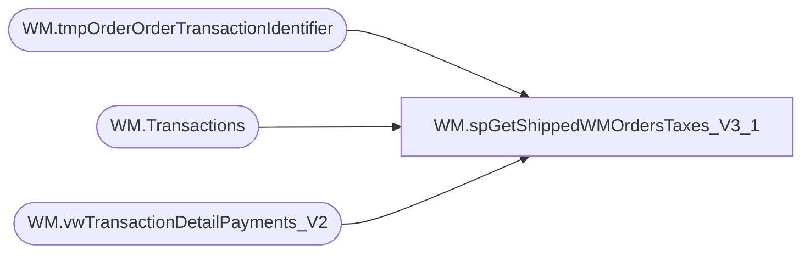

# WM.spGetShippedWMOrdersTaxes_V3_1

**Database:** WebOrderProcessing  
**Server:** bearcluster01  

## Architecture Diagram



## Table Dependencies

| Referenced Table |
|---|
| WM.tmpOrderOrderTransactionIdentifier |
| WM.Transactions |
| WM.vwTransactionDetailPayments_V2 |

## Stored Procedure Code

```sql
CREATE PROCEDURE [WM].[spGetShippedWMOrdersTaxes_V3_1]

-- =============================================================================================================
-- Name: spGetShippedWMOrdersTaxes
--
-- Description:	Get Shipped WM Orders Taxes for Sales Audit Translate
--
-- Output: 
--	
-- Dependencies: 
--
-- Revision History
--		Name:			Date:			Comments:
--		Ben Barud		09/10/2017		Initial Creation
--		Ben Barud		10/16/2017		Added Canada Non-Taxable States to TaxJurisdiction exclusions
--		Ben Barud		10/25/2017		Added exclusion to OrderTaxesSold CTE.  If tax is 0.0, exclude.
--		Ben Barud		10/25/2017		APO Tax Jurisdictions are coming in as AP.  Added case to change AP to APO.
--		Ben Barud		06/04/2021		Split credit logic from the rest of the PaymentTransactionTypes.
--										Tax Credit TransactionDetail Records need to be summed up, 
--										while all other transactions need the max(tax)
-- =============================================================================================================

AS
BEGIN
	-- SET NOCOUNT ON added to prevent extra result sets from
	-- interfering with SELECT statements.
	SET NOCOUNT ON;

	WITH OrderTaxes (OrderNumber
                    ,ShipmentNumber
					,TransactionIdentifier
					,PickupStore
					,TaxAmount
					,TaxJurisdiction
					,TaxAuthority
					,TaxType
					,CurrencyMultiplier
					,[TransactionID]
					,PaymentTransacationType
	)
	AS
	(
	SELECT DISTINCT o.[OrderNumber] AS 'OrderNumber'
	      ,ISNULL(ShipmentNumber, 0) AS ShipmentNumber
		  ,v.OrderTransactionIdentifier
		  ,o.PickupStore
          ,[Tax] AS 'TaxAmount'
          ,CASE
		    WHEN [TaxJurisdiction] = 'AP' THEN 'APO'
			ELSE [TaxJurisdiction]
		   END AS 'TaxJurisdiction'
          ,t.[TaxAuthority]
          ,[TaxType]
		  ,[CurrencyMultiplier]
		  ,v.[TransactionID] 
		  ,PaymentTransactionType
	FROM [WebOrderProcessing].[WM].vwTransactionDetailPayments_V2 v 
	INNER JOIN [WebOrderProcessing].[WM].[tmpOrderOrderTransactionIdentifier] o ON v.TransactionID = o.TransactionID AND v.OrderTransactionIdentifier = o.OrderTransactionIdentifier
	INNER JOIN [WebOrderProcessing].[WM].[Transactions] t ON v.TransactionID = t.TransactionID
	WHERE TaxJurisdiction NOT IN ('AT', 'BE', 'BG', 'HR', 'CY', 'CZ', 'DK', 'EE', 'FI', 'FR', 'DE', 'EL', 'HU', 'IE', 'IT', 'LV', 'LT', 'LU', 'MT', 'NL', 'PL', 'PT', 'RO', 'SK', 'SI', 'ES', 'SE', 'GB', 'UK', 'AB', 'BC', 'MB', 'NB', 'NS', 'NT', 'ON', 'QC', 'SK', 'NO') 
	--WHERE TaxJurisdiction NOT IN ('GB', 'IE', 'DK', 'SE', 'DE', 'BE', 'FR', 'LU', 'NL', 'NO', 'UK', 'IT') 
	--AND v.PaymentTransactionType = 'Sales' 
	AND Tax <> 0.00 
	--AND PaymentTransactionType NOT IN ('return') 
	AND v.OmsTransactionType NOT IN ('OrderManualCredit', 'ShippingManualCredit', 'ItemManualCredit')
	--AND CurrencyMultiplier <> -1
	), OrderTaxesSum (OrderNumber
		,TaxAmount
		,TaxJurisdiction
		,TaxAuthority
		,TaxType
		,CurrencyMultiplier
		,TransactionID)
	AS
	(
	SELECT DISTINCT [OrderNumber] AS 'OrderNumber'
          ,SUM([TaxAmount]) AS 'TaxAmount'
          ,CASE
		    WHEN MAX([TaxJurisdiction]) = 'AP' THEN 'APO'
			ELSE MAX([TaxJurisdiction])
		   END AS 'TaxJurisdiction'
          ,MAX([TaxAuthority]) AS 'TaxAuthority'
          ,MAX([TaxType]) AS 'TaxType'
		  ,MAX([CurrencyMultiplier]) AS 'CurrencyMultiplier'
		  ,[TransactionID] 
	FROM OrderTaxes
	GROUP BY OrderNumber, ShipmentNumber, PickupStore, TransactionID
	)
	SELECT OrderNumber
		,TaxAmount
		,TaxJurisdiction
		,TaxAuthority
		,TaxType
		,CurrencyMultiplier
		,TransactionID
	FROM OrderTaxesSum


	--WITH OrderTaxes (OrderNumber
	--				,TaxAmount
	--				,TaxJurisdiction
	--				,TaxAuthority
	--				,TaxType
	--				,CurrencyMultiplier
	--				,[TransactionID]
	--				,PaymentTransacationType
	--)
	--AS
	--(
	--SELECT DISTINCT o.[OrderNumber] AS 'OrderNumber'
 --         ,MAX([Tax]) AS 'TaxAmount'
 --         ,CASE
	--	    WHEN MAX([TaxJurisdiction]) = 'AP' THEN 'APO'
	--		ELSE MAX([TaxJurisdiction])
	--	   END AS 'TaxJurisdiction'
 --         ,MAX(t.[TaxAuthority]) AS 'TaxAuthority'
 --         ,MAX([TaxType]) AS 'TaxType'
	--	  ,MAX([CurrencyMultiplier]) AS 'CurrencyMultiplier'
	--	  ,v.[TransactionID] 
	--	  ,PaymentTransactionType
	--FROM [WebOrderProcessing].[WM].vwTransactionDetailPayments_V2 v 
	--INNER JOIN [WebOrderProcessing].[WM].[vwOrderOrderTransactionIdentifier] o ON v.TransactionID = o.TransactionID AND v.OrderTransactionIdentifier = o.OrderTransactionIdentifier
	--INNER JOIN [WebOrderProcessing].[WM].[Transactions] t ON v.TransactionID = t.TransactionID
	--WHERE TaxJurisdiction NOT IN ('AT', 'BE', 'BG', 'HR', 'CY', 'CZ', 'DK', 'EE', 'FI', 'FR', 'DE', 'EL', 'HU', 'IE', 'IT', 'LV', 'LT', 'LU', 'MT', 'NL', 'PL', 'PT', 'RO', 'SK', 'SI', 'ES', 'SE', 'GB', 'UK', 'AB', 'BC', 'MB', 'NB', 'NS', 'NT', 'ON', 'QC', 'SK', 'NO') 
	----WHERE TaxJurisdiction NOT IN ('GB', 'IE', 'DK', 'SE', 'DE', 'BE', 'FR', 'LU', 'NL', 'NO', 'UK', 'IT') 
	----AND v.PaymentTransactionType = 'Sales' 
	--AND Tax <> 0.00 AND v.OmsTransactionType NOT IN ('ShippingManualCredit')
	----AND CurrencyMultiplier <> -1
	--AND v.PaymentTransactionType NOT IN ('credit')
	--GROUP BY o.OrderNumber, o.PickupStore, v.TransactionID, PaymentTransactionType
	--UNION
	--SELECT DISTINCT o.[OrderNumber] AS 'OrderNumber'
 --         ,SUM([Tax]) AS 'TaxAmount'
 --         ,CASE
	--	    WHEN MAX([TaxJurisdiction]) = 'AP' THEN 'APO'
	--		ELSE MAX([TaxJurisdiction])
	--	   END AS 'TaxJurisdiction'
 --         ,MAX(t.[TaxAuthority]) AS 'TaxAuthority'
 --         ,MAX([TaxType]) AS 'TaxType'
	--	  ,MAX([CurrencyMultiplier]) AS 'CurrencyMultiplier'
	--	  ,v.[TransactionID] 
	--	  ,PaymentTransactionType
	--FROM [WebOrderProcessing].[WM].vwTransactionDetailPayments_V2 v 
	--INNER JOIN [WebOrderProcessing].[WM].[vwOrderOrderTransactionIdentifier] o ON v.TransactionID = o.TransactionID AND v.OrderTransactionIdentifier = o.OrderTransactionIdentifier
	--INNER JOIN [WebOrderProcessing].[WM].[Transactions] t ON v.TransactionID = t.TransactionID
	--WHERE TaxJurisdiction NOT IN ('AT', 'BE', 'BG', 'HR', 'CY', 'CZ', 'DK', 'EE', 'FI', 'FR', 'DE', 'EL', 'HU', 'IE', 'IT', 'LV', 'LT', 'LU', 'MT', 'NL', 'PL', 'PT', 'RO', 'SK', 'SI', 'ES', 'SE', 'GB', 'UK', 'AB', 'BC', 'MB', 'NB', 'NS', 'NT', 'ON', 'QC', 'SK', 'NO') 
	----WHERE TaxJurisdiction NOT IN ('GB', 'IE', 'DK', 'SE', 'DE', 'BE', 'FR', 'LU', 'NL', 'NO', 'UK', 'IT') 
	----AND v.PaymentTransactionType = 'Sales' 
	--AND Tax <> 0.00 AND v.OmsTransactionType NOT IN ('ShippingManualCredit')
	----AND CurrencyMultiplier <> -1
	--AND v.PaymentTransactionType IN ('credit')
	--GROUP BY o.OrderNumber, o.PickupStore, v.TransactionID, PaymentTransactionType
	--)
	--SELECT OrderNumber
	--	,TaxAmount
	--	,TaxJurisdiction
	--	,TaxAuthority
	--	,TaxType
	--	,CurrencyMultiplier
	--	,TransactionID
	--FROM OrderTaxes
	
END
```

