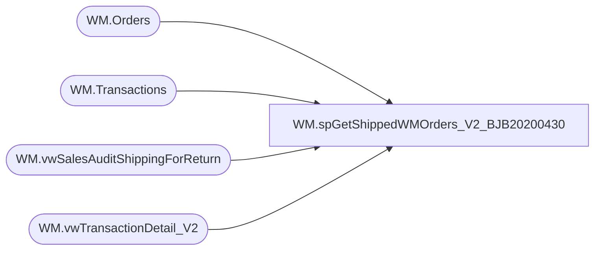

# WM.spGetShippedWMOrders_V2_BJB20200430

**Database:** WebOrderProcessing  
**Server:** bearcluster01  

## Architecture Diagram



## Table Dependencies

| Referenced Table |
|---|
| WM.Orders |
| WM.Transactions |
| WM.vwSalesAuditShippingForReturn |
| WM.vwTransactionDetail_V2 |

## Stored Procedure Code

```sql
CREATE PROCEDURE [WM].[spGetShippedWMOrders_V2_BJB20200430]

-- =============================================================================================================
-- Name: sp_GetShippedWMOrders
--
-- Description:	Get Shipped WM Orders for Sales Audit Translate
--
-- Output: 
--	
-- Dependencies: 
--
-- Revision History
--		Name:			Date:			Comments:
--		Ben Barud		9/1/2017		Initial Creation
--		Ben Barud		11/29/2017		Added logic to resolve return shipping issue when orders are credited.
-- =============================================================================================================

AS
BEGIN
	-- SET NOCOUNT ON added to prevent extra result sets from
	-- interfering with SELECT statements.
	SET NOCOUNT ON;

		SELECT OrderNumber
	      ,MAX(OrderDate) AS 'OrderDate'
		  ,SourceSite
		  ,ShippingAmount
		  ,PreviousShipping
		  ,LoyaltyNumber
	FROM(
	SELECT v.[OrderNumber]
          ,v.[TransactionDate] AS 'OrderDate'
          ,[SourceSite]
		  ,CASE
		    WHEN v.PaymentTransacTionType IN ('credit', 'return') THEN 0
			ELSE v.[Shipping]
		   END AS 'ShippingAmount'
		  --,v.[Shipping] AS 'ShippingAmount'
		  ,CASE
		    WHEN PaymentTransactionType IN ('sales', 'credit') THEN 0
			ELSE ISNULL(sv.[Shipping], 0) 
		   END AS 'PreviousShipping'
		  --,0 AS 'PreviousShipping'
		  ,t.ClientID AS 'LoyaltyNumber'
	FROM [WebOrderProcessing].[WM].[vwTransactionDetail_V2] v
	LEFT JOIN [WebOrderProcessing].[WM].[Orders] o ON v.TransactionID = o.TransactionID
	LEFT JOIN [WebOrderProcessing].[WM].[vwSalesAuditShippingForReturn] sv ON v.TransactionID = sv.TransactionID AND sv.OrderTransactionIdentifier = v.TansactionDetailID
	LEFT JOIN [WebOrderProcessing].[WM].[Transactions] t ON v.TransactionID = t.TransactionID) AS innerQry
	GROUP BY OrderNumber, SourceSite, ShippingAmount, PreviousShipping, LoyaltyNumber

	/*OLD LOGIC
	SELECT DISTINCT v.[OrderNumber]
          ,v.[TransactionDate] AS 'OrderDate'
          ,[SourceSite]
		  ,v.[Shipping] AS 'ShippingAmount'
		  ,CASE
		    WHEN PaymentTransactionType = 'sales' THEN 0
			ELSE ISNULL(sv.[Shipping], 0) 
		   END AS 'PreviousShipping'
		  ,t.ClientID AS 'LoyaltyNumber'
	FROM [WebOrderProcessing].[WM].[vwTransactionDetail] v
	LEFT JOIN [WebOrderProcessing].[WM].[Orders] o ON v.TransactionID = o.TransactionID
	LEFT JOIN [WebOrderProcessing].[WM].[vwSalesAuditShippingForReturn] sv ON v.TransactionID = sv.TransactionID AND sv.OrderTransactionIdentifier = v.OrderTransactionIdentifier
	LEFT JOIN [WebOrderProcessing].[WM].[Transactions] t ON v.TransactionID = t.TransactionID
	*/


	/*OLD LOGIC
    --SELECT svs.[TransactionNum]
    --      ,[OrderDate]
    --      ,[SourceSite]
    --      ,[ShippingAmount]
    --FROM [WM].[Orders] o
    --LEFT JOIN [WebOrderProcessing].[WM].[vwTransactionsShipments_vs_Shipped] svs ON o.TransactionID = svs.TransactionID
    --WHERE svs.ShipmentsCount = svs.ShippedCount
	*/
END
```

