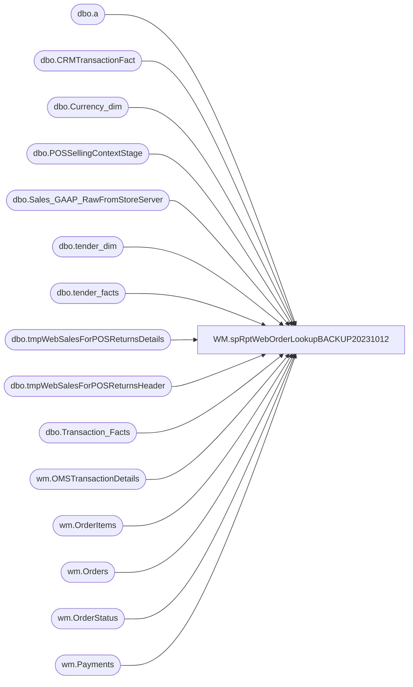

# WM.spRptWebOrderLookupBACKUP20231012

**Database:** WebOrderProcessing  
**Server:** bearcluster01  

## Architecture Diagram



## Table Dependencies

| Referenced Table |
|---|
| dbo.a |
| dbo.CRMTransactionFact |
| dbo.Currency_dim |
| dbo.POSSellingContextStage |
| dbo.Sales_GAAP_RawFromStoreServer |
| dbo.tender_dim |
| dbo.tender_facts |
| dbo.tmpWebSalesForPOSReturnsDetails |
| dbo.tmpWebSalesForPOSReturnsHeader |
| dbo.Transaction_Facts |
| wm.OMSTransactionDetails |
| wm.OrderItems |
| wm.Orders |
| wm.OrderStatus |
| wm.Payments |

## Stored Procedure Code

```sql
CREATE proc [WM].[spRptWebOrderLookupBACKUP20231012]

as

--used for web returns at the JumpMind POS

if (object_id('tempdb..#SubTotalsPre') is not null) drop table #SubTotalsPre 
SELECT 
		o.TransactionID,
		--o.ShipmentNumber,
		PickupStore as LocationCode,
		cast(o.OrderDate as date) OrderDate,
		o.OrderNumber,
		oi.OrderItemID,
		oi.SKU, 
		max(oi.Price) as Price,
		max(oi.DiscountedPrice) as SubTotal, ---why would there be multiple instances of a single OrderItemID?? - if so, assume the max 
		max(oi.qty) Qty ---why would there be multiple instances of a single OrderItemID?? - if so, assume the max  
into #SubTotalsPre
FROM wm.Orders o with (nolock)
join wm.OrderItems oi with (nolock) on o.OrderID=oi.OrderID
join wm.OrderStatus os on o.OrderId=os.OrderID and os.CurrentStatus=1
where datediff(dd, OrderDate, getdate())<=60
and PickUpStore in ('0013','2013')
and os.Status in ('Complete','Shipped')
and len(oi.sku) <7
--and o.OrderNumber='W4771124'
GROUP BY 
	o.TransactionID,
	--o.ShipmentNumber,
	PickupStore,
	cast(o.OrderDate as date),
	o.OrderNumber,
	oi.OrderItemID,
	oi.SKU

--select *
--from #SubTotalsPre 
--where TransactionID=6927900
--and OrderNumber='W4837042'
--and OrderItemID=24279971
--order by OrderItemID

if (object_id('tempdb..#PaymentMethods') is not null) drop table #PaymentMethods 
select 
	p.TransactionID,
	p.OMSTransactionType,
	--p.ShipmentNumber,
	p.OrderTransactionIdentifier,
	p.PaymentType as PaymentMethod,
	p.Tax,
	--p.OrderDiscount,
	--p.ItemDiscount,
	--p.SubTotal,
	--p.Shipping,
	--p.Tax,
	--p.TotalCharges,
	p.SubTotal,
	p.Shipping,
	p.TotalCharges,
	p.TransactionAmount
into #PaymentMethods 
from wm.OMSTransactionDetails p with (nolock)
where exists (select st.TransactionID from #SubTotalsPre st where st.TransactionID=p.TransactionID)
and p.OMSTransactionTYpe not in ('ItemManualCredit','OrderManualCredit','ShippingManualCredit','Return')
and SubTotal<>'1.00' --donation --confuses JumpMind since no tax(?) and also cause extra rows which is also not helping...
group by 
	p.TransactionID,
	p.OMSTransactionType,
	--p.ShipmentNumber,
	p.OrderTransactionIdentifier,
	p.PaymentType,
	p.Tax,
	p.SubTotal,
	p.Shipping,
	p.TotalCharges,
	p.TransactionAmount


if (object_id('tempdb..#SubTotals') is not null) drop table #SubTotals
select	
	st.TransactionID,
	--st.ShipmentNumber,
	st.OrderNumber,
	st.OrderDate,
	st.LocationCode,
	st.OrderItemID,
	st.SKU,
	st.Price,
	st.SubTotal,
	st.Qty,
	(select sum(st1.Price)
		from #SubTotalsPre st1 
		where st.TransactionID=st1.TransactionID
		--and st.ShipmentNumber=st1.ShipmentNumber
		and st.OrderNumber=st1.OrderNumber
	) as PriceTotalForOrder,
	(select sum(st1.SubTotal) 
		from #SubTotalsPre st1 
		where st.TransactionID=st1.TransactionID
		--and st.ShipmentNumber=st1.ShipmentNumber
		and st.OrderNumber=st1.OrderNumber
	) as SubTotalTotalForOrder
into #SubTotals
from #SubTotalsPre st
where exists (select pm.TransactionID from #PaymentMethods pm where pm.TransactionID=st.TransactionID)
--where st.OrderNumber='W4849436'


if (object_id('tempdb..#SubtTotalsWithTax') is not null) drop table #SubtTotalsWithTax
select 
	st.TransactionID,
	st.OrderNumber,
	st.LocationCode,
	st.OrderDate,
	st.OrderItemID,
	st.SKU,
	sum(Price) as Price,
	sum(SubTotal) SubTotal,
	sum(Qty) Qty,
	st.PriceTotalForOrder,
	st.SubTotalTotalForOrder,
	(select sum(pm.Tax) Tax from #PaymentMethods pm where pm.TransactionID=st.TransactionID) OrderTax
into #SubtTotalsWithTax
from #SubTotals st  
group by 
	st.TransactionID,
	st.OrderNumber,
	st.LocationCode,
	st.OrderDate,
	st.OrderItemID,
	st.SKU,
	st.PriceTotalForOrder,
	st.SubTotalTotalForOrder


if (object_id('tempdb..#SubtTotalsBrokenOut') is not null) drop table #SubtTotalsBrokenOut
select
	TransactionID,
	OrderNumber,
	LocationCode,
	OrderDate,
	OrderItemID,
	SKU,
	Qty,
	Price,
	SubTotal,
	PriceTotalForOrder,
	SubTotalTotalForOrder,
	OrderTax,
	--CASE
	--		WHEN (OrderTax = 0) THEN 0.00
	--		WHEN (SubTotalTotalForOrder = 0) THEN 0.00
	--			ELSE CAST(ROUND(((OrderTax / SubTotalTotalForOrder) * SubTotal),2) as Decimal(9,2))
	--	END AS ItemLevelTax
	CASE
			WHEN (OrderTax = 0) THEN 0.00
			WHEN (SubTotalTotalForOrder = 0) THEN 0.00
				ELSE CAST(ROUND(((OrderTax / SubTotalTotalForOrder) * SubTotal),4) as Decimal(9,4))
		END AS ItemLevelTax
into #SubtTotalsBrokenOut
from #SubtTotalsWithTax


if (object_id('tempdb..#WebPlusTF') is not null) drop table #WebPlusTF
select 
	ws.TransactionID,
	ws.OrderNumber,
	ws.LocationCode,  
	ws.OrderDate, 
	ws.OrderItemID,
	ws.sku, 
	ws.qty, 
	--ws.ItemDescription, 
	ws.Price, 
	ws.SubTotal as DiscountedPrice, 
	--ws.Tax, 
	ws.PriceTotalForOrder as PriceTotal,
	ws.SubTotalTotalForOrder as SubTotal, 
	ws.ItemLevelTax, 
	(ws.SubTotal + ws.ItemLevelTax) TenderPlusTax,
	--ws.PaymentMethod,  	 
	min(tf.TransactionID) TF_TransactionID
into #WebPlusTF 
from #SubtTotalsBrokenOut ws
left join papamart.dw.dbo.Sales_GAAP_RawFromStoreServer tf on left(tf.WebOrderNumber,8)=ws.OrderNumber
group by 
	ws.TransactionID,
	ws.OrderNumber,
	ws.LocationCode, 
	ws.OrderDate, 
	ws.OrderItemID,
	ws.sku, 
	ws.qty, 
	--ws.ItemDescription, 
	ws.Price, 
	ws.SubTotal, 
	--ws.Tax, 
	ws.PriceTotalForOrder,
	ws.SubTotalTotalForOrder, 
	ws.ItemLevelTax, 
	(ws.SubTotal + ws.ItemLevelTax)
	--ws.PaymentMethod

if (object_id('WebOrderProcessing..tmpWebSalesForPOSReturnsDetails') is not null) drop table tmpWebSalesForPOSReturnsDetails
select 
	ws.TransactionID, 
	ws.OrderNumber, 
	ws.LocationCode,
	l.LocationID,
	ws.OrderDate, 
	ws.OrderItemID,
	--ws.PaymentMethod,
	ctf.CustomerNumber,
	ws.sku,  
	--ws.ItemDescription, 
	ws.qty,
	ws.Price, 
	ws.DiscountedPrice, 
	--ws.Tax, 
	--ws.SubTotal, 
	ws.ItemLevelTax, 
	ws.TenderPlusTax Tender,
	case when cd.currency_code is null 
		then case when ws.LocationCode>='2000' then 'GBP' else 'USD'end 
		else cd.currency_code
	end as currency_code,
	tf.transaction_id as tfID
into tmpWebSalesForPOSReturnsDetails
from #WebPlusTF ws
join papamart.dw.dbo.Transaction_Facts tf on ws.TF_TransactionID=tf.transaction_id
join papamart.dw.dbo.Currency_dim cd on tf.currency_key=cd.currency_key
left join papamart.dw.dbo.CRMTransactionFact ctf on tf.transaction_id=ctf.TransactionID
join papamart.dw.dbo.POSSellingContextStage l on ws.LocationCode=l.StoreNumber


if (object_id('WebOrderProcessing..tmpWebSalesForPOSReturnsHeader') is not null) drop table tmpWebSalesForPOSReturnsHeader
select
	pm.TransactionID,
	ps.OrderNumber,
	--pm.OMSTransactionType,
	--pm.ShipmentNumber,
	--pm.OrderTransactionIdentifier,
	ps.currency_code,
	pm.PaymentMethod,
	max(pm.Tax) Tax, --not sure why multiple records but if I sum all columns it will be massive higher
	--pm.OrderDiscount,
	--pm.ItemDiscount,
	max(pm.SubTotal) SubTotal,
	max(pm.Shipping) Shipping,
	max(pm.TotalCharges) TotalCharges,
	sum(distinct pm.TransactionAmount) TransactionAmount,
	(
		select 
			min(x.PaymentAuthCode)
		from 
			(
				select p.PaymentAuthCode
				from wm.Payments p 
				where p.TransactionID=pm.TransactionID
				and p.TransactionNum=ps.OrderNumber
				and p.PaymentMethod=pm.PaymentMethod
				group by p.PaymentAuthCode,p.PaymentAmount
				--having max(pm.TotalCharges)=p.PaymentAmount
			) x
	) as PSPCode,
	ps.tfID
into tmpWebSalesForPOSReturnsHeader
from #PaymentMethods pm 
join tmpWebSalesForPOSReturnsDetails ps on pm.TransactionID=ps.TransactionID
group by 
	pm.TransactionID,
	ps.OrderNumber,
	--pm.OMSTransactionType,
	--pm.ShipmentNumber,
	--pm.OrderTransactionIdentifier,
	ps.currency_code,
	pm.PaymentMethod,
	ps.tfID 
	--pm.Tax,
	----pm.OrderDiscount,
	----pm.ItemDiscount,
	--pm.SubTotal,
	--pm.Shipping,
	--pm.TotalCharges
	--pm.TransactionAmount


--==== --NEED TO GET ADYEN SPECIFIC TENDERS
if (object_id('tempdb..#tender') is not null) drop table #tender 
select 
	tf.transaction_id,
	td.tender_desc,
	sum(tf.tender_amt) Amt
into #tender
from papamart.dw.dbo.tender_facts tf
join papamart.dw.dbo.tender_dim td on tf.tender_key=td.tender_key
where exists (select ps.tfID 
				from tmpWebSalesForPOSReturnsHeader ps 
				where ps.tfID=tf.transaction_id 
				and (ps.paymentMethod like '%adyen%' or ps.PaymentMethod is NULL)
			  )
and td.tender_desc <> 'tax'
group by 
	tf.transaction_id,
	td.tender_desc

update a
set a.PaymentMethod=
	case 
		when a.PaymentMethod='Adyen_ApplePay'
			then 'ApplePay'
		when a.PaymentMethod='Adyen_PayPal'
			then 'PayPal'
	end
from tmpWebSalesForPOSReturnsHeader a 
where a.PaymentMethod in ('Adyen_ApplePay','Adyen_PayPal')

update a
	set a.PaymentMethod=
		case 
			when t.tender_desc in ('Adyen Amex','American Express (No Ref)','American Express')
				then 'AMEX'--'AMERICAN_EXPRESS_CREDIT'
			when t.tender_desc in ('Visa', 'Adyen Visa')
				then 'VISA' --'VISA_CREDIT'
			when t.tender_desc in ('Master Card', 'Adyen Mastercard', 'MasterCard')
				then 'MASTERCARD'--'MASTERCARD_CREDIT'
			when t.tender_desc in ('BABW Gift Card Tender')
				then 'GIFTCARD'--'GIFT_CARD'
			when t.tender_desc in ('Discover','Adyen Discover')
				then 'DISCOVER' --'DISCOVER_CREDIT'
			else t.tender_desc
		end 
from tmpWebSalesForPOSReturnsHeader a --where PaymentMethod like '%adyen%'
join #tender t 
	on a.tfID=t.transaction_id
	--and a.TotalCharges=t.Amt 
where a.PaymentMethod='Adyen' 
and t.tender_desc<>'BABW Gift Card Tender'


update a
set a.PaymentMethod=
	--case 
	--	when a.PaymentMethod='Visa' then 'VISA_CREDIT'
	--	when a.PaymentMethod='MasterCard' then 'MASTERCARD_CREDIT'
	--	when a.PaymentMethod='Amex' then 'AMERICAN_EXPRESS_CREDIT'
	--	when a.PaymentMethod='Discover' then 'DISCOVER_CREDIT'
	--	when a.PaymentMethod='GiftCard' then 'GIFT_CARD'
	--end 
	case 
		when a.PaymentMethod='VISA_CREDIT' then 'Visa'
		when a.PaymentMethod='MASTERCARD_CREDIT' then 'MasterCard'
		when a.PaymentMethod='AMERICAN_EXPRESS_CREDIT' then 'Amex' 
		when a.PaymentMethod='DISCOVER_CREDIT' then 'Discover'
		when a.PaymentMethod='GIFT_CARD' then 'GiftCard'
	end 
from tmpWebSalesForPOSReturnsHeader a
where a.PaymentMethod in 
	(
		'VISA_CREDIT', 
		'MASTERCARD_CREDIT',
		'AMERICAN_EXPRESS_CREDIT',
		'DISCOVER_CREDIT',
		'GIFT_CARD' 
	)

--select PaymentMethod, count(*) 
--from tmpWebSalesForPOSReturnsHeader
--group by PaymentMethod 


--select a.PaymentMethod, t.tender_desc
--from tmpWebSalesForPOSReturnsHeader a --where PaymentMethod like '%adyen%'
--left join #tender t 
--	on a.tfID=t.transaction_id
--	--and a.TotalCharges=t.Amt 
--where a.PaymentMethod='Adyen' 
--group by a.PaymentMethod, t.tender_desc


--select *
--from tmpWebSalesForPOSReturnsHeader
--where PaymentMethod='Adyen'


--select * 
--from papamarttest.dw.dbo.transaction_facts 
--where transaction_id=468976108


----select t.tender_key, td.tender_desc
----from papamarttest.dw.dbo.tender_facts t
----join papamarttest.dw.dbo.tender_dim td on t.tender_key=td.tender_key
----where t.transaction_id in (select tfID from tmpWebSalesForPOSReturnsHeader where PaymentMethod='Adyen')
----group by t.tender_key, td.tender_desc

----select tender_desc 
----from papamarttest.dw.dbo.tender_dim
----where tender_key in (select tender_key from #x)
----group by tender_desc
```

