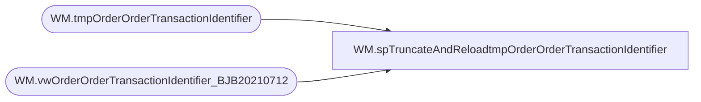

# WM.spTruncateAndReloadtmpOrderOrderTransactionIdentifier

**Database:** WebOrderProcessing  
**Server:** bearcluster01  

## Architecture Diagram



## Table Dependencies

| Referenced Table |
|---|
| WM.tmpOrderOrderTransactionIdentifier |
| WM.vwOrderOrderTransactionIdentifier_BJB20210712 |

## Stored Procedure Code

```sql
CREATE PROCEDURE [WM].[spTruncateAndReloadtmpOrderOrderTransactionIdentifier]

-- =============================================================================================================
-- Name: WM.spTruncateAndReloadtmpOrderOrderTransactionIdentifier
--
-- Description:	Truncate and Reload tmpOrderOrderTransactionIdentifier
--
-- Output: 
--	
-- Dependencies: 
--
-- Revision History
--		Name:			Date:			Comments:
--		Ben Barud		7/12/2021		Initial Creation
-- =============================================================================================================

AS
BEGIN
	-- SET NOCOUNT ON added to prevent extra result sets from
	-- interfering with SELECT statements.
	SET NOCOUNT ON;

	IF OBJECT_ID('[WebOrderProcessing].[WM].[tmpOrderOrderTransactionIdentifier]') IS NULL
	BEGIN
		CREATE TABLE [WebOrderProcessing].[WM].[tmpOrderOrderTransactionIdentifier]
		(
		TransactionID int,
		OrderID int,
		[OrderNumber] varchar(10),
		[PickupStore] varchar(4),
		[SourceSite] varchar(7),
		[OrderTransactionIdentifier] int
		)
	END
	ELSE
	BEGIN
		TRUNCATE TABLE [WebOrderProcessing].[WM].[tmpOrderOrderTransactionIdentifier]
	END

	INSERT INTO [WebOrderProcessing].[WM].tmpOrderOrderTransactionIdentifier ([TransactionID]
		,[OrderId]
		,[OrderNumber]
		,[PickupStore]
		,[SourceSite]
		,[OrderTransactionIdentifier])
	SELECT [TransactionID]
		,[OrderId]
		,[OrderNumber]
		,[PickupStore]
		,[SourceSite]
		,[OrderTransactionIdentifier]
	FROM [WebOrderProcessing].[WM].[vwOrderOrderTransactionIdentifier_BJB20210712] WITH(NOLOCK)
	ORDER BY 1 DESC
END
```

